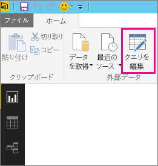
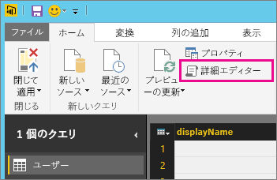
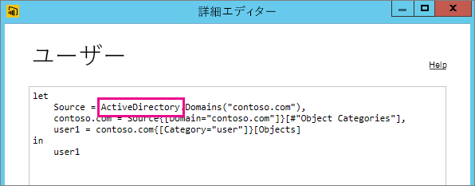

# 更新がサポートされていないデータ ソースのトラブルシューティング
スケジュールされた更新用にデータセットを構成しようとすると、エラーが発生する場合があります。

        You cannot schedule refresh for this dataset because it gets data from sources that currently don’t support refresh.

これは、使用しているデータ ソースが Power BI Desktop 内では更新用にサポートされていない場合に発生します。 使用しているデータ ソースを検索し、「[Power BI でのデータの更新](refresh-data.md)」のサポートされているデータ ソースの一覧と比較する必要があります。 

## データ ソースの検索
どのデータ ソースを使用しているかが不明な場合は、Power BI Desktop 内で、次の手順を実行して確認できます。  

1. Power BI Desktop で、 **[レポート]** ウィンドウが表示されていることを確認します。  
   ![Desktop の [レポート] ウィンドウ](media/service-admin-troubleshoot-unsupported-data-source-for-refresh/tshoot-report-pane.png)
2. リボン バーから **[クエリの編集]** を選択します。  
   
3. **[詳細設定エディター]** を選択します。  
   
4. ソース用に一覧で示されているプロバイダーをメモしておきます。  この例では、プロバイダーは ActiveDirectory です。  
   
5. プロバイダーを、「[Power BI でのデータの更新](refresh-data.md)」のサポートされているデータ ソースの一覧と比較します。  Active Directory は、更新がサポートされたデータ ソースではないことが分かります。  

## 次の手順
[データ更新](refresh-data.md)  
[Power BI Gateway - Personal](service-gateway-personal-mode.md)  
[オンプレミス データ ゲートウェイ](service-gateway-onprem.md)  
[オンプレミス データ ゲートウェイのトラブルシューティング](service-gateway-onprem-tshoot.md)  
[Power BI Gateway - Personal のトラブルシューティング](service-admin-troubleshooting-power-bi-personal-gateway.md)  

他にわからないことがある場合は、 [Power BI コミュニティで質問してみてください](http://community.powerbi.com/)。

