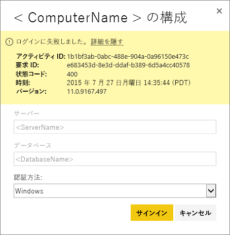
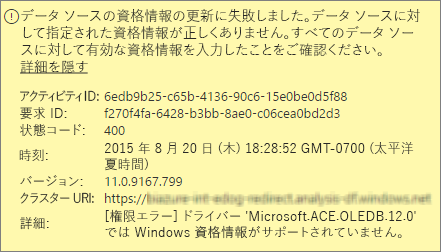
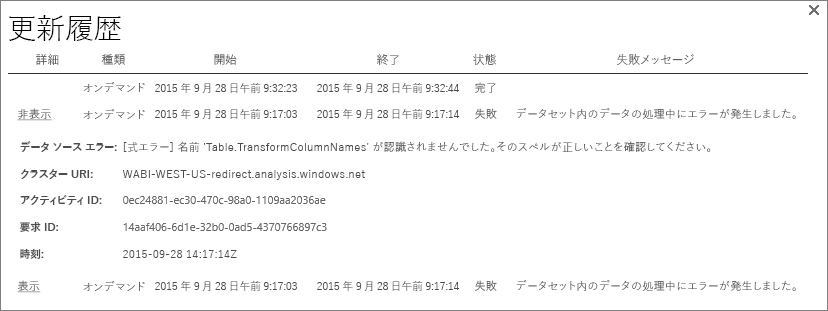
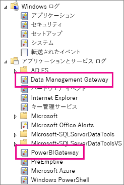
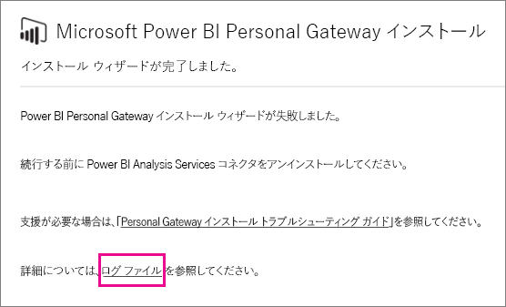
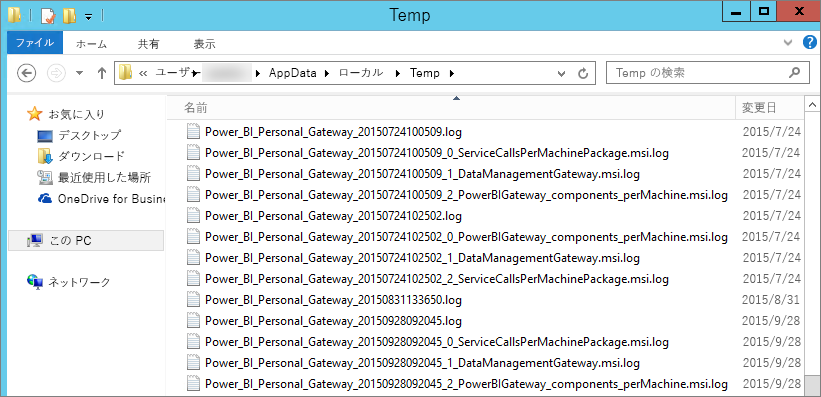

# Power BI Gateway - Personal のトラブルシューティング
次のセクションでは、Power BI Gateway-Personal を使用するときに遭遇する可能性がありますの一般的な問題を実行します。

> [!NOTE]
> 個人用のゲートウェイの現在のバージョンは、**オンプレミス データ ゲートウェイ (個人用)** です。 このバージョンを使用する場合は、現在インストールしているバージョンを更新してください。
> 
> 

## 最新のバージョンに更新する
多くの問題は、ゲートウェイのバージョンが古くなっているときに適用します。  適切な対策を最新バージョンにしているかどうかを確認することをお勧めします。 場合は、1 か月以上ゲートウェイを更新していない、最新バージョンのゲートウェイのインストールを検討してください。 次に、問題を再現できるかどうかを参照してください。

## インストール
**Personal gateway は 64 ビット**-コンピューターが 32 ビットの場合は、personal gateway をインストールすることはできません。 オペレーティング システムでは、64 ビット バージョンであります。 Windows の 64 ビット バージョンをインストールまたは 64 ビット コンピューターで、パーソナル ゲートウェイをインストールします。

**Personal gateway は、コンピューターのローカル管理者であるにもかかわらず、サービスとしてのインストールに失敗した**-コンピューターのローカル管理者グループに、ユーザーがグループ ポリシーとしてサインインするユーザー名を許可しない場合、インストールが失敗します。サービス。 現時点では、グループ ポリシーにより、ユーザーをサービスとしてのサインインを確認します。 この問題の修正に取り組んでいます。 [詳細情報](https://technet.microsoft.com/library/cc739424.aspx)

**操作がタイムアウト**-このメッセージは、personal gateway をインストールしているコンピューター (物理マシンまたは仮想マシン) が 1 つのコア プロセッサを搭載している場合に共通します。 すべてのアプリケーションを閉じ、不要なプロセスすべてをオフにしてもう一度インストールしてください。

**パーソナル ゲートウェイと同じコンピューターに data Management Gateway または Analysis Services Connector をインストールすることはできません**- Analysis Services Connector を既ににない場合、または Data Management Gateway がインストールされているコネクタをまずアンインストールする必要がありますかゲートウェイです。 次に、パーソナル ゲートウェイをインストールしてください。

> [!NOTE]
> インストール中に問題が発生した場合、セットアップ ログは、問題の解決に役立つ情報を提供できます。 詳細については、次を参照してください。[セットアップ ログ](#SetupLogs)します。
> 
> 

 **プロキシ構成**環境内には、プロキシの使用が必要がある場合、パーソナル ゲートウェイの構成に問題が発生する可能性があります。 プロキシの構成方法の詳細については、「[Power BI Gateway のプロキシ設定を構成する](service-gateway-proxy.md)」を参照してください。

## 更新のスケジュール設定
**エラー:The credential stored in the cloud is missing. (クラウドに格納されている資格情報がありません。)**

設定でこのエラーが発生する可能性があります\<データセット\>している場合、スケジュールされた更新とし、アンインストール、パーソナル ゲートウェイを再インストールします。 Personal gateway をアンインストールすると、更新用に構成されていますが、データセットのデータ ソースの資格情報は、Power BI サービスから削除されます。

**解決方法:** Power BI で、データセットの [設定の更新] に移動します。 データ ソースの管理で、エラーのあるデータ ソースの選択**資格情報を編集**し、もう一度データ ソースにサインインします。

**エラー:データセットに提供されている資格情報が無効です。続行するには、[更新] または [データ ソースの設定] ダイアログ ボックスで資格情報を更新してください。**

**解決方法**:資格情報についてのメッセージが表示される場合、次の原因が考えられます。

* ユーザー名とデータ ソースにサインインするためのパスワードが最新の状態を確認します。 Power BI で、対象データ セットの [設定の更新] に移動します。 データ ソースの管理、**資格情報を編集**データ ソースの資格情報を更新します。
* クラウド ソースと 1 つのクエリでは、オンプレミス ソースの間のマッシュ アップは、OAuth を使用して、認証は、ソースのいずれかの場合に、パーソナル ゲートウェイで更新に失敗します。 この問題の例では、CRM Online とローカルの SQL Server の間のマッシュ アップです。 マッシュ アップは、CRM Online に OAuth を必要とするために失敗します。
  
  このエラーは既知の問題とで検索します。 問題を回避するには、クラウド ソースとオンプレミス ソースに対して個別のクエリがあります。 次に、マージを使用して、またはそれらを結合するクエリを追加します。

**エラー:Unsupported data source. (サポートされていないデータ ソースです。)**

**解決方法:**[更新のスケジュール設定] でサポートされていないデータ ソースであることを示すメッセージが表示される場合、次のことを意味する可能性があります。 

* 現在の Power BI での更新は、データ ソースがサポートされていません。 
* Excel ブックには、データ モデル、ワークシートのデータのみが含まれていません。 現在 Power BI で更新がサポートされているのは、アップロードされた Excel ブックにデータ モデルが含まれている場合だけです。 Excel で Power Query を使用してデータをインポートする場合には、データ モデルにデータをロードするオプションを必ず選択してください。 このオプションでは、データ モデルにデータをインポートします。 

**エラー: [データを結合できません]&lt;一部のクエリ&gt;/&lt;.&gt; / &lt;.&gt;が同時に使用できないプライバシー レベルは、データ ソース アクセスします。このデータの組み合わせを再構築してください。**

**解決方法**:このエラーは、プライバシー レベルの制限と、使用しているデータ ソースの種類のためです。

**エラー:データ ソース エラー:値 "\[Table\]" を型 Table に変換できません。**

**解決方法**:このエラーは、プライバシー レベルの制限と、使用しているデータ ソースの種類のためです。

**エラー:この行に十分な領域がありません。**

このエラーは、4 MB より大きい 1 つの行サイズがある場合に発生します。 データ ソースから行を検索し、フィルターで除外またはその行のサイズを縮小しようとします。

## データ ソース
**データ プロバイダーがない**– パーソナル ゲートウェイは 64 ビット バージョンのみ。 つまり、パーソナル ゲートウェイのインストール先コンピューターに、64 ビット バージョンのデータ プロバイダーをインストールする必要があります。 たとえば、データセット内のデータ ソースが Microsoft Access の場合は、パーソナル ゲートウェイがインストールされているのと同じコンピューターに 64 ビットの ACE プロバイダーをインストールする必要があります。  

>[!NOTE]
>Excel の 32 ビット バージョンがあれば、同じコンピューターに 64 ビット バージョンの ACE プロバイダーをインストールできません。

**Access データベースで Windows 認証がサポートされない** - 現在 Power BI がサポートしているのは Access データベースの匿名認証のみです。 Access データベースの Windows 認証を有効にすることに取り組んでいます。

**データ ソースの資格情報を入力するときにエラー サインイン**-以前のバージョンの personal gateway にありますデータ ソースの Windows 資格情報を入力するときに、このようなエラーが発生した場合。 [最新バージョンの Power BI Gateway - Personal をインストール](https://powerbi.microsoft.com/gateway/)してください。

  

**エラー:ACE OLEDB を使用して、データ ソースに対して Windows 認証を選択するときに、サインイン エラーが発生する** - ACE OLEDB プロバイダーを使用して、データ ソースのデータ ソース資格情報を入力するときに、次のエラーが発生することがあります。

Power BI は、ACE OLEDB プロバイダーを使用してデータ ソースに対して Windows 認証をサポートされていません。

**解決方法:** このエラーを回避する選択**匿名認証**します。 従来の ACE OLEDB プロバイダーは、匿名の資格情報は Windows 資格情報に等しくなります。

## タイルの更新
ダッシュ ボード タイルの更新でエラーを受信している場合は、次の記事を参照してください。

[タイルのエラーのトラブルシューティング](refresh-troubleshooting-tile-errors.md)

## トラブルシューティングするためのツール
### 更新履歴
**更新履歴**どのようなエラーが発生したことを確認して、サポート要求を作成する必要がある場合に有用なデータを提供します。 スケジュールされていると、必要に応じて、更新の両方を表示することができます。 取得する方法を次に示します、**更新履歴**します。

1. Power BI ナビゲーション ウィンドウの **[データセット]** で、データセットを選択してから、&gt;[メニューを開く] &gt; **[更新のスケジュール設定]** を選択します。
   
1. **を設定しています.**、**更新履歴**します。  
   
   
   

### イベント ログ
いくつかのイベント ログには、情報を提供できます。 最初の 2 つ**Data Management Gateway**と**PowerBIGateway**はコンピューターの管理者がいる場合に存在します。  管理者でない、Personal Gateway を使用している場合は、内にログ エントリが表示されます、**アプリケーション**ログ。

**Data Management Gateway** と **PowerBIGateway** ログは、 **アプリケーションとサービス ログ**の下に表示されます。

### Fiddler のトレース
[Fiddler](http://www.telerik.com/fiddler) は、HTTP トラフィックを監視する Telerik 提供の無償ツールです。 クライアント コンピューターから Power BI サービスとの通信を確認できます。 この通信は、エラーやその他の関連情報が表示されます。

### セットアップ ログ
場合、 **Personal Gateway**のインストールに失敗したセットアップ ログを表示するリンクが表示されます。 セットアップ ログから失敗に関する詳細が表示できます。 これらのログは、Windows のインストール ログ、MSI ログとも呼ばれます。 これらのログは非常に複雑で、読み解くのが困難です。 通常、結果として得られるエラーは、下部に、自明でないエラーの原因を特定します。 見ているものが別のログのエラーの結果であることも、ログの上の部分に含まれているエラーの結果であることもあります。

またはに移動することができます、 **Temp フォルダー** (%temp%)始まるファイルを探して**Power\_双\_** します。

> [!NOTE]
> %temp% に移動すると、temp のサブフォルダーに移動する場合があります。**Power\_双\_** ファイルは、temp ディレクトリのルート。  1 レベルまたは 2 レベル上に移動する必要がある場合があります。
> 
> 

## 次の手順
[Power BI Gateway のプロキシ設定を構成する](service-gateway-proxy.md)  
[データ更新](refresh-data.md)  
[Power BI Gateway - Personal](service-gateway-personal-mode.md)  
[タイルのエラーのトラブルシューティング](refresh-troubleshooting-tile-errors.md)  
[オンプレミス データ ゲートウェイのトラブルシューティング](service-gateway-onprem-tshoot.md)  
他にわからないことがある場合は、 [Power BI コミュニティを利用してください](http://community.powerbi.com/)。

