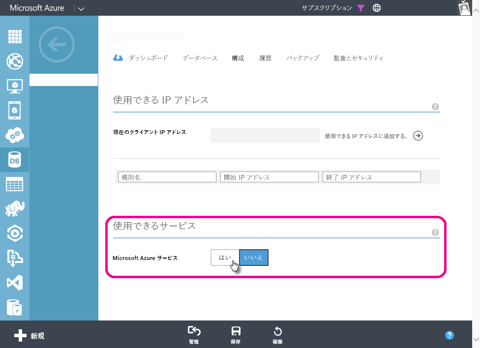

# Power BI における Azure SQL Database のスケジュール設定された更新に関するトラブルシューティング
スケジュール設定された更新を設定するための手順の詳細については、「[Power BI でのデータの更新](refresh-data.md)」をご確認ください。

Azure SQL Database のスケジュール設定された更新を設定していて、資格情報の編集中にエラー (エラー コード 400) が発生した場合は、次の操作を実行して適切なファイアウォール規則を設定します。

1. Azure の管理ポータルにログインします
2. 更新を構成している対象の Azure SQL サーバーに移動します
3. 利用できるサービス セクションで 'Windows Azure サービス' をオンにします

  

他にわからないことがある場合は、 [Power BI コミュニティを利用してください](http://community.powerbi.com/)。

