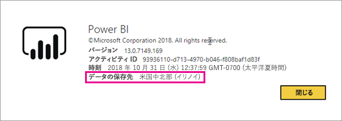
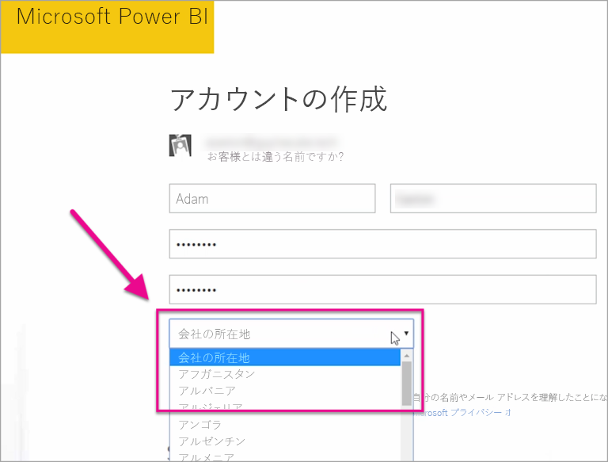

# Power BI テナントの場所

<iframe width="560" height="315" src="https://www.youtube.com/embed/0fOxaHJPvdM?showinfo=0" frameborder="0" allowfullscreen></iframe>

Power BI テナントが配置される場所およびその場所を選択する方法について説明します。 サービスとの相互作用の影響を与えることができます、場所は重要では学習があります。

## Power BI テナントの場所を確認する方法

テナントが存在するリージョンを調べるには、次の手順のようにします。

1. Power BI サービスの上部のメニューで、ヘルプ **[?]** を選択して、 **[Power BI について]** を選択します。

1. **[データの保存先]** の隣の値を確認します。 テナントがあるリージョンになります。 ワークスペースの異なるリージョンでは、専用の容量を使用している場合を除きにも、値により、データが格納されているリージョンです。

    

## データ領域を選択する方法

データ リージョンは、テナントを作成するときに選択した国に基づきます。 この情報が共有されるため、両方の Office 365、Power BI にサインアップする選択が適用されます。 新しいテナントの場合は、サインアップするときに、一覧から適切な国を選択します。

Power BI では、テナントのデータの保存場所を決定する、選択内容に最も近いデータ領域を取得します。

> [!IMPORTANT]
> テナントを作成した後は、選択を変更することはできません。

他にわからないことがある場合は、 [Power BI コミュニティを利用してください](http://community.powerbi.com/)。

