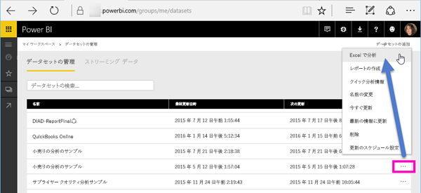
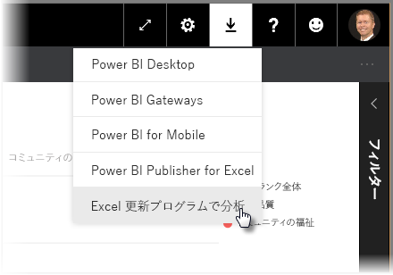
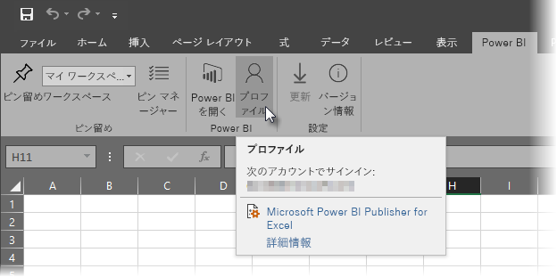
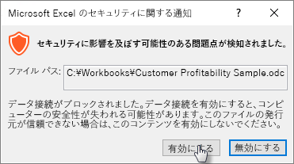
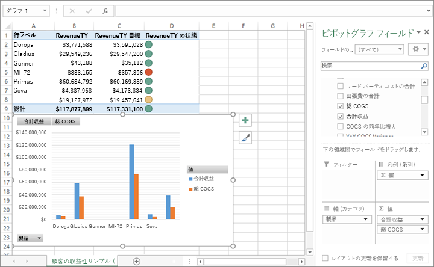

# Excel で分析
Excel を使用して Power BI にあるデータセットを表示したり、データセットと対話したりする必要が生じる場合があります。 **[Excel で分析]** を使用すれば、Power BI に存在するデータセットに応じて、表示や対話だけでなく、Excel 内で PivotTable、グラフ、スライサーの機能を活用できます。

## 要件
**[Excel で分析]** を使用するには、次のいくつかの要件があります。

* **[Excel で分析]** は、Microsoft Excel 2010 SP1 以降でサポートされています。
* Excel のピボット テーブルは、数値フィールドのドラッグ アンド ドロップでの集計をサポートしていません。 Power BI でのデータセットには、*メジャーを事前定義する必要があります*。
* 一部の組織では、グループ ポリシーの規則により、必要な **[Excel で分析]** 更新プログラムを Excel にインストールできないことがあります。 更新プログラムをインストールできない場合は、管理者に問い合わせてください。
* **[Excel で分析]** には、Pro ライセンスが必要です。 無料ライセンスと Pro ライセンスの機能の違いについては、[Power BI 無料版と Power BI Pro の比較](service-free-vs-pro.md)ページを参照してください。 

## しくみ
**Power BI** のデータセットまたはレポートに関連付けられた省略記号のメニュー (...) から **[Excel で分析]** を選択すると、Power BI によって .ODC ファイルが作成され、ブラウザーからお使いのコンピューターにダウンロードされます。

Excel でファイルを開くと、Power BI データセットの表、フィールド、メジャーとともに、空の**ピボットテーブル**と**フィールド**のリストが表示されます。 Excel でローカルのデータセットに対して作業する場合と同じように、ピボットテーブルやグラフを作成したり、データセットを分析したりできます。

.ODC ファイルには、Power BI 内のユーザーのデータセットに接続する MSOLAP 接続が含まれています。 データの分析または処理操作を行うと、Excel は Power BI のデータセットをクエリし、結果を Excel に返します データセットが DirectQuery を使用してライブ データ ソースに接続している場合、Power BI はデータ ソースをクエリし、結果を Excel に返します

**[Excel で分析]** 機能は、*Analysis Services の表形式*または*多次元*データベースに接続するデータセットやレポート、または Data Analysis Expressions (DAX) を使って作成されたモデル メジャーがあるデータ モデルを含む Power BI Desktop ファイルや Excel ブックからのデータセットやレポートに対して、非常に便利です。

## [Excel で分析] を使ってみる
Power BI で、レポートまたはデータセット名の横の省略記号メニュー(...) を選択し、表示されたメニューから **[Excel で分析]** を選択します。

### Excel の更新プログラムのインストール
**[Excel で分析]** を初めて使うときは、Excel ライブラリへの更新プログラムをインストールする必要があります。 Excel 更新プログラムをダウンロードして実行するよう求められます (これにより、*SQL_AS_OLEDDB.msi* Windows インストーラー パッケージのインストールが開始されます)。 このパッケージは **Microsoft AS OLE DB Provider for SQL Server 2016 RC0 (プレビュー)** をインストールします。

> [!NOTE]
> **[Excel 更新プログラムのインストール]** ダイアログの **[次回からこのページを表示しない]** を必ずオンにしてください。 更新プログラムのインストールは 1 回だけ必要です。
> 
> 

**[Excel で分析]** のために Excel 更新プログラムを再度インストールする必要がある場合、下の図のとおり、Power BI の **[ダウンロード]** アイコンから更新プログラムをダウンロードできます。

### Power BI へのサインイン
ブラウザーで Power BI にサインインしていても、Excel で初めて .ODC ファイルを開くときには、Power BI アカウントを使用して Power BI にサインインするよう求められる場合があります。 これにより、Excel から Power BI への接続を認証します。

### 複数の Power BI アカウントを持つユーザー
複数の Power BI アカウントを持つユーザーがそのうちの 1 つのアカウントを使用して Power BI にログインしているとき、[Excel で分析] で使用されているデータセットへのアクセス権限を持つアカウントが、ログインしているアカウントとは別のアカウントである場合があります。 このような場合、[Excel で分析] ブックで使用されているデータセットにアクセスしようとすると、**Forbidden** エラーやサインインの失敗が生じることがあります。

このようなときは、[Excel で分析] によってアクセスされているデータセットへのアクセス権限を有する Power BI アカウントを使用して再度サインインする機会が提供されます。 Excel の **[Power BI]** リボン タブから **[プロファイル]** を選択すると、ユーザーが現在どのアカウントを使用してログインしているかを特定できるほか、サインアウトをするためのリンクが表示されます (その後、別のアカウントでサインインします)。

### データ接続を有効にする
Power BI データを Excel で分析するには、.odc ファイルのファイル名とパスを検証するよう求められます。次に **[有効化]** を選択します。

> [!NOTE]
> Power BI テナントの管理者は、*Power BI 管理ポータル*を使って、Analysis Services (AS) データベースに格納されているオンプレミスのデータセットでの **[Excel で分析]** の使用を無効にできます。 このようにすると、**[Excel で分析]** は AS データベースに対しては無効になりますが、他のデータセットについては引き続き使用できます。
> 
> 

## 分析
Excel が開かれ、空のピボットテーブルがある場合、Power BI データセットを使用して、あらゆる種類の分析を実行できます。 他のローカル ブックの場合と同様に、[Excel で分析] を使用して、ピボットテーブル、グラフを作成したり、他のソースからデータを追加したりできます。 もちろん、あらゆる種類のビューをデータに適用したさまざまなワークシートを作成することもできます。

> [!NOTE]
> **[Excel で分析]** を使用すると、データセットに対するアクセス許可を持つすべてのユーザーに、詳細レベルのデータすべてが公開されることを把握しておくことが重要です。
> 
> 

## 保存
このように Power BI データセットに接続されたブックは、他のブックと同じように保存できます。 ただし、Power BI に発行またはインポートできるのは、テーブルにデータがあるか、データ モデルを持つブックのみであるため、Power BI データセットに接続されたブックを Power BI に発行またはインポートすることはできません。 新しいブックは、単に Power BI 内のデータセットに接続されているだけなので、Power BI に発行またはインポートすると堂々巡りになってしまいます。

## 共有
ブックを保存すると、組織内の他の Power BI ユーザーと共有できます。

ブックを共有したユーザーがそのブックを開くと、ブックを最後に保存したときの状態でピボットテーブルとデータが表示されますが、これはデータの最終版ではない可能性があります。 最新のデータを入手するには、ユーザーは **[データ]** リボンの **[更新]** をクリックする必要があります。 また、ブックは Power BI のデータセットに接続しているため、ブックの更新を試みるユーザーはまず Power BI にサインインし、Excel 更新プログラムをインストールする必要があります。

ユーザーはデータセットを更新する必要がある一方で、Excel Online では外部接続の更新がサポートされていないため、ユーザー自身のコンピューター上のデスクトップ版 Excel を使用してブックを開くことをお勧めします。

## トラブルシューティング
”Excel で分析” の使用中に、予期しない結果が出る場合や、機能が期待どおりに動作しない場合があります。 [このページで、[Excel で分析] の使用中に発生する一般的な問題の解決方法を説明します。](desktop-troubleshooting-analyze-in-excel.md)