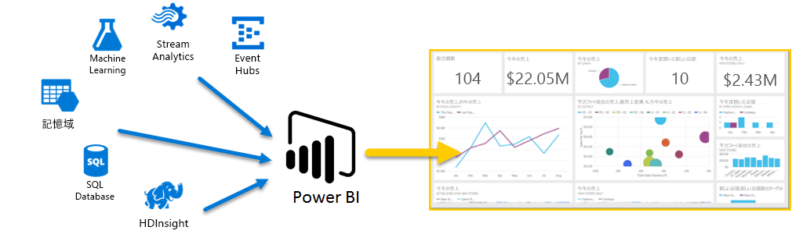
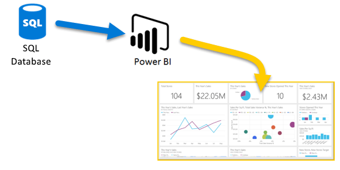
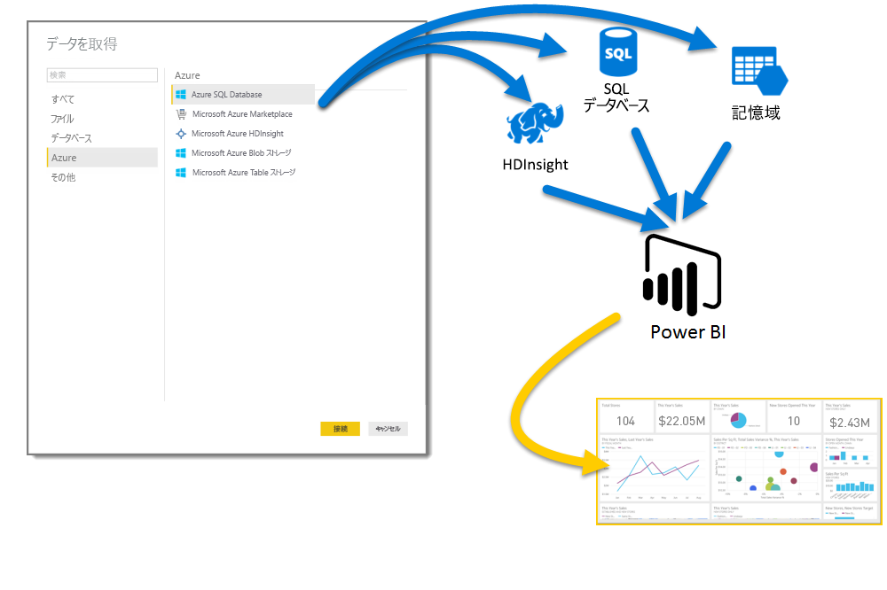
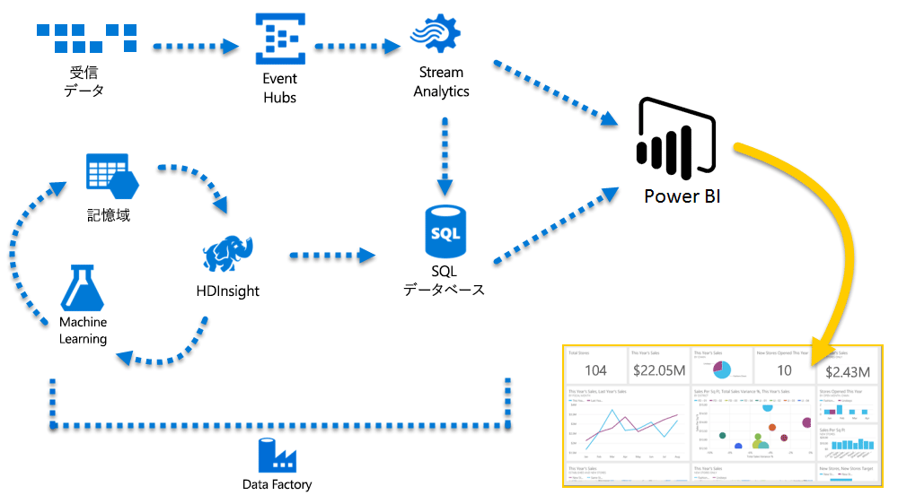

# Azure と Power BI
**Azure** サービスと **Power BI**を併用すると、データ処理の労力を、ビジネスにリアルタイムの洞察を与える分析やレポートに変えることができます。 データ処理がクラウド ベースかオンプレミスか、簡単か複雑か、ソースが 1 つか膨大なスケールか、あるいはウェアハウスに保存されたデータかリアルタイムのデータかに関わらず、Azure と Power BI には相互接続が組み込まれていて統合されているので、ビジネス インテリジェンス作業の効率が高まります。

Power BI では多数の Azure との接続を利用でき、それらのサービスを使用してユーザーのビジネスにとって一意なビジネス インテリジェンス ソリューションを作成できます。 1 つまたは少数の Azure データ ソースに接続し、そのデータを成形して調整することによって、カスタマイズ レポートを作成できます。

### Azure SQL Database と Power BI
最初に、Azure SQL Database に対する簡単な接続を確立し、ビジネスの進捗状況を監視するレポートを作成できます。 [Power BI Desktop](desktop-getting-started.md) を使用すると、ビジネスを促進する傾向や主要業績評価指標を特定するレポートを作成することが可能です。

[Azure SQL Database](http://azure.microsoft.com/services/sql-database/) の詳細についてはこちらをご覧ください。

### クラウド データの変換、成形、マージ
複雑なデータや、各種ソースのデータがありますか。 問題はありません。 **Power BI Desktop** と Azure サービスを併用すると、 **[データ取り出し]** ダイアログをタップするだけで接続できます。 同じクエリ内で、 **Azure SQL Database**、 **Azure HDInsight** データ ソース、 **Azure BLOB ストレージ** (または **Azure テーブル ストレージ**) に接続してから、必要なそれぞれのサブセットのみを選択し調整していくことができます。

同じデータ接続を使用して、さらには同じクエリを使用しても、異なる対象ユーザーに別個のレポートを作成できます。 新しいレポート ページを作成し、それぞれの対象ユーザー向けに視覚エフェクトを調整し、ビジネスが情報に通じているように監視するだけです。

詳細については、次のリソースを参照してください。

* [Azure SQL Database](http://azure.microsoft.com/services/sql-database/)
* [Azure HDInsight](http://azure.microsoft.com/services/hdinsight/)
* [Azure Storage](http://azure.microsoft.com/services/storage/) (BLOB ストレージおよびテーブル ストレージ)

### Azure サービスおよび Power BI による各種融合と成長
Azure と Power BI を使用して必要な限りの拡張を行えます。 複数のソース データ処理の活用、大規模なリアルタイム システムの使用、[Stream Analytics](http://azure.microsoft.com/services/stream-analytics/) と [Event Hubs](http://azure.microsoft.com/services/event-hubs/) の使用、ビジネスで優位性を与えるビジネス インテリジェンス レポートと各種 SaaS サービスとの融合を行います。

### Power BI API によるアプリ データへの接続
Power BI を使用すると、既存のアプリも分析できます。 アプリケーション開発者は Power BI API を使用して、データ セット全体をプログラムを使用して Power BI に送信できます。 継続的な更新が必要ですか。 Power BI API を使用すると、開発者がリアルタイムのデータ更新を送信していつでも作業を開始できるようになり、スケール要件が実行する価値がある規模になると、Azure Stream Analytics を使用するように発展することができます。

[Power BI デベロッパー ポータル](http://dev.powerbi.com)には、Power BI API に関する詳細が示されています。 また、[Power BI 開発者向けブログ](http://blogs.msdn.com/powerbidev)には、他のユーザーが Power BI でプログラムによって何を行っているかが記されています。 さらに、[Power BI 開発を始める](https://msdn.microsoft.com/library/dn889824.aspx)ことに特化したページもあります。

### Azure と Power BI を併用して何ができますか。
**Azure** と **Power BI** を組み合わせて行えるシナリオはたくさんあります - 可能性とチャンスはビジネスによって異なります。 **Azure サービス**について詳しくは、こちらの[概要ページ](http://go.microsoft.com/fwlink/?LinkId=535031&clcid=0x409)をご確認ください。**Azure を使用したデータ分析シナリオ**、およびお持ちのデータ ソースをビジネスをさらに成長させるインテリジェンスに変換する方法が取り上げられています。

