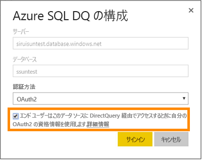
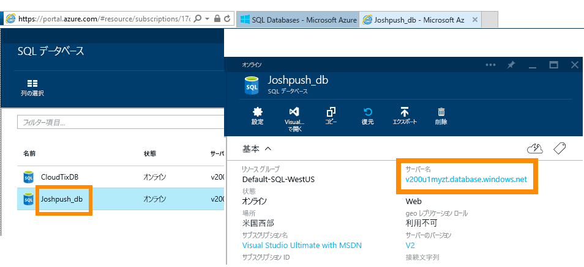
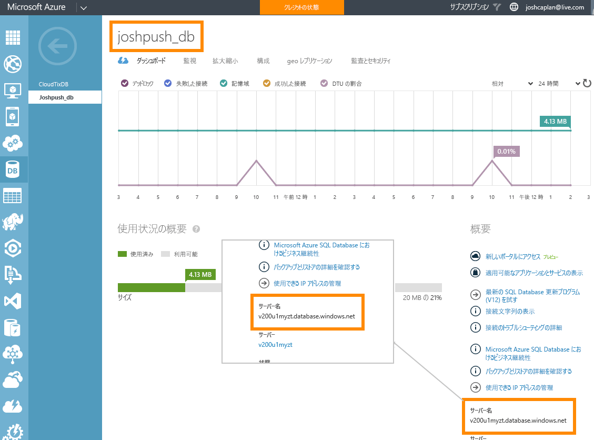

# Azure SQL Database と DirectQuery
Azure SQL Database に直接接続し、ライブ データを使用するレポートを作成する方法について説明します。 Power BI ではなくソースにデータを保持できます。

DirectQuery を使用すると、レポート ビューでデータを調べる際にクエリが Azure SQL Database に送り返されます。 この操作は、接続先のデータベースとエンティティに精通しているユーザーにお勧めします。

**注:**

* 接続するときに、完全修飾のサーバー名を指定します (詳細については後述します)。
* データベースのファイアウォール ルールが "[Azure サービスに対するアクセスを許可する](https://msdn.microsoft.com/library/azure/ee621782.aspx)" ように構成されていることを確認します。
* 列の選択、フィルターの追加など、どの操作によってもクエリがデータベースに送り返されます。
* タイルは、1 時間ごとに更新されます (更新をスケジュール設定する必要はありません)。 この動作は、接続するときに [詳細] 設定で調整できます。
* DirectQuery データセットの Q&A は使用できません。
* スキーマの変更が自動的に選択されることはありません。

これらの制限および注意事項については、エクスペリエンスの向上に伴い変更される可能性があります。 接続するための手順の詳細を以下に示します。 

## Power BI Desktop と DirectQuery
DirectQuery を使用して Azure SQL Database に接続するには、Power BI Desktop を使用する必要があります。 この方法はさらに柔軟性と機能が向上します。 Power BI Desktop を使用して作成したレポートを、Power BI サービスに発行できます。 Power BI Desktop で DirectQuery を使用して Azure SQL Database に接続する方法の詳細については、「[Power BI Desktop の DirectQuery](desktop-use-directquery.md)」をご覧ください。 

## シングル サインオン

Azure SQL の DirectQuery データセットをサービスに発行した後は、Azure Active Directory (Azure AD) OAuth2 を使用して、エンドユーザーのシングル サインオン (SSO) を有効にできます。 

SSO を有効にするには、データセットの設定に移動し、**[データ ソース]** タブを開いて、SSO のチェック ボックスをオンにします。

SSO オプションが有効になっている場合、データ ソースを基に作成されたレポートにユーザーがアクセスすると、Power BI は Azure SQL Database へのクエリで、認証済みの Azure AD 資格情報を送信します。 これにより、Power BI はデータ ソース レベルで構成されているセキュリティ設定を適用できます。

SSO オプションは、このデータ ソースを使うすべてのデータセットで有効になります。 インポートのシナリオに使われる認証方法には影響しません。

## パラメーターの値の見つけ方
完全修飾サーバー名とデータベース名は、Azure Portal に記されています。

## 次の手順
[Power BI Desktop で DirectQuery を使用する](desktop-use-directquery.md)  
[Power BI の概要](service-get-started.md)  
[Power BI のデータの取得](service-get-data.md)  
他にわからないことがある場合は、 [Power BI コミュニティを利用してください](http://community.powerbi.com/)。
