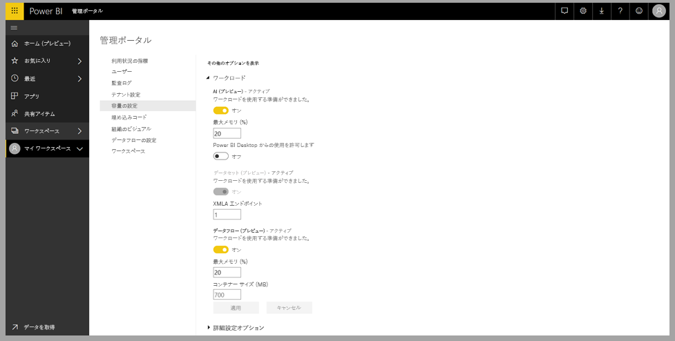
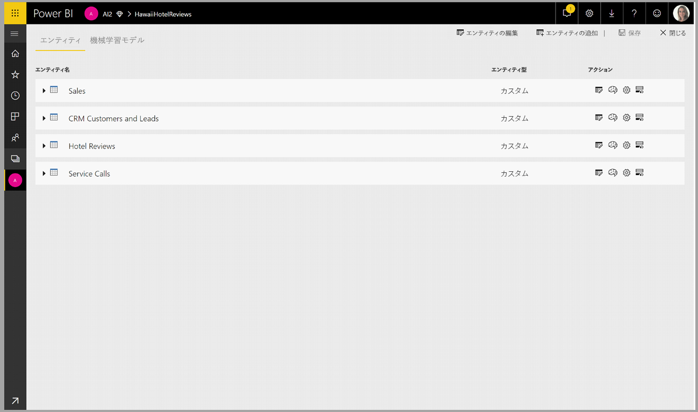
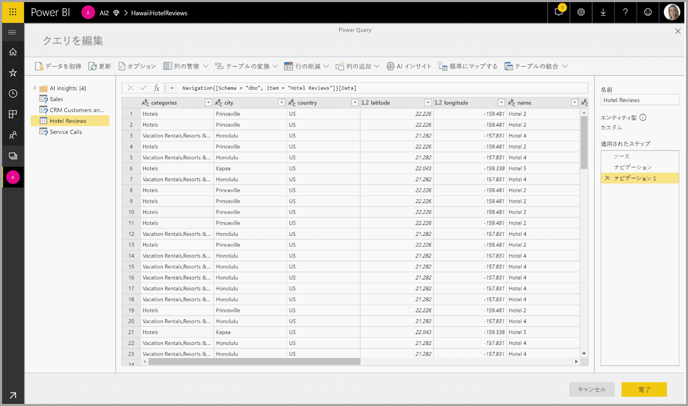
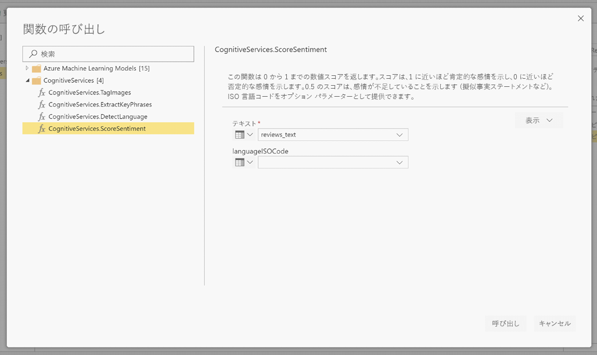
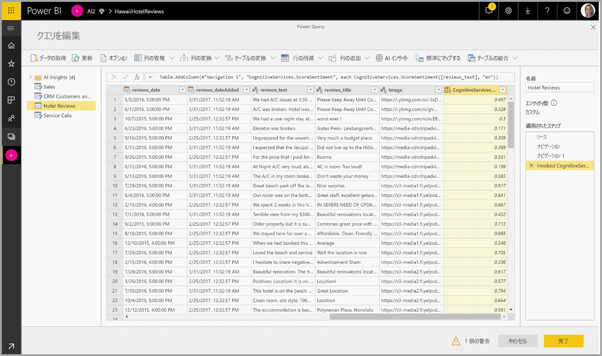
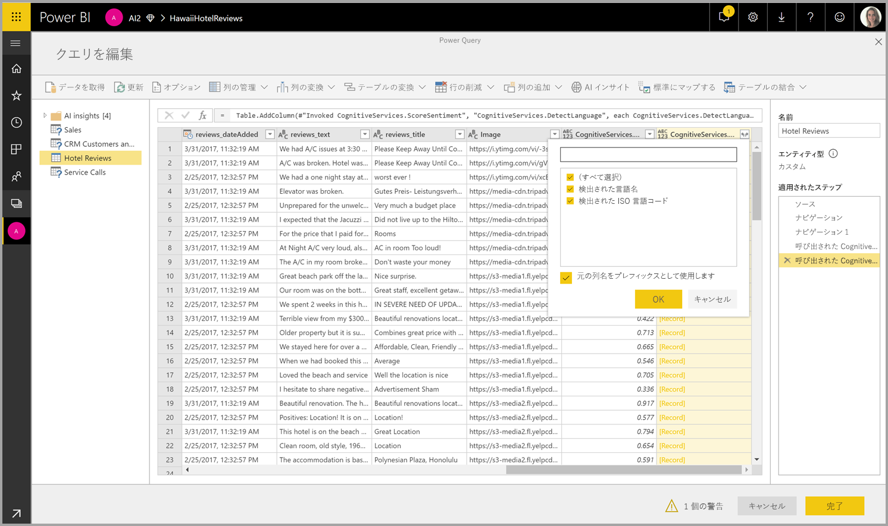

# Power BI での Cognitive Services (プレビュー)

Power BI で Cognitive Services を使用すると、[Azure Cognitive Services](https://azure.microsoft.com/services/cognitive-services/) からのさまざまなアルゴリズムを適用して、データフロー用のセルフ サービスのデータ準備でデータを強化できます。

現在サポートされているサービスは、[感情分析](https://docs.microsoft.com/azure/cognitive-services/text-analytics/how-tos/text-analytics-how-to-sentiment-analysis)、[キー フレーズ抽出](https://docs.microsoft.com/azure/cognitive-services/text-analytics/how-tos/text-analytics-how-to-keyword-extraction)、[言語検出](https://docs.microsoft.com/azure/cognitive-services/text-analytics/how-tos/text-analytics-how-to-language-detection)、および[イメージのタグ付け](https://docs.microsoft.com/azure/cognitive-services/computer-vision/concept-tagging-images)です。 変換は Power BI サービス上で実行されます。Azure Cognitive Services サブスクリプションは不要です。 この機能には、Power BI Premium が必要です。

## **AI 機能を有効にする**

Cognitive Services は、Premium 容量ノード EM2、A2、または P1 以降でサポートされます。 Cognitive Services を実行する際は、容量上の別個の AI ワークロードが使用されます。 パブリック プレビューの期間中、既定では、このワークロードは無効になっています。 Power BI で Cognitive Services を使用する前に、管理ポータルの容量設定で AI ワークロードを有効にする必要があります。 [ワークロード] セクションで AI ワークロードを有効にし、このワークロードで消費する最大メモリ量を定義します。 推奨されるメモリ制限は、20% です。 この制限を超えると、クエリ速度が低下します。

## **Power BI で Cognitive Services の使用を開始する**

Cognitive Services の変換は、[データフロー用のセルフ サービスのデータ準備](https://powerbi.microsoft.com/blog/introducing-power-bi-data-prep-wtih-dataflows/)の一部です。 Cognitive Services を使用してデータを強化するには、最初にデータフローを編集します。

Power Query エディターの上部のリボン内で **[AI Insights]** ボタンを選択します。

ポップアップ ウィンドウで、使用する関数と、変換するデータを選択します。 この例では、レビュー テキストを含む列のセンチメントをスコア付けしています。

**Cultureinfo** は、テキストの言語を指定する省略可能な入力です。 このフィールドには、ISO コードを指定します。 Cultureinfo の入力としては、列、または静的フィールドを使用します。 この例では、列全体で言語が英語 (en) として指定されています。 このフィールドを空白のままにすると、Power BI は、言語を自動的に検出してから、関数を適用します。 次に、**[呼び出し]** を選択します。

![[呼び出し] の選択](media/service-cognitive-services/cognitive-services_05.png)

関数を呼び出すと、結果が新しい列としてテーブルに追加されます。 変換もクエリ内の適用された手順として追加されます。

関数が複数の出力フィールドを返す場合、その関数を呼び出すと複数の出力フィールドのレコードを持つ新しい列が追加されます。

[展開] オプションを使用すると、一方または両方の値を列としてデータに追加できます。

## **使用できる関数**

このセクションでは、Power BI 内の Cognitive Services で使用可能な関数について説明します。

### **言語検出**

言語検出関数では、テキスト入力が評価され、フィールドごとに言語名と ISO 識別子が返されます。 この関数は、データ列で任意のテキストが収集され、言語が不明な場合に役立ちます。 この関数では、入力データがテキスト形式であることが前提となっています。

Text Analytics では、最大 120 の言語が認識されます。 詳細については、[サポートされる言語](https://docs.microsoft.com/azure/cognitive-services/text-analytics/text-analytics-supported-languages)に関する記事を参照してください。

### **キー フレーズ抽出**

**キー フレーズ抽出**関数では、非構造化テキストが評価され、テキスト フィールドごとにキー フレーズの一覧が返されます。 この関数では、テキスト フィールドを入力する必要があります。また、**Cultureinfo** の省略可能な入力を受け入れることもできます。 (前述の「**Power BI で Cognitive Services の使用を開始する**」セクションを参照してください)。

キー フレーズ抽出は、指定したテキストのチャンクが大きいほど、効果的に機能します。 これは、テキストのブロックが小さいほどパフォーマンスが向上する感情分析とは反対です。 両方の操作から最良の結果を得るには、入力を適宜再構築することを検討してください。

### **センチメントのスコア付け**

**センチメントのスコア付け**関数では、テキスト入力が評価され、0 (否定的) から 1 (肯定的) までのセンチメント スコアがドキュメントごとに返されます。 この関数は、ソーシャル メディア、顧客のレビュー、およびディスカッション フォーラムで肯定的および否定的なセンチメントを検出するのに役立ちます。

Text Analytics では、機械学習分類アルゴリズムを使用して、0 ～ 1 のセンチメント スコアが生成されます。 センチメントは、スコアが 1 に近いほど肯定的、0 に近いほど否定的となります。 モデルは、センチメントが関連付けられている幅広いテキスト本文を使用して、事前にトレーニングされています。 現時点では、独自のトレーニング データを指定することはできません。 テキストの分析時、モデルでは、テキスト処理、品詞分析、語の配置、語の関連付けなど、さまざまな手法が組み合わされて使用されます。 アルゴリズムの詳細については、「[Introducing Text Analytics (テキスト分析の概要)](https://blogs.technet.microsoft.com/machinelearning/2015/04/08/introducing-text-analytics-in-the-azure-ml-marketplace/)」を参照してください。

センチメント分析は、テキスト内の特定のエンティティのセンチメントを抽出するのではなく、入力フィールド全体に対して実行されます。 実際には、ドキュメントに大きなテキストのブロックではなく、1 つか 2 つの文が含まれているときにスコリング精度が向上する傾向があります。 客観性評価フェーズでは、入力フィールドが全体として客観的であるのか、それとも入力フィールドにセンチメントが含まれているのかがモデルによって判断されます。 入力フィールドが概ね客観的な場合は、センチメント検出フェーズに進まず、スコアが .50 となり、処理が終了します。 入力フィールドがパイプライン内を進行した場合は、入力フィールドで検出されたセンチメントの程度に応じて、.50 より上または下のスコアが次のフェーズで生成されます。

現時点では、感情分析では、英語、ドイツ語、スペイン語、およびフランス語がサポートされています。 他の言語はプレビュー段階です。 詳細については、[サポートされる言語](https://docs.microsoft.com/azure/cognitive-services/text-analytics/text-analytics-supported-languages)に関する記事を参照してください。

### **タグ イメージ**

**タグ イメージ**関数では、生物、風景、アクションなどの 2,000 を超える認識可能なオブジェクトに基づいてタグが返されます。 タグが不明瞭または一般に理解されないものである場合は、既知の状況のコンテキストでタグの意味を理解しやすくする "ヒント" が表示されます。 タグは分類として編成されず、継承の階層は存在しません。 コンテンツのタグのコレクションは、完全な文の形式に整えられた、人が読解可能な言語として表示されるイメージの "説明" の基盤となります。

イメージをアップロードするか、またはイメージの URL を指定すると、Computer Vision のアルゴリズムにより、そのイメージ内で識別されたオブジェクト、生物、およびアクションに基づいてタグが出力されます。 タグ付けの対象は、前景の人間などの主題だけではありません。セット (室内またはアウトドア)、家具、道具、植物、動物、アクセサリ、小物なども対象となります。

この関数では、イメージの URL または base-64 フィールドが入力として必要です。 現時点でイメージのタグ付けでサポートされるのは、英語、スペイン語、日本語、ポルトガル語、および簡体字中国語です。 詳細については、[サポートされる言語](https://docs.microsoft.com/rest/api/cognitiveservices/computervision/tagimage/tagimage#uri-parameters)に関する記事を参照してください。

## 次の手順

この記事では、Power BI サービスで Cognitive Services を使用する方法を概説しました。 以下の記事も興味深い内容で、役立つかもしれません。 

* [チュートリアル:Power BI での Machine Learning Studio モデルの呼び出し (プレビュー)](service-tutorial-invoke-machine-learning-model.md)
* [Azure Machine Learning の Power BI への統合 (プレビュー)](service-machine-learning-integration.md)
* [チュートリアル:Power BI での Cognitive Services の使用](service-tutorial-use-cognitive-services.md)

データフローの詳細については、以下の記事をご覧ください。
* [Power BI でのデータフローの作成と使用](service-dataflows-create-use.md)
* [Power BI Premium での計算されたエンティティの使用 (プレビュー)](service-dataflows-computed-entities-premium.md)
* [オンプレミス データ ソースでのデータフローの使用 (プレビュー)](service-dataflows-on-premises-gateways.md)
* [Power BI データフロー用の開発者向けリソース (プレビュー)](service-dataflows-developer-resources.md)
* [データフローと Azure Data Lake の統合 (プレビュー)](service-dataflows-azure-data-lake-integration.md)