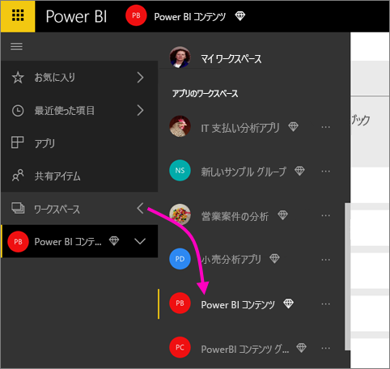
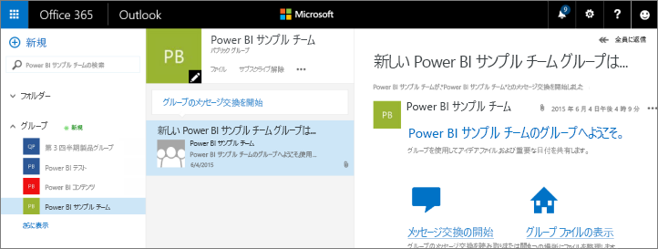
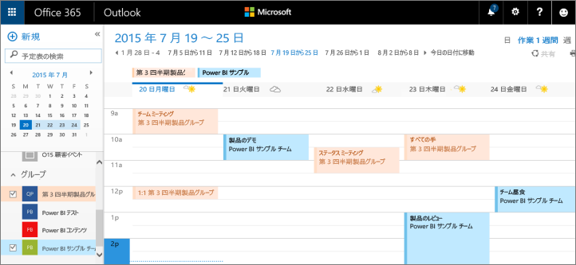

# Power BI アプリ ワークスペースでの共同作業
Power BI アプリ ワークスペースは、同僚とダッシュ ボード、レポート、およびデータセットで共同作業して*アプリ*を作成するのに最適な場所です。 コラボレーションは Power BI のワークスペースだけで終わるわけではありません。 Office 365 では、OneDrive for Business の共有ファイル、Exchange での会話、共有の予定表、タスクなど、その他のグループ サービスも提供されています。 詳細については、[Office 365 のグループ](https://support.office.com/article/Create-a-group-in-Office-365-7124dc4c-1de9-40d4-b096-e8add19209e9)を参照してください。

> [!NOTE]
> 新しいワークスペース エクスペリエンス プレビューでは、Power BI ワークスペースと Office 365 グループ間の関係が変わります。 新しいワークスペースのいずれかを作成するたびに、Office 365 グループが自動的に作成されることはありません。 新しいワークスペース (プレビュー) の作成については、[こちら](service-create-the-new-workspaces.md)を参照してください。

アプリ ワークスペースは、[Power BI Pro](service-free-vs-pro.md) でのみ利用できます。

## アプリ ワークスペースで Power BI Desktop ファイルに対して共同作業を行う
Power BI Desktop ファイルを作成した後で、そのファイルを Power BI アプリ ワークスペースに発行すると、ワークスペース内の全員がそのファイルで共同作業を行えるようになります。

1. Power BI Desktop で、**[ホーム]** リボンの **[発行]** を選択し、**[宛先を選択してください]** ボックスで目的のアプリ ワークスペースを選択します。
   
    ![[発行] アイコン](media/service-collaborate-power-bi-workspace/power-bi-group-publish-pbix.png)
2. Power BI サービスで、[ワークスペース] の横にある矢印を選択し、目的のアプリ ワークスペースを選択します。
   
    
3. [レポート] タブを選択し、目的のレポートを選択します。
   
    ![[レポート] タブ](media/service-collaborate-power-bi-workspace/power-bi-workspace-report.png)
   
    ここからは、Power BI の他のレポートと同様の操作となります。 アプリ ワークスペース内のユーザーはいずれも、[レポートを変更](service-reports.md)したり、目的のダッシュボードにタイルを保存したりできます。

## Office 365 で共同作業する
Office 365 で共同作業するには、まず Power BI のアプリ ワークスペースから作業を開始します。

1. Power BI サービスで、[ワークスペース] の横にある矢印を選択し、目的のワークスペース名の隣にある省略記号 (**…**) を選択します。 
   
   ![[ワークスペース] メニュー](media/service-collaborate-power-bi-workspace/power-bi-app-ellipsis.png)
2. このメニューから、いくつかの方法でグループと共同作業できます。 
   
   * [Office 365 のグループのメッセージ交換](service-collaborate-power-bi-workspace.md#have-a-group-conversation-in-office-365)。
   * アプリのグループ ワークスペースの予定表での[イベント スケジュール作成](service-collaborate-power-bi-workspace.md#schedule-an-event-on-the-group-workspace-calendar)。
   
   Office 365 で初めてアプリのグループ ワークスペースを参照する際は、時間がかかる場合があります。 15 ～ 30 分待ってからブラウザーを更新してください。

## Office 365 のグループのメッセージ交換
1. アプリ ワークスペース名の横にある省略記号 (…) を選択し、\> **[会話]** を選択します。 
   
    ![[会話] タブ](media/service-collaborate-power-bi-workspace/power-bi-app-ellipsis.png)
   
   Office 365 の Outlook でアプリのグループ ワークスペースのメールとメッセージ交換サイトが開きます。
   
   
2. [Office 365 の Outlook でのグループのメッセージ交換](https://support.office.com/Article/Have-a-group-conversation-a0482e24-a769-4e39-a5ba-a7c56e828b22)についてご覧ください。

## アプリのグループ ワークスペースの予定表でのイベント スケジュール作成
1. アプリ ワークスペース名の横にある省略記号 (**[...]**) \> **[予定表]** を選択します。 
   
   ![[予定表] タブ](media/service-collaborate-power-bi-workspace/power-bi-app-ellipsis.png)
   
   Office 365 の Outlook でアプリのグループ ワークスペースの予定表が開きます。
   
   
2. [Office 365 の Outlook のグループ予定表](https://support.office.com/Article/Add-edit-and-subscribe-to-group-events-0cf1ad68-1034-4306-b367-d75e9818376a)についてご覧ください。

## アプリ ワークスペースの管理
アプリ ワークスペースの所有者または管理者は、ワークスペース メンバーを追加または削除できます。 詳細については、「[Power BI および Office 365 でのグループ管理](service-manage-app-workspace-in-power-bi-and-office-365.md)」を参照してください。

## 次の手順
* [Power BI でアプリとアプリ ワークスペースを作成する](service-create-distribute-apps.md)
* 他にわからないことがある場合は、 [Power BI コミュニティを利用してください](http://community.powerbi.com/)。
* フィードバックがある場合は、 「[Power BI Ideas](https://ideas.powerbi.com/forums/265200-power-bi)」 (Power BI に関するヒント) を参照してください。

