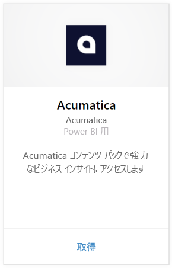
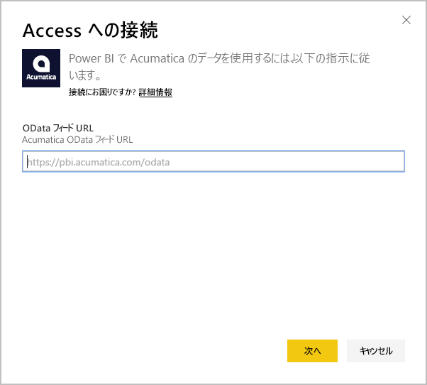
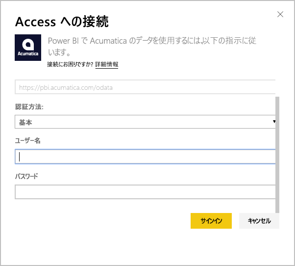
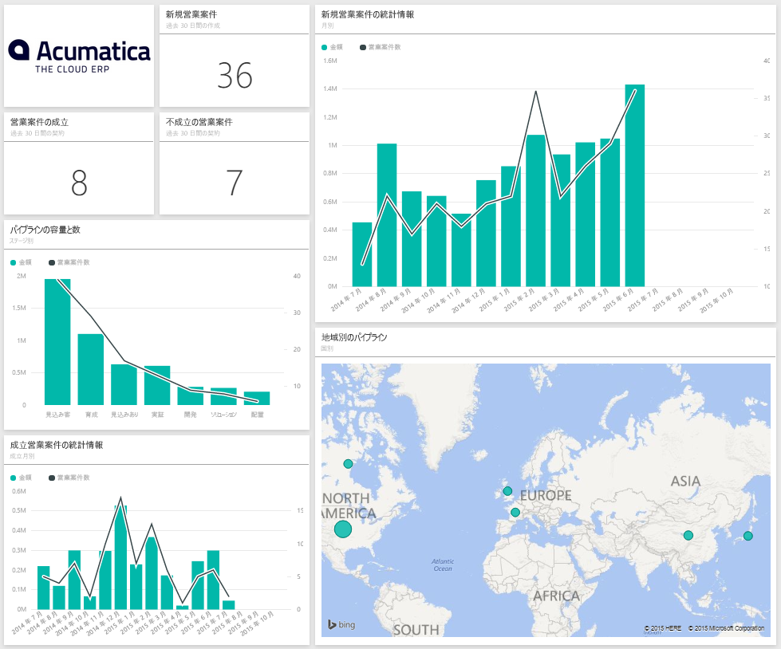
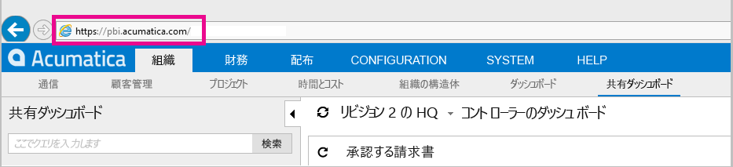
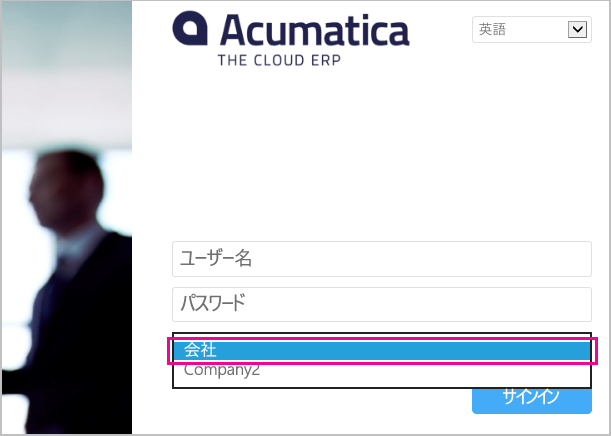

# Power BI で Acumatica に接続する
Power BI Acumatica コンテンツ パックを使用すると、短時間で営業案件に関するデータについての洞察が得られます。 Power BI は、営業案件、アカウント、顧客などのデータを取得し、そのデータに基づいて既定のダッシュボードと関連レポートを作成します。

[Acumatica コンテンツ パック](https://app.powerbi.com/getdata/services/acumatica)に接続するか、Power BI と [Acumatica との統合](https://powerbi.microsoft.com/integrations/acumatica)について詳細をお読みください。

>[!NOTE]
>このコンテンツ パックには、Acumatica v5.2 以降が必要です。

## 接続する方法
1. 左側のナビゲーション ウィンドウの下部にある **[データの取得]** を選択します。
   
   
2. **[サービス]** ボックスで、 **[取得]** を選択します。
   
   
3. **[Acumatica]** \> **[取得]** の順に選択します。
   
   
4. Acumatica OData エンドポイントを入力します。 OData エンドポイントを使用すると、外部システムが Acumatica のデータを要求できるようになります。 Acumatica OData エンドポイントは次の形式で、HTTPS を使用する必要があります。
   
     https://[サイト ドメイン]/odata/[会社名]
   
   会社名が必要となるのは、複数の会社展開を行っている場合のみです。 Acumatica アカウントにおけるこのパラメーターの見つけ方について詳しくは、以下をご覧ください。
   
   
5. 認証方法として **[基本]** を選択します。 Acumatica アカウントのユーザー名とパスワードを入力し、 **[サインイン]** をクリックします。
   
    
6. Power BI によるデータのインポート後、新しいダッシュ ボード、レポート、データセットが左側のナビゲーション ウィンドウに表示されます。 新しい項目には、黄色のアスタリスク \* が付きます。その項目を選択するとアスタリスクは消え、ダッシュボードを選択すると次の例のようなレイアウトで表示されます。
   
    

**実行できる操作**

* ダッシュボード上部にある [Q&A ボックスで質問](power-bi-q-and-a.md)してみてください。
* ダッシュボードで[タイルを変更](service-dashboard-edit-tile.md)できます。
* [タイルを選択](service-dashboard-tiles.md)して基になるレポートを開くことができます。
* データセットは毎日更新されるようにスケジュール設定されますが、更新のスケジュールは変更でき、また **[今すぐ更新]** を使えばいつでも必要なときに更新できます。

## システム要件
このコンテンツ パックには、Acumatica v5.2 以降が必要です。Acumatica のバージョンについては、管理者にお問い合わせください。

## パラメーターの見つけ方
**Acumatica OData エンドポイント**

Acumatica OData エンドポイントは次の形式で、HTTPS を使用する必要があります。

    https://[sitedomain]/odata/[companyname]

アプリケーション サイト ドメインは、Acumatica にサインインしているときに、ブラウザーのアドレス バーに表示されます。 次の例では、サイト ドメインが "https://pbi.acumatica.com" であるため、指定する OData エンドポイントは "https://pbi.acumatica.com/odata" になります。

 

会社名が必要となるのは、複数の会社展開を行っている場合のみです。 この情報は、Acumatica サインイン ページで確認できます。

## トラブルシューティング
ログインできない場合は、指定した Acumatica OData エンドポイントの形式が正しいことを確認してください。

    https://<application site domain>/odata/<company name>

引き続き接続できない場合、Acumatica バージョンを管理者に確認します。 このコンテンツ パックには、5.2 以降のバージョンが必要です。

## 次の手順
[Power BI の概要](service-get-started.md)

[Power BI でデータを取得する](service-get-data.md)

