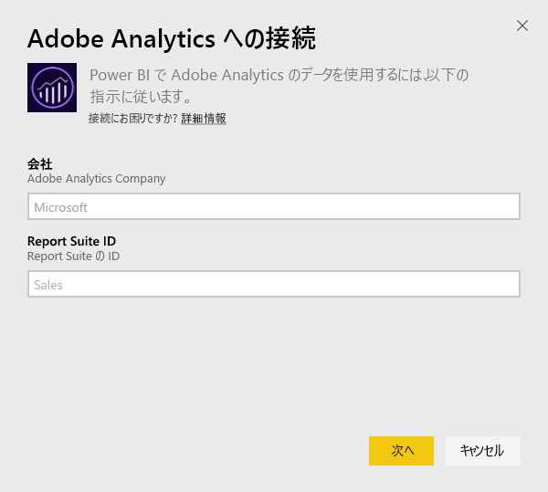
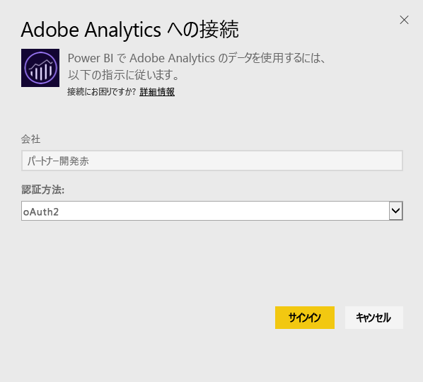
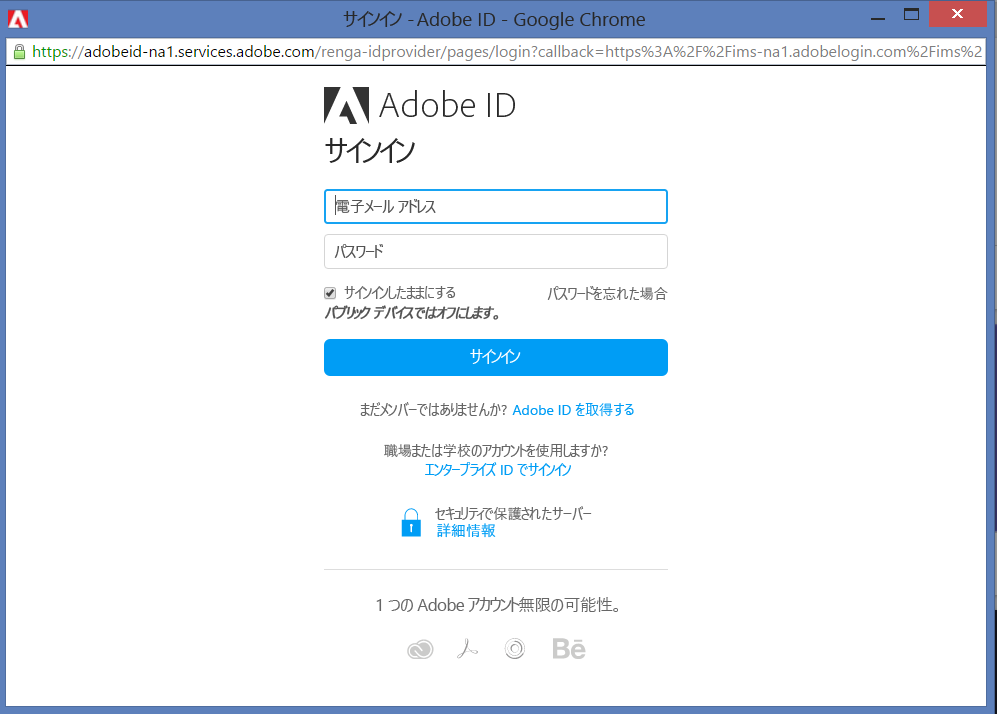
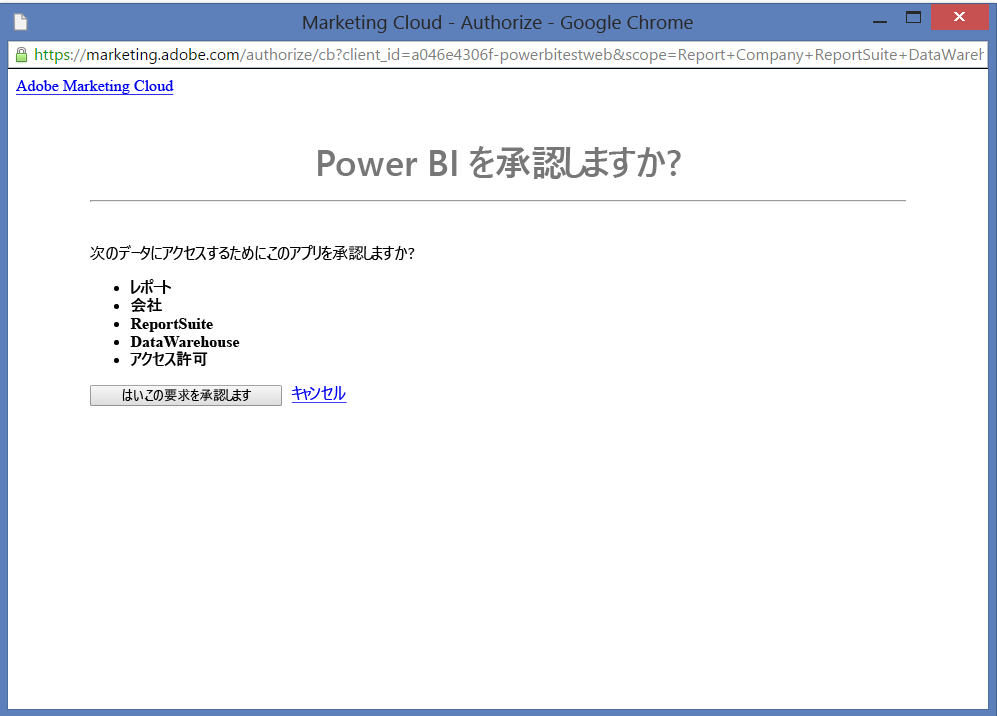
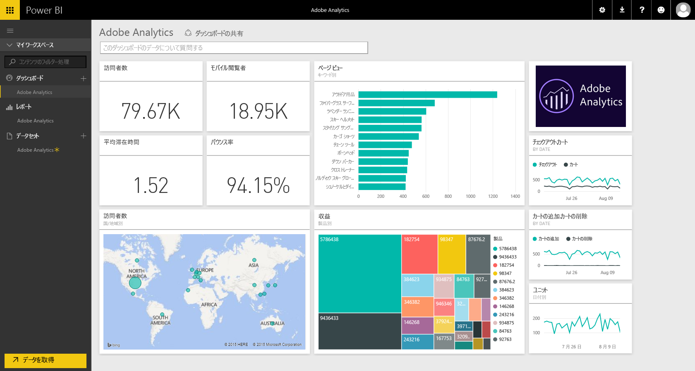
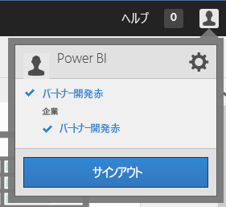
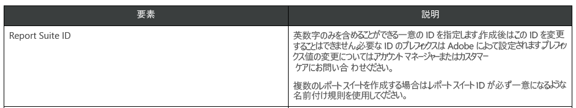

# Power BI で Adobe Analytics に接続する
Power BI で Adobe Analytics に接続するには、最初に Adobe Analytics Marketing Cloud アカウントに接続します。 アプリに Power BI ダッシュ ボードと一連の Power BI レポートが表示され、お客様のサイト トラフィックとユーザー ディメンションに関する詳細情報が提供されます。 データは、1 日に 1 回自動的に更新されます。 ダッシュボードとレポートは操作できますが、変更内容は保存できません。

[Adobe Analytics](https://app.powerbi.com/getdata/services/adobe-analytics) に接続してください。Power BI と Adobe Analytics の統合については[こちら](https://powerbi.microsoft.com/integrations/adobe-analytics)をご覧ください。

## 接続する方法
[!INCLUDE [powerbi-service-apps-get-more-apps](./includes/powerbi-service-apps-get-more-apps.md)]

3. **[Adobe Analytics]** \> **[取得]** の順に選択します。
   
   
4. Power BI は、特定の Adobe Analytics 会社と Report Suite ID (Report Suite 名ではありません) に接続します。 [これらのパラメーターの見つけ方](#FindingParams)について詳しくは、後述します。
   
   
5. **[認証方法]** として **[oAuth2]** を選択し、\>**[サイン イン]** をクリックします。 メッセージが表示されたら、Adobe Analytics 資格情報を入力します。 
   
    
   
    
6. **[承諾]** をクリックし、Power BI が Adobe Analytics データにアクセスできるようにします。
   
   
7. 承認後、インポート処理が自動的に開始します。 

## Adobe Analytics のダッシュボードとレポートを表示する
[!INCLUDE [powerbi-service-apps-open-app](./includes/powerbi-service-apps-open-app.md)]

   

[!INCLUDE [powerbi-service-apps-open-app](./includes/powerbi-service-apps-what-now.md)]

## 含まれるもの
Power BI では、Adobe Analytics レポート API を使用して、次の表のレポートを定義し実行します。

| **テーブル名** | **列の詳細** |
| --- | --- |
| 製品 |要素 =  "product" (上位 25)   メトリック = "cartadditions"、"cartremovals"、"carts"、"cartviews"、"checkouts"、"revenue"、"units" |
| ブラウザー |要素 = "browser" (上位 25)   メトリック = "bounces"、"bouncerate"、"visitors"、"visits"、"uniquevisitors"、"totaltimespent"、"pageviews" |
| ページ |要素 = "page" (上位 25)   メトリック = "cartadditions"、"cartremovals"、"carts"、"cartviews"、"checkouts"、"revenue"、"units"、"visits"、"uniquevisitors"、"pageviews"、"bounces"、"bouncerate"、"totaltimespent" |
| JavaScript が有効 |要素 =  "javascriptenabled"、"browser" (上位 25) |
| モバイル OS |要素 = "mobileos"(上位 25)  メトリック = "bounces"、"bouncerate"、"visitors"、"visits"、"uniquevisitors"、"totaltimespent"、"cartadditions"、"cartremovals"、"checkouts"、"revenue"、"units"、"pageviews" |
| 検索エンジンのキーワード |要素 = "searchengine"、"searchenginekeyword"   メトリック = "bounces"、"bouncerate"、"visitors"、"visits"、"entries"、"uniquevisitors"、"totaltimespent"、"cartadditions"、"cartremovals"、"carts"、"cartviews"、"checkouts"、"revenue"、"units"、"pageviews" |
| 製品に対する検索エンジン |要素 = "searchengine"、"product"   メトリック = "bounces"、"bouncerate"、"visitors"、"visits"、"entries"、"uniquevisitors"、"totaltimespent"、"cartadditions"、"cartremovals"、"carts"、"cartviews"、"checkouts"、"revenue"、"units"、"pageviews" |
| 参照元ページ |要素 = "referrer" (上位 15)、“page" (上位 10)   メトリック = "bounces"、"bouncerate"、"visitors"、"visits"、"entries"、"uniquevisitors"、"totaltimespent"、"cartadditions"、"cartremovals"、"carts"、"cartviews"、"checkouts"、"revenue"、"units"、"pageviews" |
| Geocountry ページ |要素 = "geocountry" (上位 20)、"page"   メトリック = "bounces"、"bouncerate"、"visitors"、"visits"、"entries"、"uniquevisitors"、"totaltimespent"、"cartadditions"、"cartremovals"、"carts"、"cartviews"、"checkouts"、"revenue"、"units"、"pageviews" |
| Geocountry 製品 |上位 = "geocountry" (上位 20)、"product"  メトリック = "bounces"、"bouncerate"、"visitors"、"visits"、"entries"、"uniquevisitors"、"totaltimespent"、"cartadditions"、"cartremovals"、"carts"、"cartviews"、"checkouts"、"revenue"、"units" |
| 国および地域の参照 |要素 = "geocountry" (上位 200)   メトリック = "bounces"、"bouncerate"、"visitors"、"visits"、"entries"、"uniquevisitors"、"totaltimespent"、"cartadditions"、"cartremovals"、"carts"、"cartviews"、"checkouts"、"revenue"、"units" |
| 言語 |要素 = "language"、"browser" (上位 25)   メトリック = "bounces"、"bouncerate"、"visitors"、"visits"、"uniquevisitors"、"totaltimespent"、"pageviews"、"cartadditions"、"cartremovals"、"checkouts"、"carts"、"cartviews" |
| 検索エンジンの参照 |要素 = "searchengine" (上位 100)   メトリック = "bounces"、"bouncerate"、"visitors"、"visits"、"entries"、"uniquevisitors"、"totaltimespent"、"cartadditions"、"cartremovals"、"carts"、"cartviews"、"checkouts"、"revenue"、"units" |
| ブラウザーの参照 |要素 = "browser" (上位 25) |

## システム要件
以下に説明されているように、正しいパラメーターへのアクセスを含め、[Adobe Analytics](http://www.adobe.com/marketing-cloud/web-analytics.html) へのアクセスが必要です。

## パラメーターの見つけ方
**会社**

[会社] 値は、サインインしたアカウントの右上に表示されます。 この値では、大文字/小文字の違いとスペースの有無が区別されます。 自分のアカウントとまったく同じように入力してください。

**Report Suite ID**

Suite ID は、Report Suite の作成時に設定されます。 ID 値は管理者に連絡して教えてもらえます。 これは Report Suite 名ではありません。

Adobe [ドキュメント](https://marketing.adobe.com/resources/help/en_US/reference/new_report_suite.html):

## トラブルシューティング
資格情報を入力した後にアクセス許可がないことを示すエラーが表示される場合は、Adobe Analytics API へのアクセス許可が付与されていることを管理者にご確認ください。 さらに、提供された Adobe ID が (Adobe Analytics 会社に関連付けられている) マーケティング クラウド組織にリンクされていることを確認してください。

資格情報画面を通過してからエラーに遭遇するような場合、レポートの完了に時間がかかりすぎている可能性があります。 一般的なエラーの形式は、*"Adobe Analytics レポートからデータを取得できませんでした。コンテンツには&quot;参照元、ページ&quot;が含まれ、継続時間は約 xx 秒でした"* のようになります。 「含まれるもの」セクションを確認し、Adobe インスタンスのサイズと比較します。 現在のところ、遺憾ではありますが、このタイムアウトを回避する方法はありません。 しかしながら、大規模なインスタンスのサポート向上のための更新プログラムを予定しています。 https://ideas.powerbi.com で Power BI チームにフィードバックをお送りください

## 次の手順
* [Power BI のアプリについて](service-create-distribute-apps.md)
* [Power BI でデータを取得する](service-get-data.md)
* 他にわからないことがある場合は、 [Power BI コミュニティで質問してみてください](http://community.powerbi.com/)。

