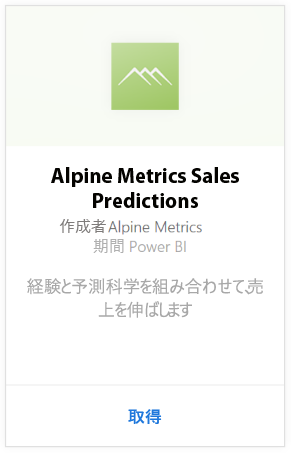
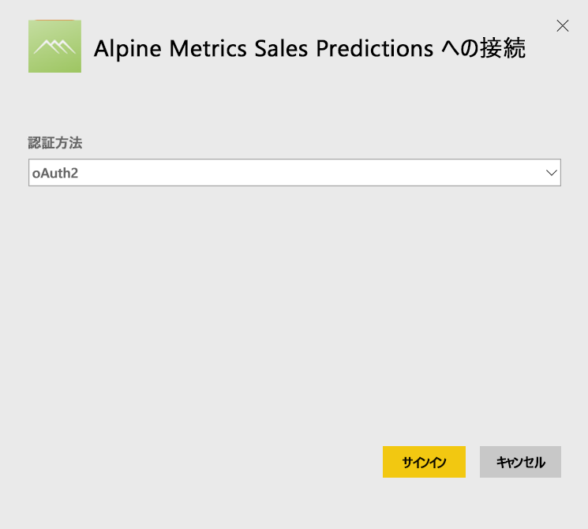
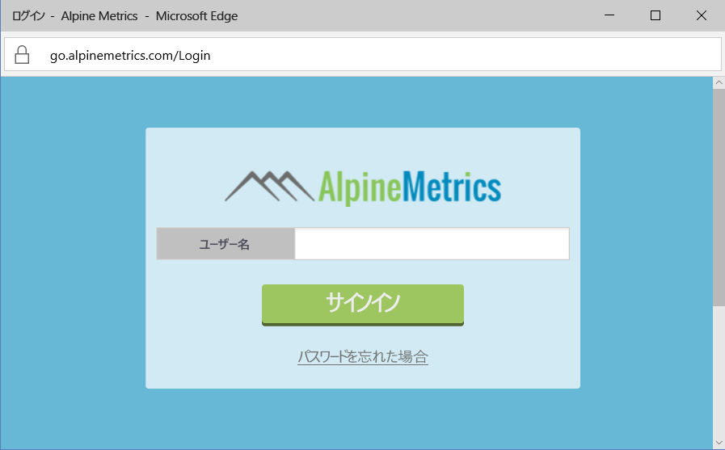
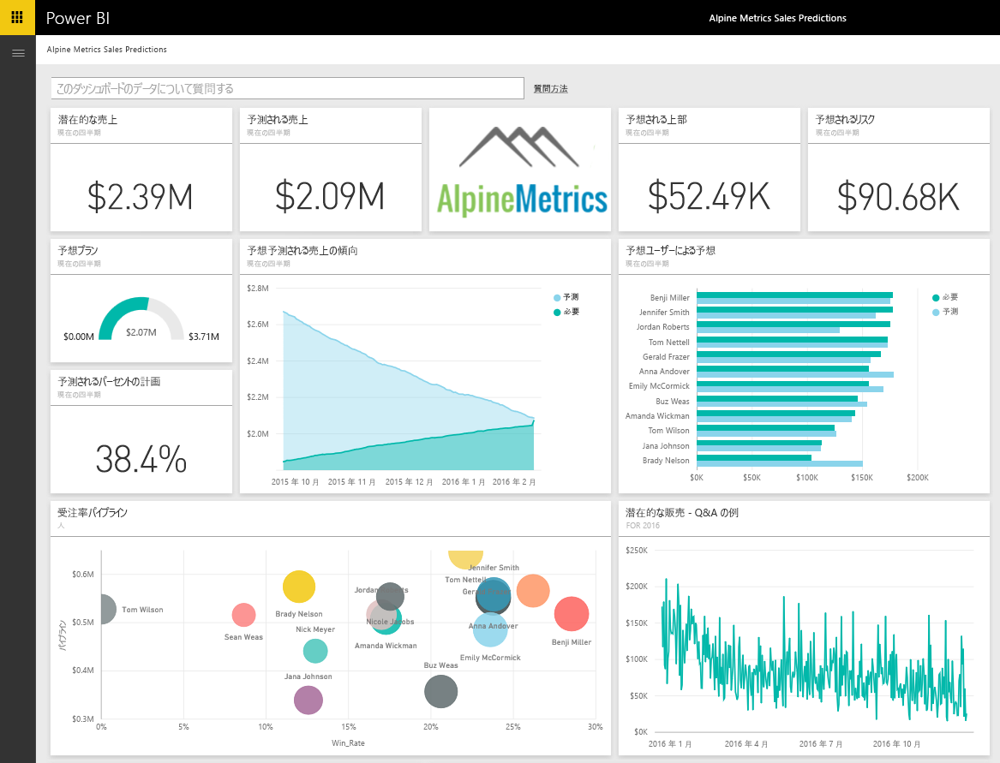

# Power BI で Alpine Metrics Sales Predictions に接続する
Alpine Metrics は、さまざまな規模の販売組織が利用できる、最新の予測販売プロセス最適化をクラウドやオンデマンドで提供します。 Power BI 用 Alpine Metrics Sales Predictions コンテンツ パックには、売上予測や潜在的リスクなどのメトリックが含まれています。これらのメトリックを使用して、ビジネスの将来に関する深い洞察を得ることができます。 

Power BI 用 [Alpine Metrics Sales Predictions コンテンツ パック](https://app.powerbi.com/getdata/services/alpine-metrics)に接続します。

## 接続する方法
1. 左側のナビゲーション ウィンドウの下部にある [データの取得] を選択します。  
   
    
2. **[サービス]** ボックスで、 **[取得]**を選択します。  
   
    
3. **[AlpineMetrics Sales Predictions]** を選択した後、**[取得]** を選択します。  
   
    
4. **[OAuth 2]** を選択し、**[サインイン]** をクリックします。 要求されたら、AlpineMetrics 資格情報を入力します。
   
    
   
    
5. 接続されると、ダッシュボード、レポート、およびデータセットが自動的に読み込まれます。 完了すると、タイルがユーザーのアカウントのデータで更新されます。
   
    

**実行できる操作**

* ダッシュボード上部にある [Q&A ボックスで質問](power-bi-q-and-a.md)してみてください。
* ダッシュボードで[タイルを変更](service-dashboard-edit-tile.md)できます。
* [タイルを選択](service-dashboard-tiles.md)して基になるレポートを開くことができます。
* データセットは毎日更新されるようにスケジュール設定されますが、更新のスケジュールは変更でき、また **[今すぐ更新]** を使えばいつでも必要なときに更新できます。

## 含まれるもの
コンテンツ パックには、次のテーブルのデータが含まれています。  

    - Account    
    - ビジネス    
    - 国    
    - 業界    
    - 営業案件  
    - 人  
    - 予測    
    - 予測履歴    
    - Product  
    - 地域    

## システム要件
このコンテンツ パックをインスタンス化するには、上記のテーブルへのアクセス許可を持つ Alpine Metrics アカウントが必要です。

## 次の手順
[Power BI の概要](service-get-started.md)

[Power BI - 基本的な概念](service-basic-concepts.md)

