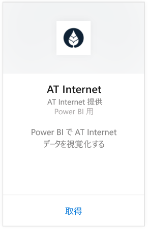
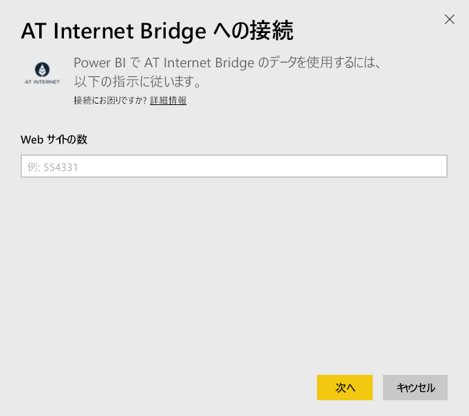
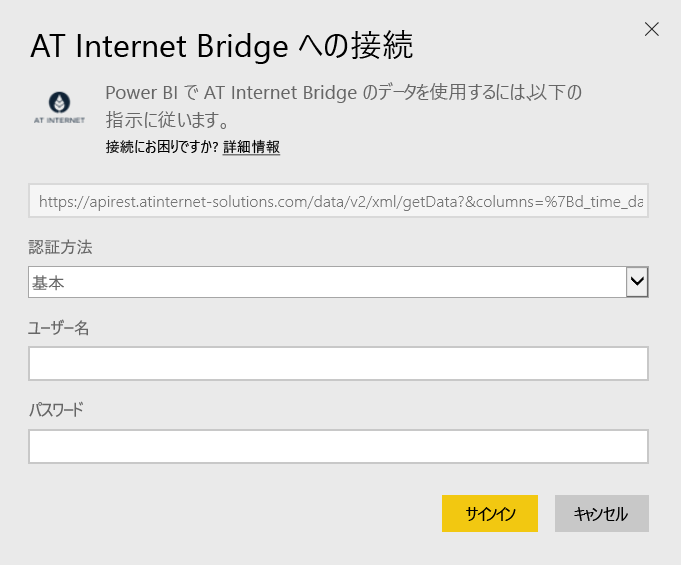

# Power BI で AT Internet Bridge に接続する
AT Internet 社が提供する統合デジタル分析プラットフォーム Analytics Suite を使用すると、データからイミディエイト値を抽出できます。 Power BI 用 AT Internet Bridge コンテンツ パックには、ユーザーのサイトに関する、訪問者、ソース、ローカライズ、およびデバイスのデータが格納されます。

Power BI 用 [AT Internet Bridge コンテンツ パック](https://app.powerbi.com/getdata/services/at-internet-bridge)に接続します。

## 接続する方法
1. 左側のナビゲーション ウィンドウの下部にある **[データの取得]** を選択します。
   
    
2. **[サービス]** ボックスで、 **[取得]** を選択します。
   
    
3. **[AT Internet Bridge]** \> **[取得]** の順に選択します。
   
   
4. 接続先の AT Internet Web サイト番号を指定します。
   
   
5. 認証メカニズムとして **[Basic]** を選択し、AT Internet のユーザー名とパスワードを入力して、 **[サインイン]** をクリックします。
   
   
6. **[接続]** をクリックしてインポート プロセスを開始します。 完了すると、ナビゲーション ウィンドウに、新しいダッシュ ボード、レポート、モデルが表示されます。 インポートされたデータを表示するダッシュボードを選択します。
   
    

**実行できる操作**

* ダッシュボード上部にある [Q&A ボックスで質問](consumer/end-user-q-and-a.md)してみてください。
* ダッシュボードで[タイルを変更](service-dashboard-edit-tile.md)できます。
* [タイルを選択](consumer/end-user-tiles.md)して基になるレポートを開くことができます。
* データセットは毎日更新するようにスケジュール設定されますが、更新のスケジュールは変更でき、また **[今すぐ更新]** を使えばいつでも必要なときに更新できます。

## 含まれるもの
このコンテンツ パックには、次の表に、過去 45 日間のデータが含まれています。  

    - 変換  
    - デバイス  
    - ローカライズ  
    - ソース  
    - グローバル アクセス  

## 次の手順
[Power BI とは?](power-bi-overview.md)

[Power BI - 基本的な概念](consumer/end-user-basic-concepts.md)

