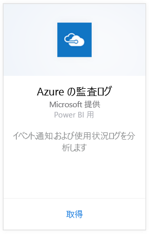
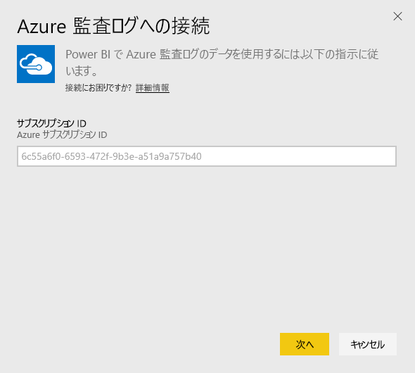
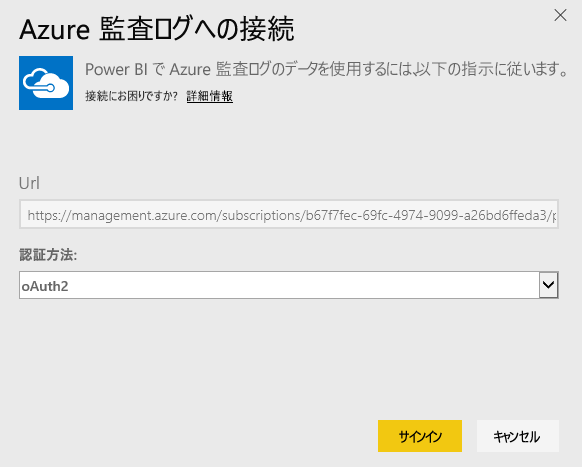
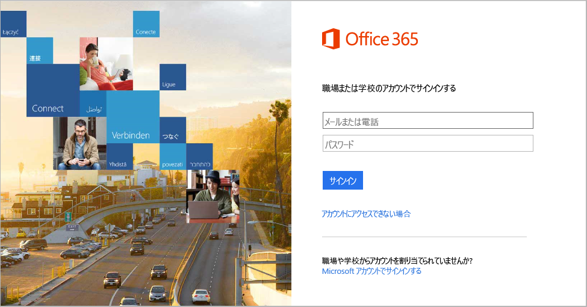
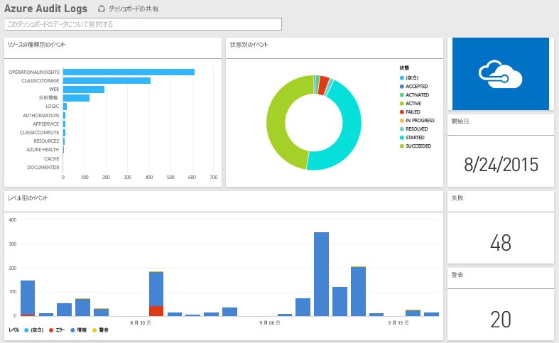

# Power BI で Azure 監査ログに接続する
Azure 監査ログのコンテンツ パックを利用して、監査ログに格納されている情報を分析したり、視覚化したりすることができます。 Power BI は、データを取得し、そのまま使えるダッシュボードをビルドし、取得したデータに基づくレポートを作成します。

[Azure 監査ログのコンテンツ パック](https://app.powerbi.com/getdata/services/azure-audit-logs)に接続するか、Power BI と [Azure 監査ログとの統合](https://powerbi.microsoft.com/integrations/azure-audit-logs)について詳細をお読みください。

## 接続する方法
1. 左側のナビゲーション ウィンドウの下部にある **[データの取得]** を選択します。  
   
    
2. **[サービス]** ボックスで、 **[取得]**を選択します。  
   
     
3. **[Azure 監査ログ]** > **[取得]** の順に選択します。  
   
   
4. プロンプトが表示されたら、 **Azure サブスクリプション ID**を入力します。 [サブスクリプション ID](#FindingParams) を確認する方法について詳しくは、以下をご覧ください。   
   
    
5. **[認証方法]** として**[oAuth2]** を選択し、**[サイン イン]** をクリックします。
   
    
6. アカウントの資格情報を入力して、サインイン プロセスを終了します。
   
    
7. Power BI は、Azure 監査ログのデータを取得して、すぐに使用できるダッシュボードとレポートを作成します。 
   
    

**実行できる操作**

* ダッシュボード上部にある [Q&A ボックスで質問](service-q-and-a.md)してみてください。
* ダッシュボードで[タイルを変更](service-dashboard-edit-tile.md)できます。
* [タイルを選択](service-dashboard-tiles.md)して基になるレポートを開くことができます。
* データセットは毎日更新されるようにスケジュール設定されますが、更新のスケジュールは変更でき、また **[今すぐ更新]** を使えばいつでも必要なときに更新できます。

## システム要件
Azure 監査ログのコンテンツ パックには、Azure Portal の監査ログへのアクセスが必要です。 詳しくは、[ここ](https://azure.microsoft.com/en-us/documentation/articles/insights-debugging-with-events/)をご覧ください。

## パラメーターの見つけ方
サブスクリプション ID を確認するには、2 つの簡単な方法があります。

1. https://portal.azure.com から &gt; [参照] -&gt; [サブスクリプション] -&gt; [サブスクリプション ID]
2. https://manage.windowsazure.com から -&gt; [設定] -&gt; [サブスクリプション ID]

サブスクリプション ID は数字や文字の長いセットで、上記の手順 \#4 の例のようになります。 

## トラブルシューティング
資格情報エラーまたは、更新しようとして資格情報が正しくないためにエラーが表示される場合は、Azure 監査ログのコンテンツ パックのすべてのインスタンスを削除し、再接続してみてください。

## 次の手順
[Power BI の概要](service-get-started.md)  
[Power BI - 基本的な概念](service-basic-concepts.md)  

