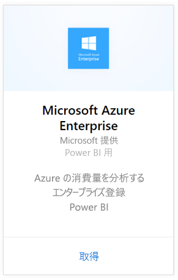
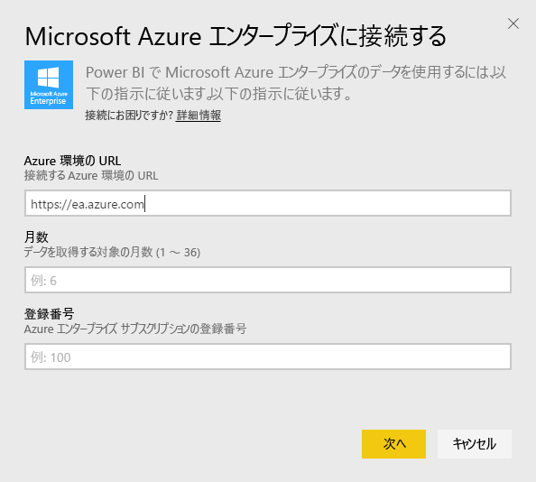
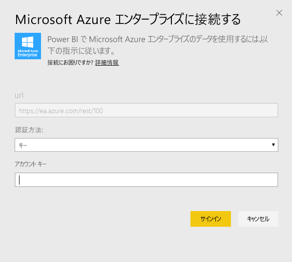
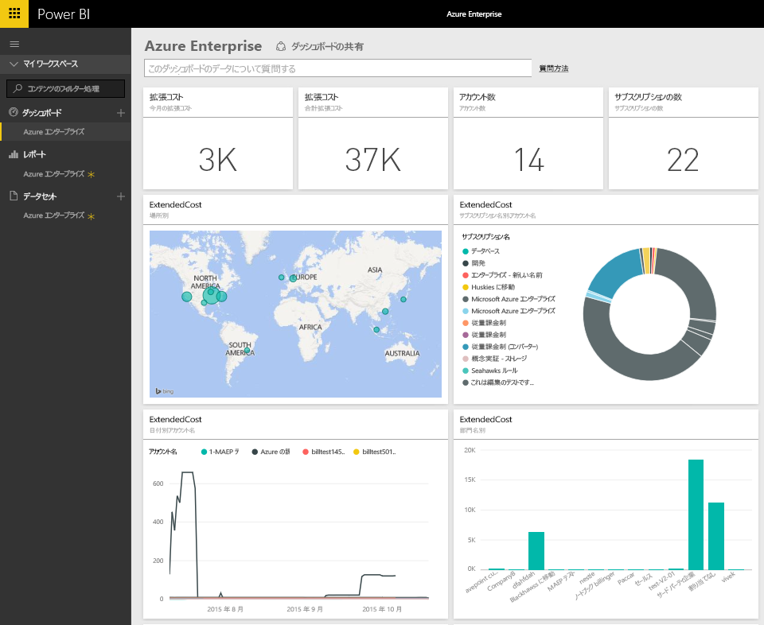
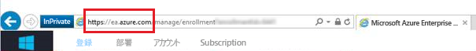
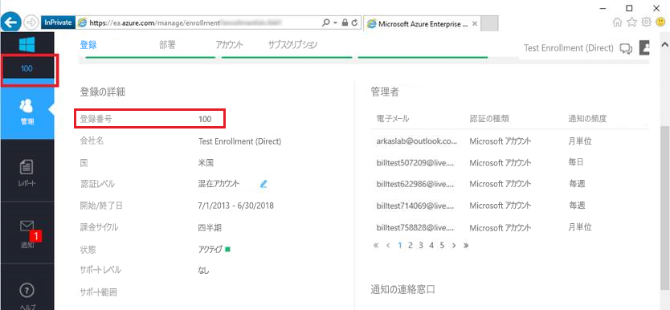
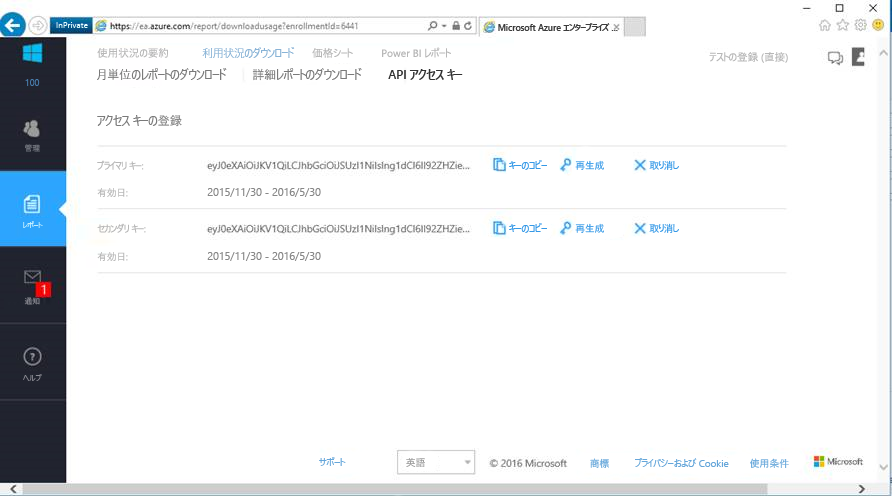

# Power BI で Microsoft Azure エンタープライズに接続する
Power BI コンテンツ パックを使用すると Power BI で Microsoft Azure Enterprise のデータを調べて監視できます。 データは、1 日 1 回自動的に更新されることになります。

Power BI 用 [Microsoft Azure Enterprise コンテンツ パック](https://app.powerbi.com/getdata/services/azure-enterprise)に接続します。

## 接続する方法
1. 左側のナビゲーション ウィンドウの下部にある **[データの取得]** を選択します。
   
    
2. **[サービス]** ボックスで、 **[取得]** を選択します。
   
   
3. **[Microsoft Azure Enterprise]** \> **[取得]** の順に選択します。
   
   
4. Azure 環境の URL、インポートするデータの月数、Azure Enterprise 登録番号を指定します。 Azure 環境の URL は `https://ea.azure.com` または `https://ea.windowsazure.cn` です。 [これらのパラメーターの見つけ方](#FindingParams)について詳しくは、後述します。
   
    
5. 接続するためのアクセス キーを指定します。 登録のキーは、Azure EA ポータルでわかります。
   
    
6. インポート処理が自動的に開始されます。 完了すると、ナビゲーション ウィンドウに、新しいダッシュ ボード、レポート、モデルが表示されます。 インポートされたデータを表示するダッシュボードを選択します。
   
   

**実行できる操作**

* ダッシュボード上部にある [Q&A ボックスで質問](power-bi-q-and-a.md)してみてください。
* ダッシュボードで[タイルを変更](service-dashboard-edit-tile.md)できます。
* [タイルを選択](service-dashboard-tiles.md)して基になるレポートを開くことができます。
* データセットは毎日更新されるようにスケジュール設定されますが、更新のスケジュールは変更でき、また **[今すぐ更新]** を使えばいつでも必要なときに更新できます。

## 含まれるもの
Azure Enterprise コンテンツ パックには、接続フローで指定した月の範囲の月単位のレポート データが含まれています。 この範囲の期間は移動するので、データセットが更新されると、含まれる日付も更新されます。

## システム要件
コンテンツ パックは、Azure Portal 内のエンタープライズ機能にアクセスする必要があります。

## パラメーターの見つけ方
課金情報を見ることができる EA の直接のお客様、パートナー、間接のお客様は、Power BI レポートを利用できます。 接続フローで期待される各値の詳細については以下を参照してください。

**Azure 環境の URL**

* この値は通常 https://ea.azure.com ですが、サインインした後で URL を調べて確認できます。
  
    

**月数**

* これは、インポートするデータの (当日からの) 月数を表す 1 ～ 36 の値です。

**登録番号**

* これは、Azure Enterprise の登録番号です。この番号は [Azure Enterprise Portal](https://ea.azure.com/) のホーム画面の \[Enrollment Detail] \(登録の詳細) で確認できます。
  
    

**アクセス キー**

* キーは、Azure Enterprise ポータルの [利用状況のダウンロード] の [API アクセス キー] でわかります。
  
    

**追加のヘルプ**

* Azure Enterprise Power BI パックを設定する追加のヘルプを表示するには、Azure Enterprise Portal にログインし、[ヘルプ] で API ヘルプ ファイルを表示し、[レポート]-> [利用状況のダウンロード]-> [API アクセス キー] と選択して詳細な説明を参照します。

## 次の手順
[Power BI の概要](service-get-started.md)

[Power BI でデータを取得する](service-get-data.md)

