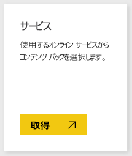
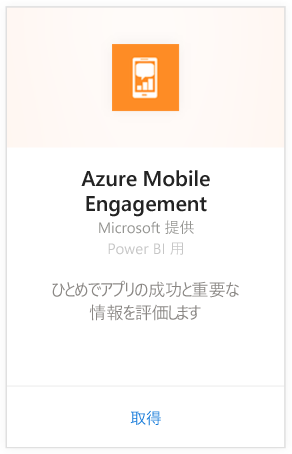
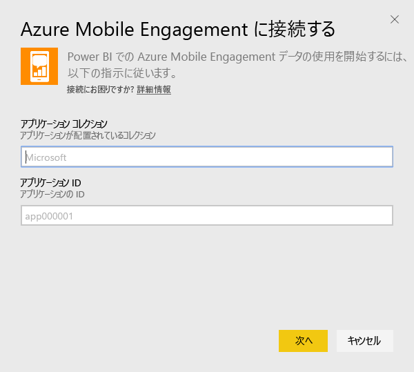
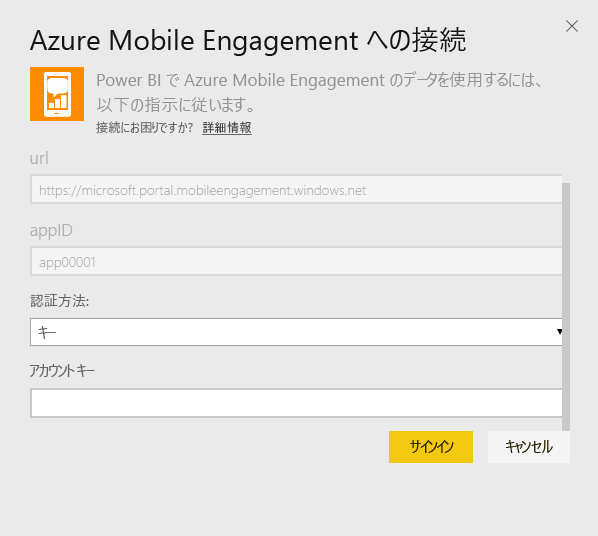
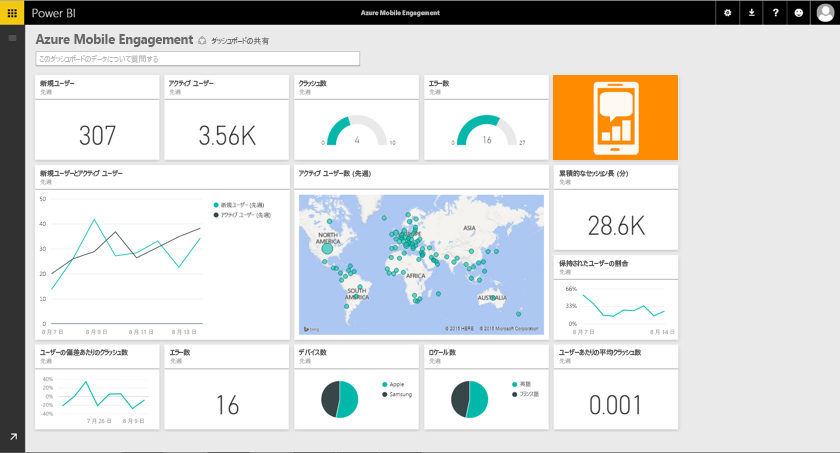

# Power BI で Azure Mobile Engagement に接続する
Power BI Azure Mobile Engagement コンテンツ パックを使用すると、短時間でアプリ データの情報を得られます。

Power BI 用 [Azure Mobile Engagement コンテンツ パック](https://app.powerbi.com/groups/me/getdata/services/azme)に接続します。

## 接続する方法
1. 左側のナビゲーション ウィンドウの下部にある **[データの取得]** を選択します。
   
    
2. **[サービス]** ボックスで、 **[取得]** を選択します。
   
    
3. **[Azure Mobile Engagement]** \> **[取得]** を選択します。
   
     
4. アプリのコレクションとアプリ名を指定します。 この情報は、Azure Mobile Engagement アカウントにあります。
   
     
5. [認証方式] で、キーを入力し、[サインイン] をクリックします。
   
    
6. Power BI によるデータのインポート後、新しいダッシュ ボード、レポート、データセットが左側のナビゲーション ウィンドウに表示されます。 新しい項目は、黄色のアスタリスク (\*) でマークされます。このアスタリスクは、選択すると非表示になります。
   
    

 **実行できる操作**

* ダッシュボード上部にある [Q&A ボックスで質問](power-bi-q-and-a.md)してみてください。
* ダッシュボードで[タイルを変更](service-dashboard-edit-tile.md)できます。
* [タイルを選択](service-dashboard-tiles.md)して基になるレポートを開くことができます。
* データセットは毎日更新されるようにスケジュール設定されますが、更新のスケジュールは変更でき、また **[今すぐ更新]** を使えばいつでも必要なときに更新できます。

## 次の手順
[Power BI の概要](service-get-started.md)

[Power BI でデータを取得する](service-get-data.md)

