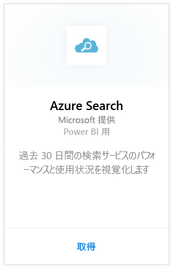
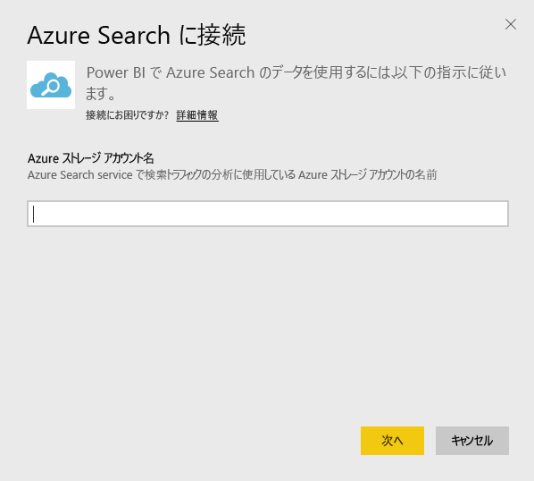
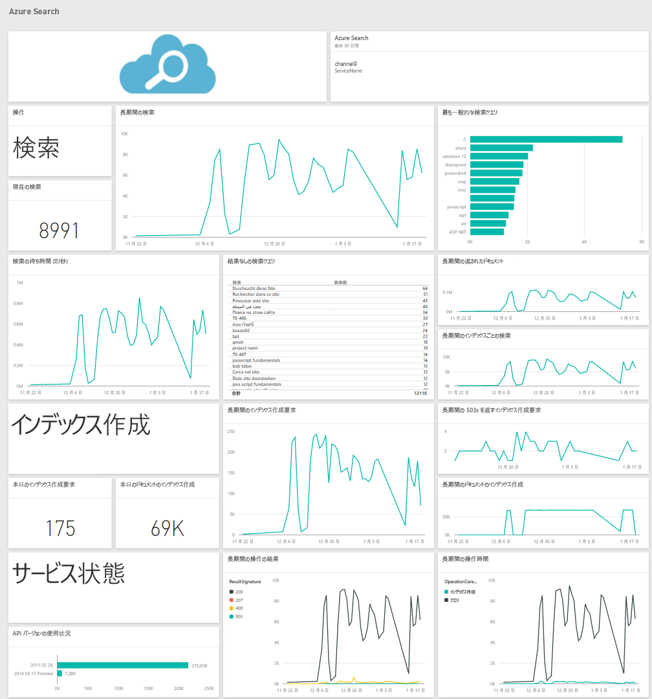

# Power BI で Azure Search に接続する
Azure Search のトラフィック分析を使うと、Azure Search サービスへのトラフィックを監視し、把握できます。 Power BI 用の Azure Search コンテンツ パックは、過去 30 日間の検索、インデックス作成、サービス統計情報、待機時間など、検索データの詳細な洞察を提供します。 詳細については、[Azure のブログ投稿](https://azure.microsoft.com/en-us/blog/analyzing-your-azure-search-traffic/)をご覧ください。

Power BI 用 [Azure Search コンテンツ パック](https://app.powerbi.com/getdata/services/azure-search)に接続します。

## 接続する方法
1. 左側のナビゲーション ウィンドウの下部にある **[データの取得]** を選択します。
   
    
2. **[サービス]** ボックスで、 **[取得]**を選択します。
   
    
3. **[Azure Search]** \> **[取得]** を選択します。
   
   
4. Azure Search 分析が格納されているテーブル ストレージ アカウントの名前を指定します。
   
   
5. 認証メカニズムとして **[キー]** を選び、ストレージ アカウント キーを指定します。 **[サインイン]** をクリックして、読み込みプロセスを開始します。
   
   
6. 読み込みが完了すると、新しいダッシュボード、レポート、モデルがナビゲーション ウィンドウに表示されます。 インポートされたデータを表示するダッシュボードを選択します。
   
    

**実行できる操作**

* ダッシュボード上部にある [Q&A ボックスで質問](power-bi-q-and-a.md)してみてください。
* ダッシュボードで[タイルを変更](service-dashboard-edit-tile.md)できます。
* [タイルを選択](service-dashboard-tiles.md)して基になるレポートを開くことができます。
* データセットは毎日更新されるようにスケジュール設定されますが、更新のスケジュールは変更でき、また **[今すぐ更新]** を使えばいつでも必要なときに更新できます。

## システム要件
Azure Search コンテンツ パックを使うには、Azure Search のトラフィック分析をアカウントで有効にする必要があります。

## トラブルシューティング
ストレージ アカウント名とフル アクセス キーを正しく指定したことを確認します。 ストレージ アカウント名は、Azure Search のトラフィック分析機能を構成したアカウントに対応している必要があります。

## 次の手順
[Power BI の概要](service-get-started.md)

[Power BI - 基本的な概念](service-basic-concepts.md)

