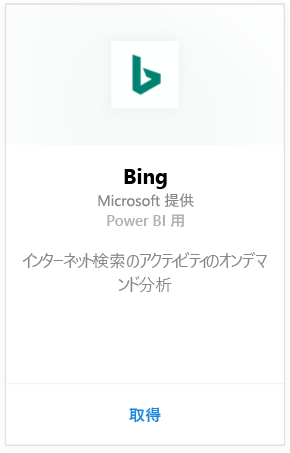
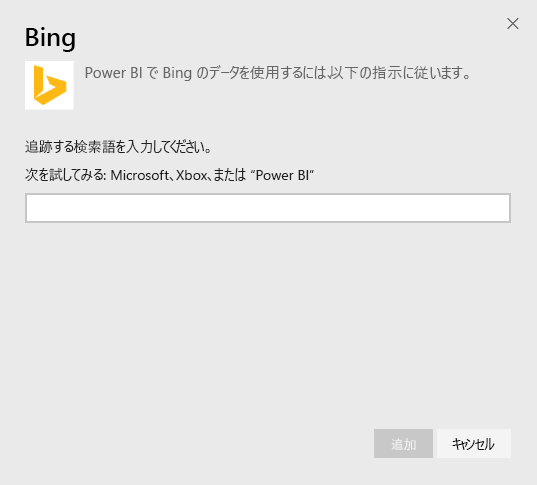
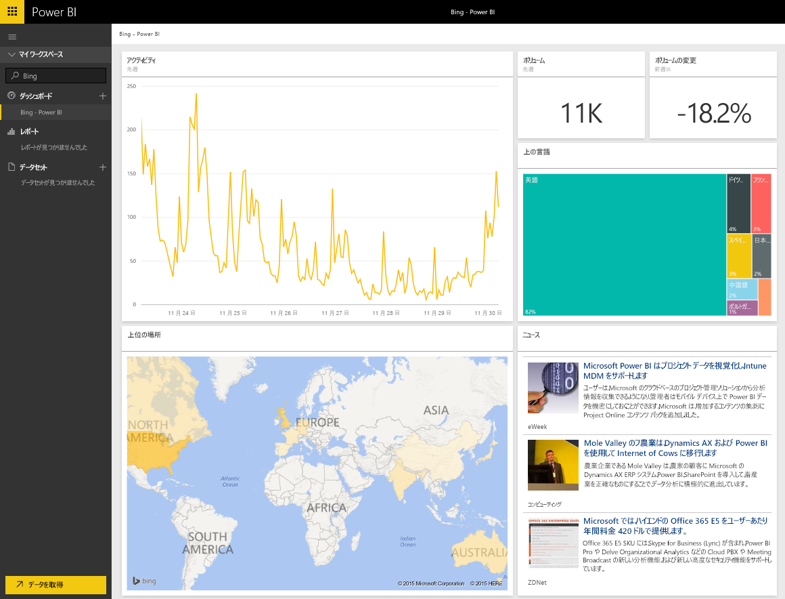

# Power BI で Bing に接続する
Bing コンテンツ パックを使用すると、任意の用語について、インターネット検索の利用状況に関する分析結果を表示できます。

Power BI 用 [Bing コンテンツ パック](https://app.powerbi.com/groups/me/getdata/services/bing) に接続します。

>[!NOTE]
>Bing タイルは約 5 分ごとに自動更新され、選択可能な唯一のタイルであるニュース タイルには、対応するニュース記事が表示されます。 

>[!NOTE]
>Bing コンテンツ パックから取得されるタイルは、モバイル アプリケーションでは表示されません。 現在、この問題の解決に取り組んでいます。

1. 左側のナビゲーション ウィンドウの下部にある **[データの取得]** を選択します。
   
    
2. **[サービス]** ボックスで、 **[取得]**を選択します。
   
    
3. **[Bing]** > **[取得]** の順に選択します。
   
    
4. [パラメーター] ダイアログ ボックスで、追跡する検索用語を入力して、[追加] をクリックします。
   
        
5. 左側のダッシュボード一覧に、Bing という名前の新しいエントリと、指定した検索用語が表示されます。 このダッシュボードに関連付けられているデータセットやレポートはありません。 タイルの読み込みにはしばらく時間がかかることがありますが、読み込みが完了すると、下図のようなレイアウトが表示されます。
   
    

読み込みが完了すると、データの調査を開始できます。このダッシュボードから自身のアカウントの他のダッシュボードに、タイルをピン留めすることもできます。

