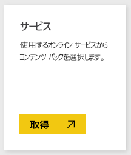
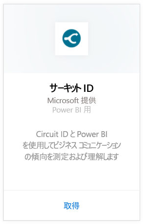
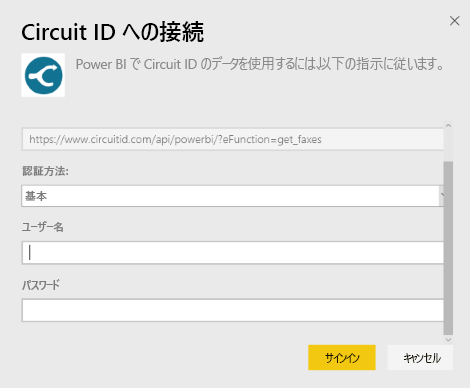
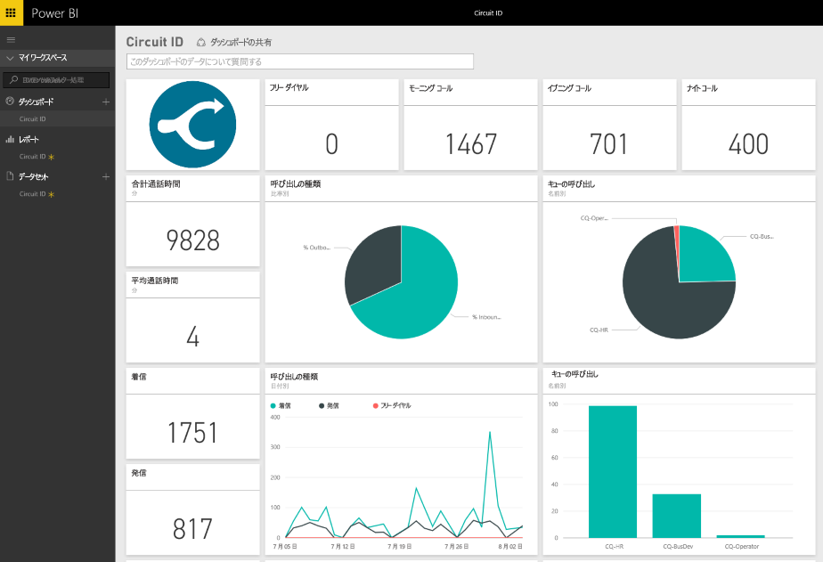

# Power BI で Circuit ID に接続する
Circuit ID からの通信データの分析は、Power BI を使えば簡単に行えます。 Power BI は、データを取得し、そのデータに基づいて既定のダッシュボードと関連レポートを作成します。 接続すると、データの探索や、必要に応じたダッシュボードのカスタマイズを行えます。 データは毎日自動的に更新されます。

Power BI 用 [Circuit ID コンテンツ パック](https://app.powerbi.com/getdata/services/circuitid)に接続します。

## 接続する方法
1. 左側のナビゲーション ウィンドウの下部にある **[データの取得]** を選択します。
   
    
2. **[サービス]** ボックスで、 **[取得]** を選択します。
   
    
3. **[Circuit ID]** \> **[接続]** の順に選択します。
   
    
4. [認証方式] で、[Basic] を選択し、ユーザー名とパスワードを入力します。 続いて、[サインイン] をクリックします。
   
    
5. Power BI によるデータのインポート後、新しいダッシュ ボード、レポート、データセットが左側のナビゲーション ウィンドウに表示されます。 新しい項目には黄色のアスタリスクでマークが付けられます。
   
    

**実行できる操作**

* ダッシュボード上部にある [Q&A ボックスで質問](consumer/end-user-q-and-a.md)してみてください。
* ダッシュボードで[タイルを変更](service-dashboard-edit-tile.md)できます。
* [タイルを選択](consumer/end-user-tiles.md)して基になるレポートを開くことができます。
* データセットは毎日更新するようにスケジュール設定されますが、更新のスケジュールは変更でき、また **[今すぐ更新]** を使えばいつでも必要なときに更新できます。

## 次の手順
[Power BI とは?](power-bi-overview.md)

[Power BI のデータの取得](service-get-data.md)

