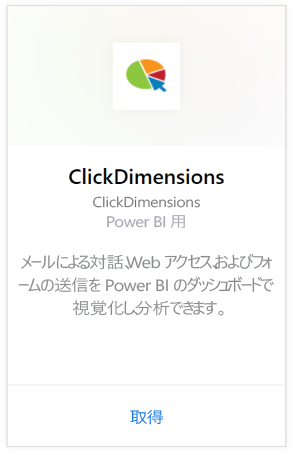
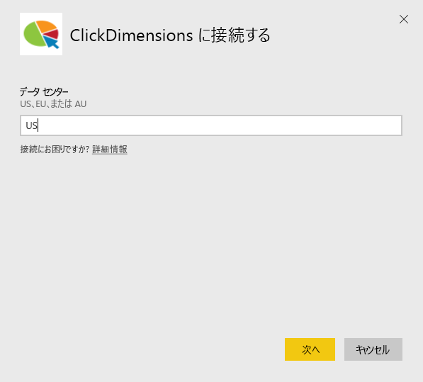
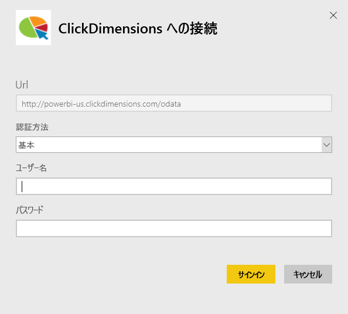
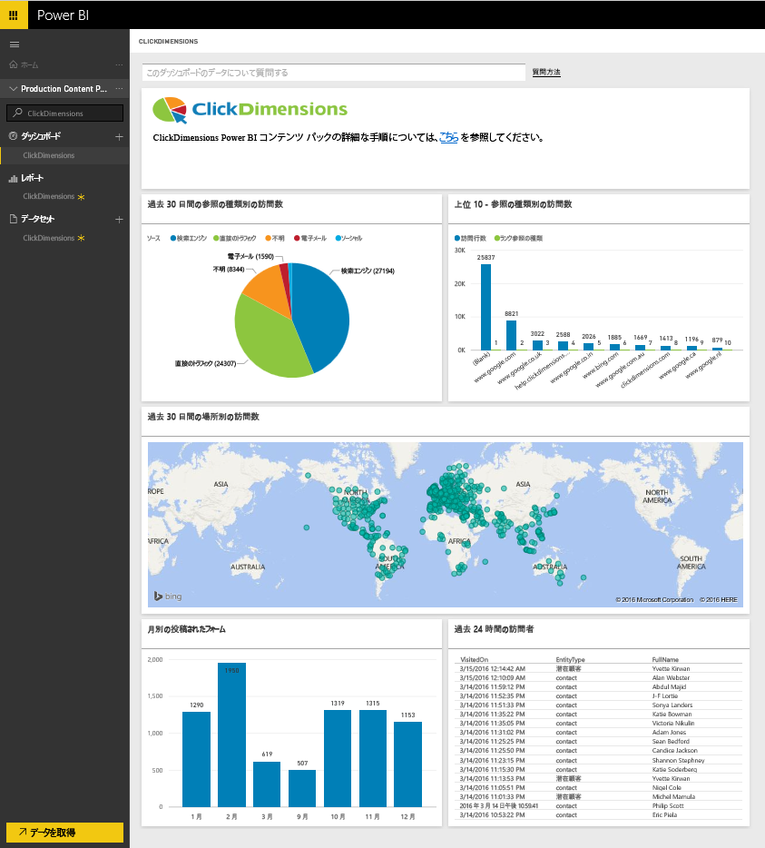
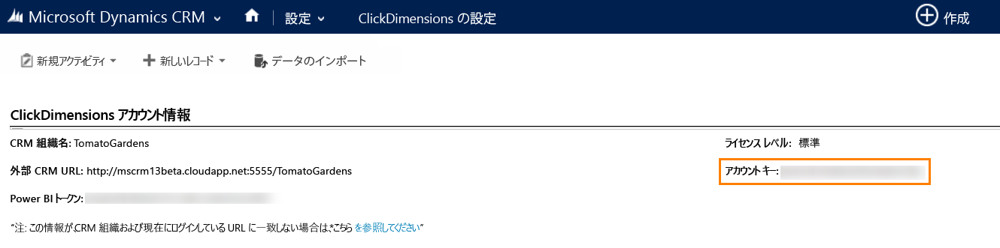
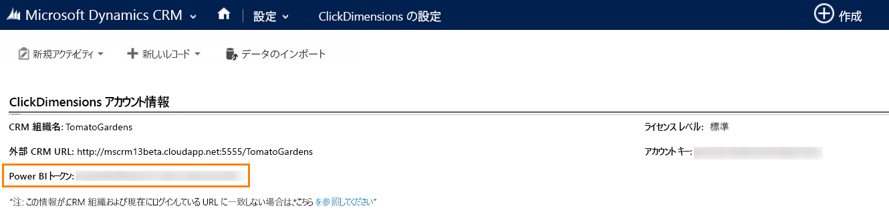

# Power BI で ClickDimensions に接続する
Power BI 用 ClickDimensions コンテンツ パックを使用すると、ClickDimensions マーケティング データを Power BI で利用して、管理チームが営業およびマーケティングの成果を把握することができます。 メールによる対話、Web アクセス、およびフォームの送信を Power BI のダッシュボードとレポートで視覚化し、分析できます。

Power BI 用 [ClickDimensions コンテンツ パック](https://app.powerbi.com/getdata/services/click-dimensions)に接続します。

## 接続する方法
1. 左側のナビゲーション ウィンドウの下部にある **[データの取得]** を選択します。
   
   
2. **[サービス]** ボックスで、 **[取得]** を選択します。
   
   
3. **[ClickDimensions]** \> **[取得]** の順に選択します。
   
   
4. データ センターの場所 (US、EU、または AU) を入力し、**[次へ]** を選択します。
   
   
5. **[認証方法]** として **[基本]** を選択し、**[サイン イン]** をクリックします。 要求されたら、ClickDimensions 資格情報を入力します。 [これらのパラメーターの見つけ方](#FindingParams)について詳しくは、後述します。
   
    
6. 承諾後、インポート処理が自動的に開始されます。 完了すると、ナビゲーション ウィンドウに、新しいダッシュ ボード、レポート、モデルが表示されます。 インポートされたデータを表示するダッシュボードを選択します。
   
     

**実行できる操作**

* ダッシュボード上部にある [Q&A ボックスで質問](power-bi-q-and-a.md)してみてください。
* ダッシュボードで[タイルを変更](service-dashboard-edit-tile.md)できます。
* [タイルを選択](service-dashboard-tiles.md)して基になるレポートを開くことができます。
* データセットは毎日更新されるようにスケジュール設定されますが、更新のスケジュールは変更でき、また **[今すぐ更新]** を使えばいつでも必要なときに更新できます。

## システム要件
Power BI コンテンツ パックに接続するには、アカウントに対応するデータ センターを指定し、ClickDimensions アカウントでログインする必要があります。 指定するデータ センターがわからない場合は、管理者に問い合わせてください。

## パラメーターの見つけ方
アカウント キーは、CRM の [設定] の [ClickDimensions 設定] で確認できます。 [ClickDimensions 設定] に表示されたアカウント キーをコピーし、[ユーザー名] ボックスに貼り付けます。  

  

[ClickDimensions 設定] に表示された Power BI トークンをコピーし、[パスワード] ボックスに貼り付けます。 Power BI トークンは、CRM の [設定] の [ClickDimensions 設定] で確認できます。  

  

## 次の手順
[Power BI の概要](service-get-started.md)

[Power BI でデータを取得する](service-get-data.md)

