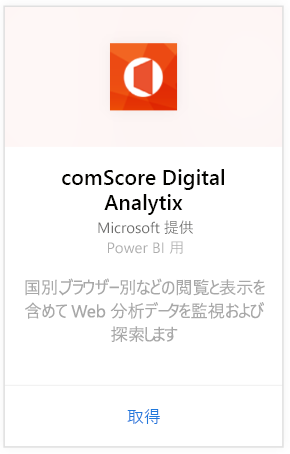
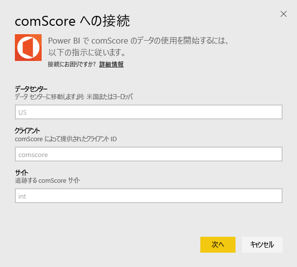
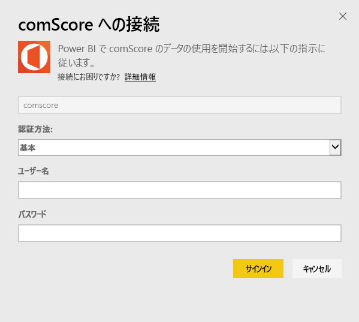
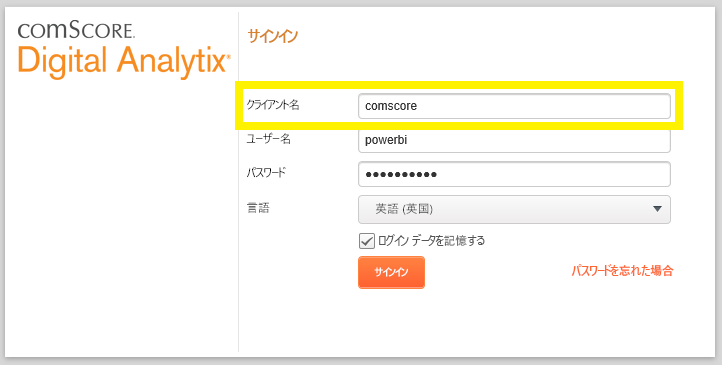
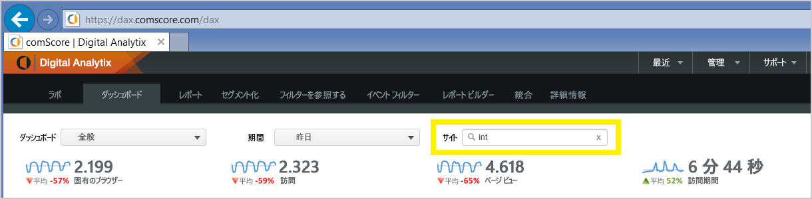

# Power BI で comScore Digital Analytix に接続する
Power BI コンテンツ パックを使用して、Power BI 内の comScore Digital Analytix データを表示および探索します。 データは、1 日 1 回自動的に更新されることになります。

[Power BI 用 comScore コンテンツ パック](https://app.powerbi.com/getdata/services/comscore)に接続します。

>[!NOTE]
>コンテンツ パックに接続するには、comScore DAx ユーザー アカウントが必要で、comScore API にアクセスできる必要があります。 [詳細](#Requirements)は、以下を参照してください。

## 接続する方法
1. 左側のナビゲーション ウィンドウの下部にある [データの取得] を選択します。
   
   
2. **[サービス]** ボックスで、 **[取得]** を選択します。
   
   
3. **[comScore Digital Analytix]** \> **[取得]** の順に選択します。
   
   
4. 接続先のデータセンター、comScore Client ID、およびサイトを入力します。 これらの値の検索方法の詳細については、以下の[comScore パラメーターの検索方法](#FindingParams)を参照してください。
   
   
5. comScore のユーザー名とパスワードを入力して接続します。 この値の検索の詳細については、以下を参照してください。
   
   
6. インポート処理が自動的に開始されます。 完了すると、ナビゲーション ウィンドウに、新しいダッシュ ボード、レポート、モデルが表示されます。 インポートされたデータを表示するダッシュボードを選択します。

**実行できる操作**

* ダッシュボード上部にある [Q&A ボックスで質問](consumer/end-user-q-and-a.md)してみてください。
* ダッシュボードで[タイルを変更](service-dashboard-edit-tile.md)できます。
* [タイルを選択](consumer/end-user-tiles.md)して基になるレポートを開くことができます。
* データセットは毎日更新するようにスケジュール設定されますが、更新のスケジュールは変更でき、また **[今すぐ更新]** を使えばいつでも必要なときに更新できます。

## システム要件
接続するには、comScore DAx ユーザー アカウントと comScore DAx API へのアクセス権限が必要です。 アカウントについては、comScore DAx の管理者にお問い合わせください。

## パラメーターの見つけ方
各 comScore パラメーターの検索方法の詳細は以下のとおりです。

**データ センター**

接続先のデータ センターは、comScore で移動する URL によって決定されます。

 

**クライアント**

クライアントは、comScore DAx へのサインイン時に指定したものと同じです。

 

**サイト**

comScore サイトでは、データの表示元のサイトを決定します。 comScore アカウントからサイトの一覧が表示されます。

## 次の手順
[Power BI の概要](service-get-started.md)

[Power BI でデータを取得する](service-get-data.md)

