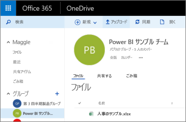
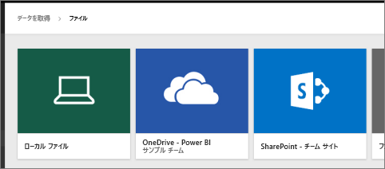
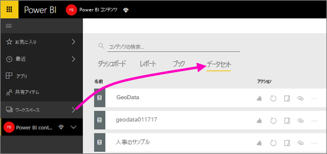
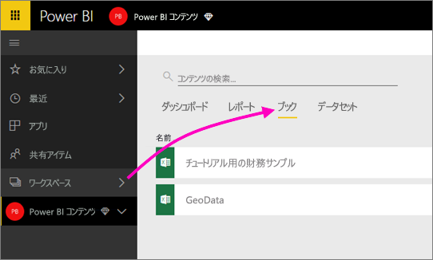

# Power BI アプリ ワークスペースの OneDrive に保存されているファイルに接続する
[Power BI にアプリ ワークスペースを作成](service-create-distribute-apps.md)した後、Excel、CSV、Power BI Desktop などのファイルを Power BI アプリ ワークスペースの OneDrive for Business に保存できるようになりました。 OneDrive に保存したファイルは引き続き更新可能で、それらのファイルに基づく Power BI レポートやダッシュボードに更新が自動的に適用されます。 

アプリ ワークスペースへのファイルの追加は、次の 2 つの手順で行います。 

1. まず、アプリ ワークスペースの [OneDrive for Business にファイルをアップロード](service-connect-to-files-in-app-workspace-onedrive-for-business.md#1-upload-files-to-the-onedrive-for-business-for-your-app-workspace)します。
2. 次に、[アップロードしたファイルに Power BI から接続](service-connect-to-files-in-app-workspace-onedrive-for-business.md#2-import-excel-files-as-datasets-or-as-excel-online-workbooks)します。

> [!NOTE]
> アプリ ワークスペースは、[Power BI Pro](service-free-vs-pro.md) でのみ利用できます。
> 
> 

## 1 アプリ ワークスペースの OneDrive for Business にファイルをアップロードする
1. Power BI サービスで、[ワークスペース] の横にある矢印を選択し、目的のワークスペース名の隣にある省略記号 (**…**) を選択します。 
   
   
2. **[ファイル]** を選択し、Office 365 のアプリ ワークスペースの OneDrive for Business を開きます。
   
   > [!NOTE]
   > アプリ ワークスペース メニューに **[ファイル]** が表示されない場合は、**[メンバー]** を選択してアプリ ワークスペースの OneDrive for Business を開きます。 そこで、 **[ファイル]** を選びます。 Office 365 で、アプリのグループ ワークスペース ファイルの OneDrive ストレージの場所が作成されます。 この処理には時間がかかる場合があります。 
   > 
   > 
3. ここで、アプリ ワークスペースの OneDrive for Business にファイルをアップロードすることができます。 **[アップロード]** を選び、ファイルに移動します。
   
   

## 2 Excel ファイルをデータセットまたは Excel Online のブックとしてインポートする
ファイルがアプリ ワークスペースの OneDrive for Business に保存されたので、選択肢ができました。 次の操作を実行できます。 

* [Excel ブックからデータセットとしてデータをインポート](service-get-data-from-files.md)し、そのデータを使用してレポートやダッシュボードを作成します。これらのデータは、Web ブラウザーやモバイル デバイスで表示できます。
* または、[Power BI で Excel ブック全体に接続](service-excel-workbook-files.md)し、Excel Online で表示されるのと同じようにブックを表示します。

### アプリ ワークスペースへのインポートまたはファイルへの接続
1. Power BI で、アプリ ワークスペースに切り替えると、アプリ ワークスペース名が左上に表示されます。 
2. 左側のナビゲーション ウィンドウの下部にある **[データの取得]** を選択します。 
   
   
3. **[ファイル]** ボックスで、 **[取得]** を選択します。
   
   
4. **[OneDrive]** - *[<アプリ ワークスペース名>]* を選択します。
   
    
5. 必要なファイルを選び、**接続**します。
   
    ここで、[Excel ブックからデータをインポートする](service-get-data-from-files.md)か、[Excel ブック全体に接続する](service-excel-workbook-files.md)かどうかを決定します。
6. **[インポート]** または **[接続]** を選びます。
   
    
7. **[インポート]** を選択した場合、**[データセット]** タブにブックが表示されます。 
   
    
   
    **[接続]** を選択した場合、**[ブック]** タブにブックが表示されます。
   
    

## 次の手順
* [Power BI でアプリとアプリ ワークスペースを作成する](service-create-distribute-apps.md)
* [Excel ブックからデータをインポートする](service-get-data-from-files.md)
* [Excel ブック全体に接続する](service-excel-workbook-files.md)
* 他にわからないことがある場合は、 [Power BI コミュニティを利用してください](http://community.powerbi.com/)。
* フィードバックがある場合は、 「[Power BI Ideas](https://ideas.powerbi.com/forums/265200-power-bi)」 (Power BI に関するヒント) を参照してください。

