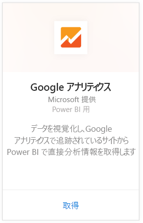
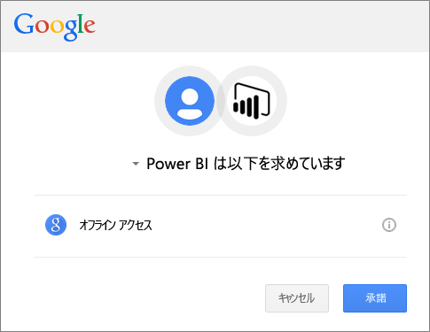
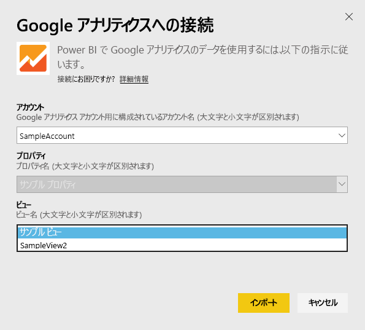
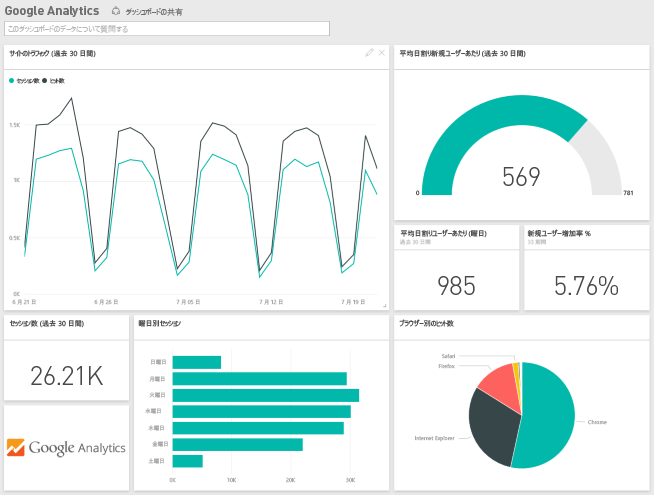
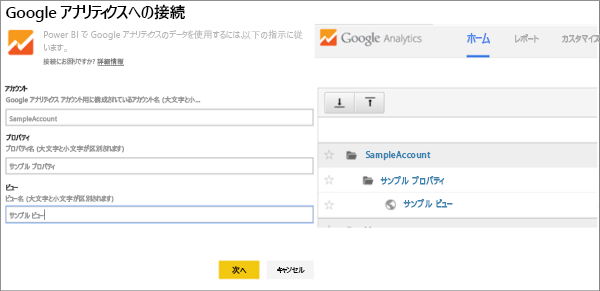

# Power BI で Google Analytics に接続する
Power BI で Google アナリティクスに接続するには、最初に Google アナリティクス アカウントに接続します。 Power BI ダッシュ ボードと一連の Power BI レポートが表示され、お客様のサイト トラフィックとユーザー ディメンションに関する詳細情報が提供されます。 ダッシュボードとレポートは操作できますが、変更内容は保存できません。 データは、1 日 1 回自動的に更新されることになります。

Power BI 用 [Google Analytics](https://app.powerbi.com/getdata/services/google-analytics) に接続します。 Power BI と Google アナリティクスの統合については[こちら](https://powerbi.microsoft.com/integrations/google-analytics)をご覧ください。

Power BI Desktop では、[Google アナリティクス コネクタ](service-google-analytics-connector.md)を開始点として、カスタマイズされたダッシュボードとレポートを作成できます。 Google アナリティクス アカウントに接続するだけで独自のレポートを作成し、Power BI サービスに公開できます。

## 接続する方法
[!INCLUDE [powerbi-service-apps-get-more-apps](./includes/powerbi-service-apps-get-more-apps.md)]

3. **[Google Analytics]** \> **[取得]** の順に選択します。
   
   
4. メッセージが表示されたら、Google アナリティクス資格情報を入力します。 認証方法として **[oAuth 2]** を選択し、**[サインイン]** をクリックします。 Google の認証フローに従います。2 段階認証を構成した場合には、それに従います。
   
   
5. **[承諾]** をクリックし、Power BI が Google アナリティクス データにアクセスできるようにします。
   
   
6. Power BI は、特定の Google アナリティクス ビューに接続します。 接続するアカウント名、プロパティ名、およびビュー名を選択します。 この情報は、Google アナリティクス アカウントの左上または **[ホーム]** タブで確認できます。以下で詳細を確認してください。 
   
   
5. **[接続]** をクリックしてインポート プロセスを開始します。 

## Google アナリティクスのダッシュボードとレポートを表示する
[!INCLUDE [powerbi-service-apps-open-app](./includes/powerbi-service-apps-open-app.md)]

   

[!INCLUDE [powerbi-service-apps-open-app](./includes/powerbi-service-apps-what-now.md)]

## システム要件
Power BI から接続するには、[Google アナリティクス](https://www.google.com/analytics/) アカウントを用意する必要があります。 Google アナリティクス アカウントに結び付けられていない他の Google アカウントを使用すると、認証エラーが表示されます。

## トラブルシューティング
**資格情報**。複数の Google アカウントを持っている場合は、正しいアカウントが使用されるように、接続時に必ず匿名モードやプライベート モードのブラウザー ウィンドウを使用してください。

Google にサインインできても、資格情報が無効であることを示すエラーが表示される場合は、[Google アナリティクス](https://www.google.com/analytics/) アカウントを持っていることを確認してください。

**パラメーター**。現時点では、パラメーターに対して一意の名前を使用する必要があります。 選択した値が重複していることを示すエラーが表示された場合は、別の値を選択するか、Google アナリティクスで使用している名前を変更して一意の名前にしてください。 この件については、改善に積極的に取り組んでいます。

>[!NOTE]
>パラメーターの大文字/小文字は区別されます。 Google アナリティクス アカウントで表示されているとおりに入力してください。

問題が解決していませんか。 サポート チケットを開き、次のようにして Power BI チームに連絡を取ります。

* Power BI アプリを使用中の場合は、[?] \> **[サポートへの問い合わせ]** の順に選択します。
* Power BI サポート サイト (現在ご覧になっているこの記事) ページの右側にある、 **[サポートへの問い合わせ]** を選択します。

## 次の手順
* [Power BI のアプリについて](service-create-distribute-apps.md)
* [Power BI でデータを取得する](service-get-data.md)
* 他にわからないことがある場合は、 [Power BI コミュニティで質問してみてください](http://community.powerbi.com/)。

