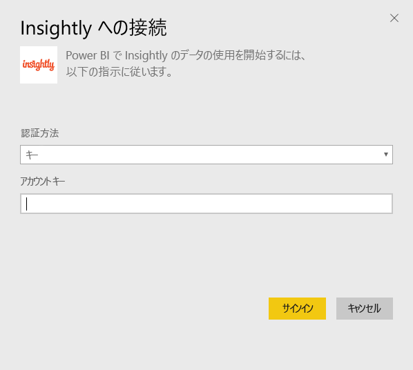
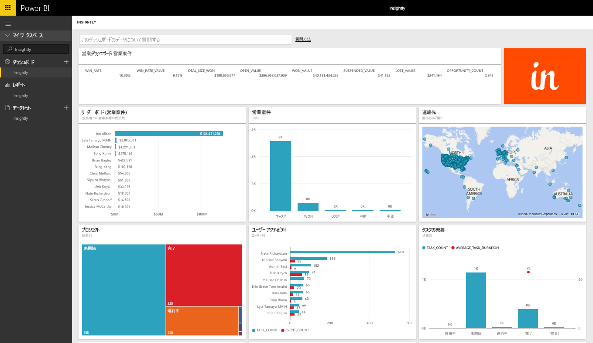
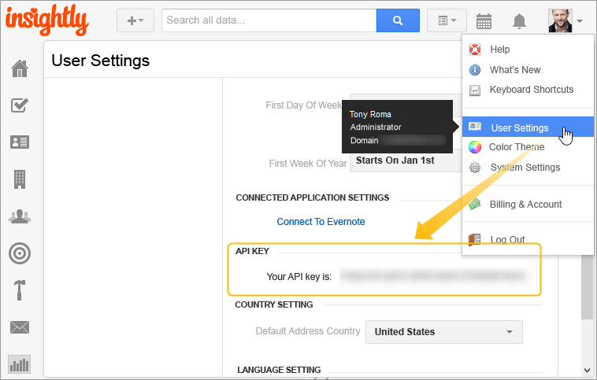

# Power BI で Insightly に接続する
Insightly コンテンツ パックを使うと、Insightly CRM データを Power BI で視覚化して共有できます。 Insightly API キーを使って Power BI に接続し、CRM データからレポートやダッシュボードを作成して表示します。 Power BI があれば、新しい方法でデータを分析できます。説得力のあるグラフやチャートを作成したり、地図上に連絡先、潜在顧客、組織を表示したりできます。

Power BI 用 [Insightly コンテンツ パック](https://app.powerbi.com/getdata/services/insightly)に接続します。

## 接続する方法
1. 左側のナビゲーション ウィンドウの下部にある **[データの取得]** を選択します。
   
   
2. **[サービス]** ボックスで、 **[取得]**を選択します。
   
   
3. **[Insightly]** \> **[取得]** の順に選択します。
   
   
4. 認証の種類として **[キー]** を選び、Insight API キーを入力し、 **[サインイン]**を選びます。 この値を見つけるには、この後の「[パラメーターの見つけ方](#FindingParams)」をご覧ください。
   
   
5. 承諾後、インポート処理が自動的に開始されます。 完了すると、ナビゲーション ウィンドウに、新しいダッシュ ボード、レポート、モデルが表示されます。 インポートされたデータを表示するダッシュボードを選択します。
   
     

**実行できる操作**

* ダッシュボード上部にある [Q&A ボックスで質問](power-bi-q-and-a.md)してみてください。
* ダッシュボードで[タイルを変更](service-dashboard-edit-tile.md)できます。
* [タイルを選択](service-dashboard-tiles.md)して基になるレポートを開くことができます。
* データセットは毎日更新されるようにスケジュール設定されますが、更新のスケジュールは変更でき、また **[今すぐ更新]** を使えばいつでも必要なときに更新できます。

## 含まれるもの
コンテンツ パックには、対応するレコードのフィールドを持つ次の表が含まれています。

| テーブル |  |  |  |
| --- | --- | --- | --- |
| 連絡先 |営業案件 |パイプラインのステージ |タスクの完了日 |
| カスタム フィールド |営業案件の契約日 |プロジェクトの完了日 |タスク |
| Events |営業案件の予測日 |プロジェクト |チーム/メンバー |
| Leads |組織 |タグ |Users |

多くのテーブルとレポートには、次のような一意の計算フィールドが含まれます。  

* 営業案件の予測契約日、営業案件の実際の契約日、プロジェクトの完了日、作業の完了日を「グループ分け」して、月、四半期、または年単位で分析した表。  
* 営業案件の加重価値フィールド (営業案件の価値 × 成功の見込み)。  
* 作業の平均期間と合計期間のフィールド (開始日と完了日に基づく)。  
* 営業案件の成功率 (成功数 / 営業案件の合計数) と成功価値の比率 (成功価値 / 営業案件の合計価値) を計算したフィールドを示すレポート。  

## システム要件
Insightly API へのアクセス許可を持つ Insightly アカウントが必要です。 表示のアクセス許可は、Power BI への接続時に使った API キーに基づいて決まります。 自分に見えている Insightly レコードは、他のユーザーと共有する Power BI レポートやダッシュボードにも表示されます。

## パラメーターの見つけ方
**API キー**

Insightly から API キーをコピーするには、Insightly のプロファイル メニューから [ユーザー設定] を選び、下へスクロールします。 この文字列が、データを Power BI に接続するために使われます。

## トラブルシューティング
データは Insightly API を使ってインポートされ、その量は Insightly サブスクリプション プラン レベルに基づく 1 日の上限に含められます。 上限の値は、API ドキュメント (https://api.insight.ly/v2.2/Help#!/Overview/Introduction#ratelimit) にあるレート制限/スロットル要求のセクションに記載されています。

提供されるレポートでは Insightly からの既定のフィールドが使用され、カスタマイズしたフィールドを含めることはできません。 レポートを編集すると、使用可能なすべてのフィールドが表示されます。

## 次の手順
[Power BI の概要](service-get-started.md)

[Power BI でデータを取得する](service-get-data.md)

