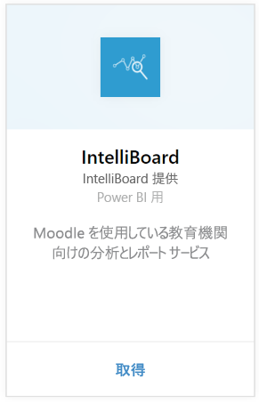
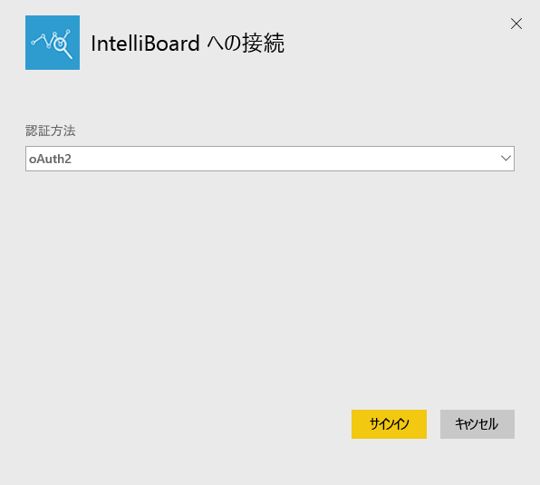
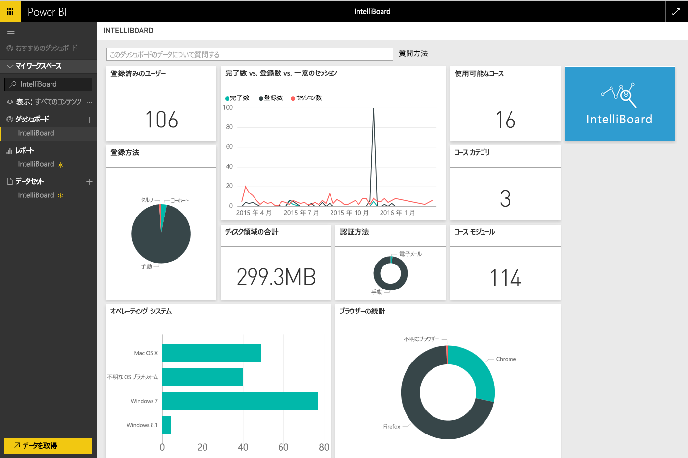

# Power BI で IntelliBoard に接続する
IntelliBoard を使用すると、レポート サービスを介して Moodle 学習管理システムのデータに簡単にアクセスできます。 Power BI 用 IntelliBoard コンテンツ パックは、コース、登録ユーザー、全体的な成績、および LMS アクティビティに関するメトリックを含む、追加の分析を提供します。

Power BI 用 [IntelliBoard コンテンツ パック](https://app.powerbi.com/getdata/services/intelliboard)に接続します。

## 接続する方法
1. 左側のナビゲーション ウィンドウの下部にある **[データの取得]** を選択します。  
   
    
2. **[サービス]** ボックスで、 **[取得]**を選択します。  
   
    
3. **[IntelliBoard]**、**[取得]** の順に選択します。  
   
    
4. **[OAuth 2]** を選択し、**[サインイン]** をクリックします。 要求されたら、IntelliBoard 資格情報を入力します。
   
    
   
    
5. 接続されると、ダッシュボード、レポート、およびデータセットが自動的に読み込まれます。 完了すると、タイルが IntelliBoard アカウントからのデータで更新されます。
   
    

**実行できる操作**

* ダッシュボード上部にある [Q&A ボックスで質問](power-bi-q-and-a.md)してみてください。
* ダッシュボードで[タイルを変更](service-dashboard-edit-tile.md)できます。
* [タイルを選択](service-dashboard-tiles.md)して基になるレポートを開くことができます。
* データセットは毎日更新されるようにスケジュール設定されますが、更新のスケジュールは変更でき、また **[今すぐ更新]** を使えばいつでも必要なときに更新できます。

## 含まれるもの
コンテンツ パックには、次のテーブルのデータが含まれています。  

    - アクティビティ  
    - Agents  
    - Auth  
    - Countries  
    - CoursesProgress  
    - Enrollments
    - Lang  
    - Platform  
    - Totals  
    - UsersProgress    

## システム要件
このコンテンツ パックをインスタンス化するには、上記のテーブルへのアクセス許可を持つ IntelliBoard アカウントが必要です。

## 次の手順
[Power BI の概要](service-get-started.md)

[Power BI - 基本的な概念](service-basic-concepts.md)

