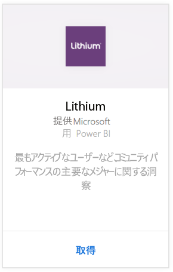
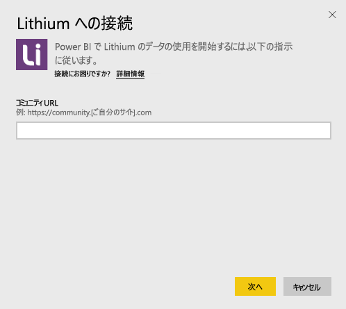
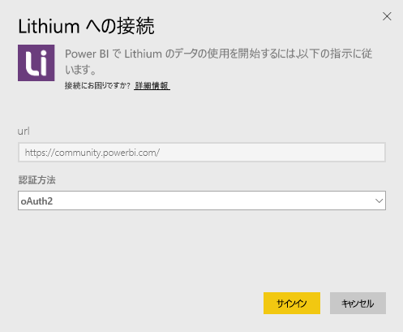
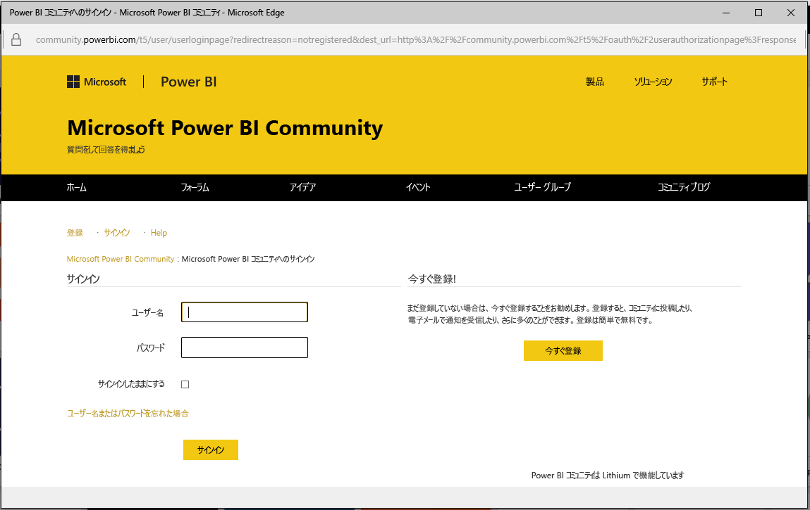
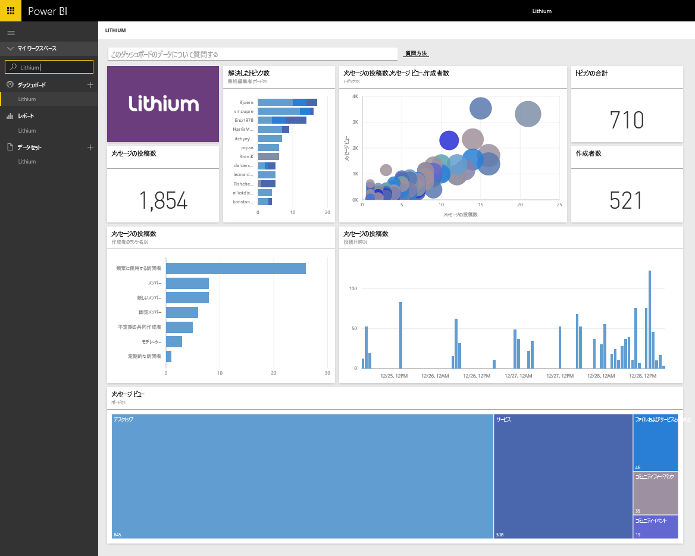

# Power BI で Lithium に接続する
Lithium は、人々が回答を得たり、エクスペリエンスを共有したりするのを手助けして、世界最高のブランドと顧客との間に信頼関係を築きます。 Lithium コンテンツ パックを Power BI に接続してオンライン コミュニティに関する主要指標を測定すると、販売の促進、サービス コストの削減、ロイヤルティの向上に役立ちます。 

Power BI 用 [Lithium コンテンツ パック](https://app.powerbi.com/getdata/services/lithium)に接続します。

>[!NOTE]
>Power BI コンテンツ パックは、Lithium API を使用します。 API への過剰な呼び出しは、Lithium からの追加料金につながる可能性があります。Lithium 管理者にご確認ください。

## 接続する方法
1. 左側のナビゲーション ウィンドウの下部にある **[データの取得]** を選択します。
   
    
2. **[サービス]** ボックスで、 **[取得]** を選択します。
   
    
3. **[Lithium]** \> **[取得]** の順に選択します。
   
   
4. Lithium コミュニティの URL を指定します。 *https://community.yoursite.com* という形式になります。
   
   
5. ダイアログが表示されたら、Lithium の資格情報を入力します。 認証方式として **[oAuth 2]** を選び、 **[サインイン]** をクリックして、Lithium 認証フローに従います。
   
   
   
   
6. ログイン フローが完了すると、インポート プロセスが開始します。 完了すると、ナビゲーション ウィンドウに、新しいダッシュ ボード、レポート、モデルが表示されます。 インポートされたデータを表示するダッシュボードを選択します。
   
    

**実行できる操作**

* ダッシュボード上部にある [Q&A ボックスで質問](power-bi-q-and-a.md)してみてください。
* ダッシュボードで[タイルを変更](service-dashboard-edit-tile.md)できます。
* [タイルを選択](service-dashboard-tiles.md)して基になるレポートを開くことができます。
* データセットは毎日更新されるようにスケジュール設定されますが、更新のスケジュールは変更でき、また **[今すぐ更新]** を使えばいつでも必要なときに更新できます。

## システム要件
Lithium コンテンツ パックには、Lithium Community v15.9 以降が必要です。 Lithium の管理者に問い合わせてご確認ください。

## 次の手順
[Power BI とは?](power-bi-overview.md)

[Power BI - 基本的な概念](service-basic-concepts.md)

