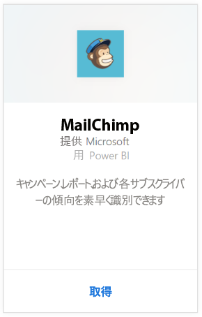
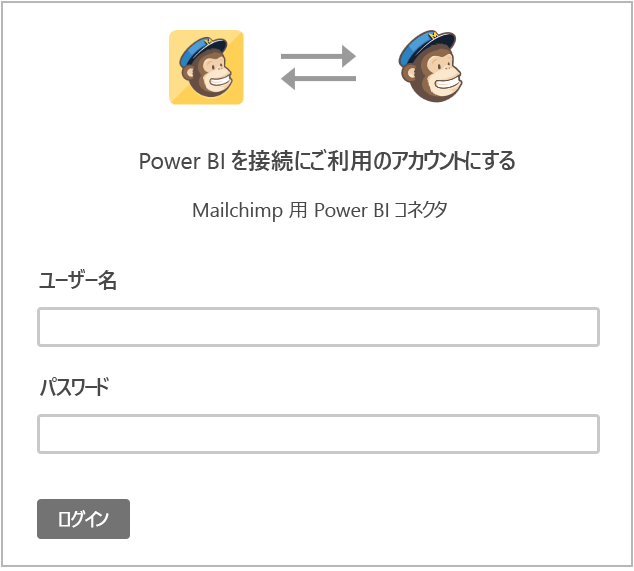
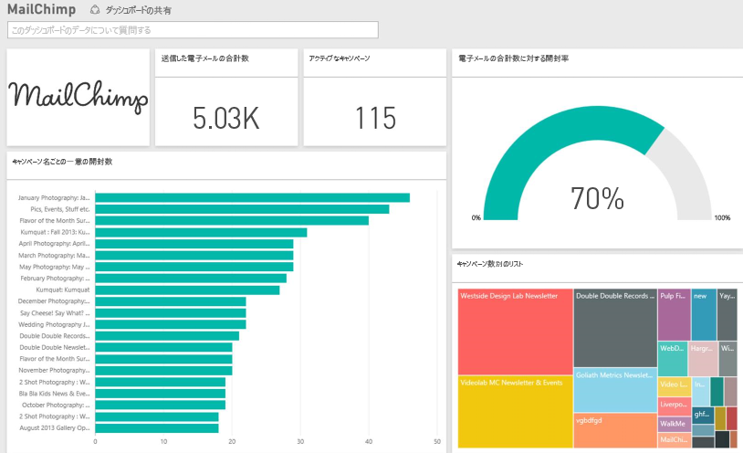

# Power BI で MailChimp に接続する
Power BI コンテンツ パックはお客様の MailChimp アカウントからデータを取得し、ダッシュボード、一連のレポート、およびデータセットを生成してデータを探索できるようにします。 分析データを集めて [MailChimp ダッシュボード](https://powerbi.microsoft.com/integrations/mailchimp)を作成すると、キャンペーン、レポート、および各サブスクライバーの傾向を素早く識別できます。 データは、毎日更新されるように設定されているため、監視対象のデータが常に最新の状態に保たれています。

Power BI 用 [MailChimp コンテンツ パック](https://app.powerbi.com/getdata/services/mailchimp)に接続します。

## 接続する方法
1. 左側のナビゲーション ウィンドウの下部にある **[データの取得]** を選択します。
   
    
2. **[サービス]** ボックスで、 **[取得]** を選択します。
   
   
3. **[MailChimp]** \> **[取得]** の順に選択します。
   
   
4. [認証方法] として **[oAuth2]** を選択し、**[サイン イン]** をクリックします。
   
    プロンプトが表示されたら、MailChimp 資格情報を入力し、認証プロセスに従います。
   
    初めて接続するときに、Power BI に対してアカウントへの読み取り専用アクセスを許可するように求められます。 **[許可]** を選択すると、インポート プロセスが始まります。このプロセスは、お客様のアカウントのデータ量によっては数分かかることがあります。
   
    
5. Power BI によるデータのインポート後、新しいダッシュ ボード、レポート、データセットが左側のナビゲーション ウィンドウに表示されます。 これは、データを表示するために Power BI によって作成された既定のダッシュボードです。 このダッシュボードを変更し、希望する方法でデータを表示できます。
   
   

**実行できる操作**

* ダッシュボード上部にある [Q&A ボックスで質問](power-bi-q-and-a.md)してみてください。
* ダッシュボードで[タイルを変更](service-dashboard-edit-tile.md)できます。
* [タイルを選択](service-dashboard-tiles.md)して基になるレポートを開くことができます。
* データセットは毎日更新されるようにスケジュール設定されますが、更新のスケジュールは変更でき、また **[今すぐ更新]** を使えばいつでも必要なときに更新できます。

## 次の手順
[Power BI の概要](service-get-started.md)

[Power BI - 基本的な概念](service-basic-concepts.md)

