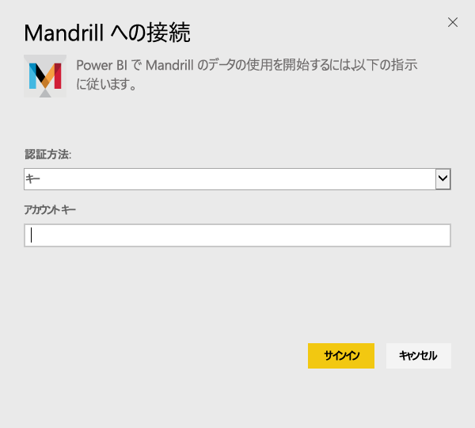
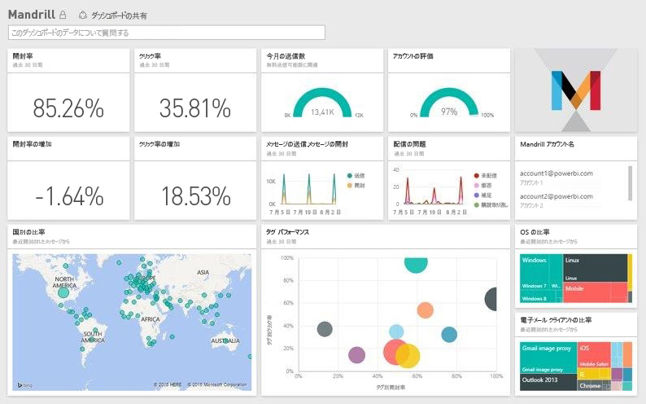

# Power BI で Mandrill に接続する
Power BI コンテンツ パックはお客様の Mandrill アカウントからデータを取得し、ダッシュボード、一連のレポート、およびデータセットを生成してデータを探索できるようにします。 Mandrill の分析を使用すると、ニュースレターや販促活動の情報を素早く取得できます。 データは、毎日更新されるように設定されているため、監視対象のデータが常に最新の状態に保たれています。

[Power BI 用 Mandrill コンテンツ パック](http://app.powerbi.com/getdata/services/mandrill)に接続します。

## 接続する方法
1. 左側のナビゲーション ウィンドウの下部にある **[データの取得]** を選択します。
   
    
2. **[サービス]** ボックスで、 **[取得]**を選択します。
   
    
3. **[Mandrill]** > **[取得]** の順に選択します。
   
    
4. **[認証方法]**として **[キー]** を選択し、API キーを指定します。 キーは、Mandrill ダッシュボードの **[設定]** タブで確認できます。 **[サインイン]** を選択すると、インポート プロセスが始まります。このプロセスは、お客様のアカウントのデータ量によっては数分かかることがあります。
   
    
5. Power BI によるデータのインポート後、新しいダッシュ ボード、レポート、データセットが左側のナビゲーション ウィンドウに表示されます。 これは、データを表示するために Power BI によって作成された既定のダッシュボードです。
   
    

**実行できる操作**

* ダッシュボード上部にある [Q&A ボックスで質問](power-bi-q-and-a.md)してみてください。
* ダッシュボードで[タイルを変更](service-dashboard-edit-tile.md)できます。
* [タイルを選択](service-dashboard-tiles.md)して基になるレポートを開くことができます。
* データセットは毎日更新されるようにスケジュール設定されますが、更新のスケジュールは変更でき、また **[今すぐ更新]** を使えばいつでも必要なときに更新できます。

## 次の手順
[Power BI の概要](service-get-started.md)

[Power BI - 基本的な概念](service-basic-concepts.md)

