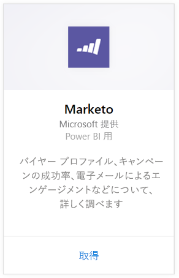
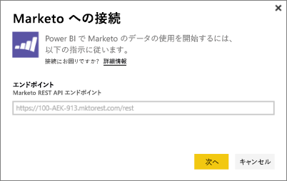
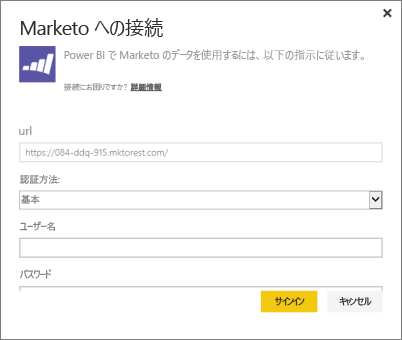
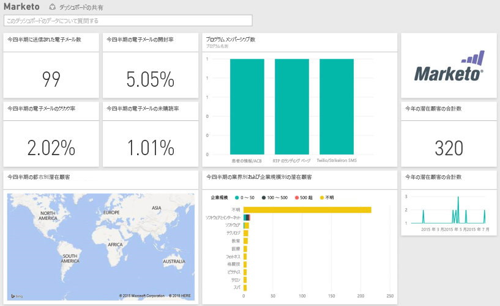

# Power BI で Marketo に接続する
Power BI 用 Marketo コンテンツ パックを使用すると、Marketo アカウントに関する情報 (潜在顧客とそのアクティビティに関するデータを含む) を入手できます。この接続を作成すると、データが取得され、そのデータに基づいて自動的にダッシュボードおよび関連するレポートが提供されます。

Power BI 用の [Marketo コンテンツ パック](https://app.powerbi.com/getdata/services/marketo)に接続します。

## 接続する方法
1. 左側のナビゲーション ウィンドウの下部にある **[データの取得]** を選択します。
   
   
2. **[サービス]** ボックスで、 **[取得]** を選択します。
   
    
3. **[Marketo]** \> **[取得]** の順に選択します。
   
   
4. Marketo または Marketo 管理者によって提供された Marketo REST エンドポイントを入力し、[次へ] を選択します。
   
   
   
   Marketo REST エンドポイントについて詳しくは、[http://developers.marketo.com/documentation/rest/endpoint-url/](http://developers.marketo.com/documentation/rest/endpoint-url/) をお読みください。
5. **[Basic]** 認証メソッドを使用する場合、クライアント ID を **[ユーザー名]** として入力し、クライアント シークレットを **[パスワード]** として入力します。 クライアント ID およびクライアント シークレットは Marketo または Marketo 管理者から入手できます ([http://developers.marketo.com/documentation/rest/custom-service/](http://developers.marketo.com/documentation/rest/custom-service/))。 
   
   
   
   これにより、*Power BI 用 Marketo* コンテンツ パックに対して [Marketo 分析](https://powerbi.microsoft.com/integrations/marketo)データへのアクセス許可が与えられ、Power BI でデータを分析できるようになります。 データは、1 日に 1 回更新されます。
6. Marketo アカウントに接続すると、すべてのデータが入ったダッシュ ボードが読み込まれます。
   
   

**実行できる操作**

* ダッシュボード上部にある [Q&A ボックスで質問](power-bi-q-and-a.md)してみてください。
* ダッシュボードで[タイルを変更](service-dashboard-edit-tile.md)できます。
* [タイルを選択](service-dashboard-tiles.md)して基になるレポートを開くことができます。
* データセットは毎日更新されるようにスケジュール設定されますが、更新のスケジュールは変更でき、また **[今すぐ更新]** を使えばいつでも必要なときに更新できます。

## 含まれるもの
Power BI は、本日から過去 1 年間のアクティビティーに関して、Marketo から次のデータを入手できます。

| テーブル名 | 説明 |
| --- | --- |
| EmailActivities |潜在顧客/取引先担当者に送られた電子メールに関するデータ。これには、デバイス、カテゴリ、バウンスの回数とパーセンテージ、クリックした回数とパーセンテージ、開かれた回数とパーセンテージ、プログラム名などが含まれます。 Power BI に表示される電子メール アクティビティは純然たる電子メール配信レポートであり、データに対する追加のロジックは適用されません。 そのため、Marketo クライアントと Power BI の間で結果が異なる可能性があります。 |
| ProgramActivites |状態が変更されたプログラムに関するデータ。 これには、理由、成功、プログラム取得の回数とパーセンテージ、プログラム成功の回数とパーセンテージなどの詳細が含まれます。 |
| WebPageActivities |ユーザーの Web ページ アクセスに関するデータ (検索のエージェント、ユーザー エージェント、Web ページ、時間など)。 |
| Datetable |現在および過去の年の日付。  日付で Marketo データを分析することができます。 |
| Leads |潜在顧客に関する情報。たとえば、会社、収益のサイズ、従業員の数、国、業種、潜在顧客のスコア、潜在顧客の状態などです。 潜在顧客は、電子メール、プログラム、Web ページのアクティビティ データにおけるプレゼンスに基づいて取得されます。 |

日付はすべて UTC です。 アカウントがあるタイム ゾーンに応じて、日付は変わる場合があります (Marketo クライアントでの表示と同様)。

## システム要件
* 接続に使用する Marketo アカウントに、潜在顧客とアクティビティへのアクセス権限がある。
* データの接続に使用できる十分な API 呼び出し回数。  Marketo には各アカウントの API があります。  制限に達すると、Power BI にデータを読み込めなくなります。 

**API の制限の詳細**

Marketo からのインポートには Marketo API を使用します。 Marketo の API 呼び出しの上限は、顧客あたり 1 日に合計 10,000 回です。これは、Marketo API を使用するすべてのアプリケーションの間で共有されます。 Power BI の統合だけでなく、他の統合でも API を使用する可能性があります。 API の詳細については、「<http://developers.marketo.com/documentation/rest/>」を参照してください。

Power BI が Marketo に対して行う API 呼び出しの量は Marketo アカウント内のデータの量に依存します。 Power BI は過去 1 年間のすべての潜在顧客とアクティビティをインポートします。 Marketo からのデータと、インポートするときに Power BI で使用される API 呼び出しの量に関する例を次に示します。  

| データ型 | 行数 | API 呼び出し |
| --- | --- | --- |
| 潜在顧客の情報 |15,000 |50 |
| メールのアクティビティ |150,000 |1,000 |
| プログラムのアクティビティ |15,000 |100 |
| Web のアクティビティ |150,000 |1,000 |
| プログラムの変更 |7,500 |50 |
| **API 呼び出し数の合計** | |**2,200** |

## 次の手順
[Power BI の概要](service-get-started.md)

[Power BI のデータの取得](service-get-data.md)

[Power BI ブログ: Power BI で Marketo データを監視および分析する](http://blogs.msdn.com/b/powerbi/archive/2015/03/19/monitor-and-analyze-your-marketo-data-with-power-bi.aspx)

