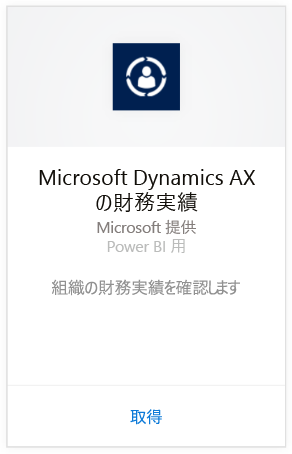
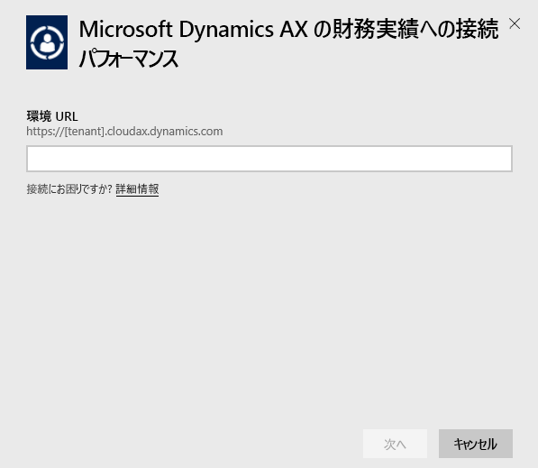
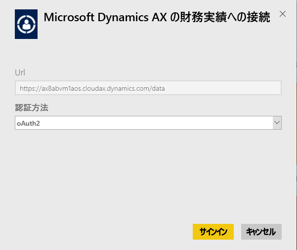
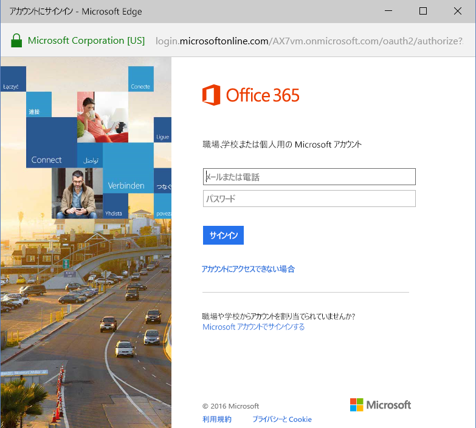
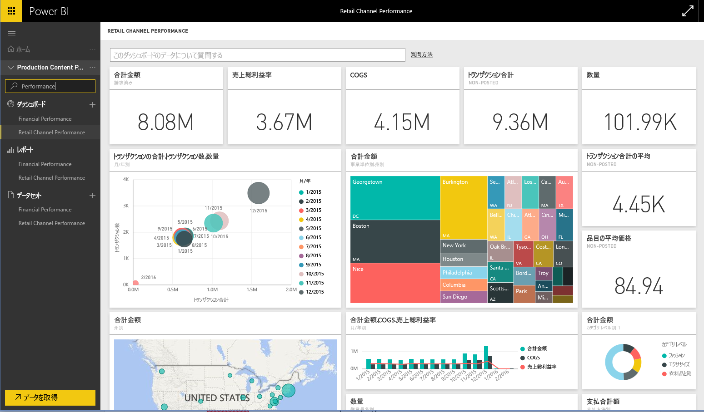

# Power BI で Microsoft Dynamics AX コンテンツ パックに接続する
Microsoft Dynamics AX には、異なるビジネス ユーザーを対象とした 3 つの Power BI コンテンツ パックがあります。 CFO 専用に設計された財務実績コンテンツ パックは、組織の財務業績に関する洞察を提供します。 リテール チャネル実績コンテンツ パックは、販売実績に注目するチャネル マネージャーを対象にしており、小売および取引データから直接描画することで、傾向を予測して洞察を導き出します。 コスト管理は、COO と CFO 向けに設計されており、経営実績の詳細を提供します。

Power BI 用 Microsoft Dynamics AX の[リテール チャネル実績コンテンツ パック](https://app.powerbi.com/getdata/services/dynamics-ax-retail-channel-performance)、[財務実績コンテンツ パック](https://app.powerbi.com/getdata/services/dynamics-ax-financial-performance)、または[コスト管理コンテンツ パック](https://app.powerbi.com/getdata/services/dynamics-ax-cost-management)に接続します。

## 接続する方法
1. 左側のナビゲーション ウィンドウの下部にある **[データの取得]** を選択します。
   
   
2. **[サービス]** ボックスで、 **[取得]**を選択します。
   
   
3. Dynamics AX コンテンツ パックのいずれかを選択して、**[取得]**を選択します。
   
   
4. Dynamics AX 7 環境の URL を指定します。 [これらのパラメーターの見つけ方](#FindingParams)について詳しくは、後述します。
   
   
5. **[認証方法]** として**[oAuth2]** を選択し、**[サイン イン]** をクリックします。 メッセージが表示されたら、Dynamics AX の資格情報を入力します。
   
    
   
    
6. 承諾後、インポート処理が自動的に開始されます。 完了すると、ナビゲーション ウィンドウに、新しいダッシュ ボード、レポート、モデルが表示されます。 インポートされたデータを表示するダッシュボードを選択します。
   
     

**実行できる操作**

* ダッシュボード上部にある [Q&A ボックスで質問](power-bi-q-and-a.md)してみてください。
* ダッシュボードで[タイルを変更](service-dashboard-edit-tile.md)できます。
* [タイルを選択](service-dashboard-tiles.md)して基になるレポートを開くことができます。
* データセットは毎日更新されるようにスケジュール設定されますが、更新のスケジュールは変更でき、また **[今すぐ更新]** を使えばいつでも必要なときに更新できます。

## 含まれるもの
コンテンツ パックは Dynamics AX 7 OData フィードを使用し、それぞれリテール チャネル、財務実績、およびコスト管理に関連するデータをインポートします。

## システム要件
このコンテンツ パックでは Dynamics AX 7 環境の URL が必要であり、ユーザーは OData フィードにアクセスする必要があります。

## パラメーターの見つけ方

Dynamics AX 7 環境の URL は、ユーザーがサインインするときにブラウザーで確認できます。 Dynamics AX ルート環境の URL を Power BI ダイアログにコピーするだけです。

## トラブルシューティング
インスタンスのサイズによっては、データの読み込みに時間がかかる場合があります。 Power BI 内で空のレポートが表示されている場合は、レポートで必要な OData テーブルへのアクセス権があることを確認してください。

## 次の手順
[Power BI の概要](service-get-started.md)

[Power BI でデータを取得する](service-get-data.md)

