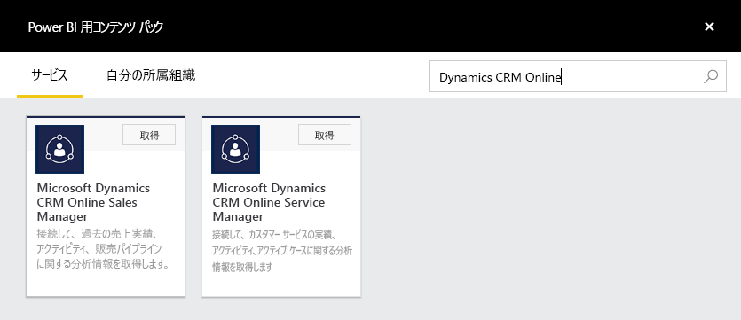
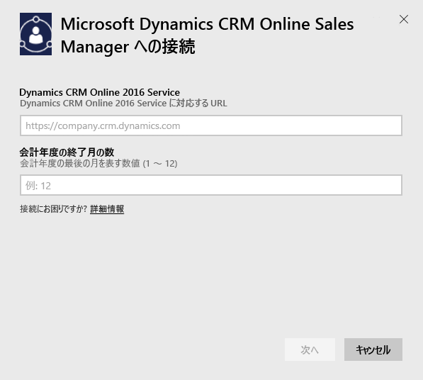
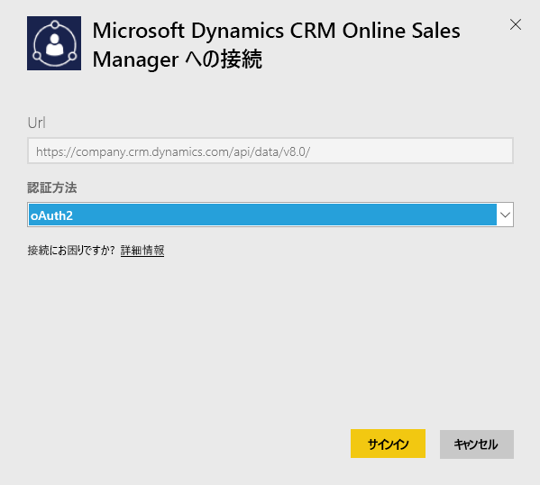
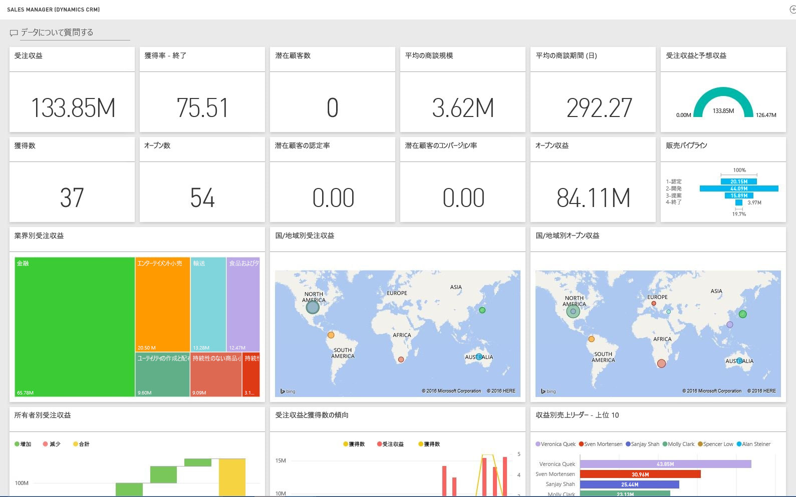

# Power BI で Microsoft Dynamics CRM に接続する
Power BI 用 Microsoft Dynamics CRM Online を利用すれば、簡単にデータにアクセスし、分析できます。 Power BI は、OData フィードを使用して記述モデルを作成します。その際、必要なすべてのエンティティやメジャー (取引先企業、活動、営業案件、製品、潜在顧客、ユーザーなど) を含めます。 アプリをインストールすると、Power BI サービス ([https://powerbi.com](https://powerbi.com)) と Power BI モバイル アプリでダッシュボードとレポートを表示できます。 

Dynamics CRM Online [営業マネージャー](https://msit.powerbi.com/groups/me/getdata/services/dynamics-crm-sales-manager)または[サービス マネージャー](https://msit.powerbi.com/groups/me/getdata/services/dynamics-crm-customer-service)に接続します。 Dynamics CRM Online と Power BI の統合については[こちら](https://powerbi.microsoft.com/integrations/microsoft-dynamicscrm)をご覧ください。

この接続には、**Microsoft Dynamics CRM Online 2016 以降**が必要です。 [要件](#Requirements)の詳細については、このあと説明します。

## 接続する方法
[!INCLUDE [powerbi-service-apps-get-more-apps](./includes/powerbi-service-apps-get-more-apps.md)]
3. **[Microsoft Dynamics CRM Sales Manager]** (Microsoft Dynamics CRM 営業マネージャー) または **[Microsoft Dynamics CRM Service Manager]** (Microsoft Dynamics CRM サービス マネージャー) を選択し、 **[接続]** をクリックします。
   
   
4. アカウントと関連付けられているサービスの URL を指定します。  これは、`https://company.crm.dynamics.com` のような形式になります。詳細については、[下の説明](#FindingParams)を参照してください。
   
   
5. メッセージが表示されたら、資格情報を指定します (ブラウザーで既にサインインしている場合、この手順は省略される可能性があります)。 認証方式として、「 **oAuth2** 」と入力し、 **[サインイン]** をクリックします。
   
   
6. 接続後、営業マネージャーまたはサービス マネージャー向けにカスタマイズされたダッシュボードが表示されます。そのダッシュボードには、独自のデータが格納されています。
   
   

## Microsoft Dynamics CRM のダッシュボードとレポートを表示する
[!INCLUDE [powerbi-service-apps-open-app](./includes/powerbi-service-apps-open-app.md)]

[!INCLUDE [powerbi-service-apps-open-app](./includes/powerbi-service-apps-what-now.md)]

## 含まれるもの
このセクションでは、[営業マネージャー](#Sales)と[サービス マネージャー](#Service)に含まれるものを詳しく説明します。

データは Dynamics CRM Online ユーザーに割り当てられているセキュリティ ロールに基づいて制限されることに注意してください。

ダッシュボードとレポートは、チームまたはグループに焦点を当てて短期データについての業務レポートを提供するためのものです。 各クエリは、Dynamics CRM Online から最大 10 万個のレコードを取得するように制限されています。 組織のデータが多くてこの制限を超えた場合、データ更新の Dynamics CRM Online が終了されるためにプロビジョニングは失敗します。 アカウントが大きすぎる場合は、Power BI Desktop を接続してカスタム ソリューションを構築してください。

### 営業マネージャー
ダッシュボードとレポートには、次のような主要メトリックが含まれます。  

* 受注収益   
* 受注率   
* オープン収益   
* 損失収益   
* 予想収益  
* 平均の商談規模その他。  

次のような主要グラフも含まれます。  

* 受注収益と損失収益のトレンド、受注収益と予想収益のトレンド  
* 業界、地域、区域などの各種ディメンション別受注収益   
* 収益別売上リーダー、アクティビティ、   
* 上位アカウント、上位受注/失注取引、    
* 新規潜在顧客トレンド、販売パイプラインその他。   

これらのメトリックとグラフは、販売組織のパフォーマンスを把握し、販売チーム内での販売パイプラインの分析に役立ちます。

次の表は、このサービスで使用可能な CRM エンティティの一覧と、各エンティティ レコードに適用されるフィルターの詳細です。

| CRM エンティティ | 適用されるフィルター |
| --- | --- |
| アカウント |過去 365 日間に変更された関連営業案件のあるすべてのアカウント |
| アクティビティ |過去 90 日間に変更されたすべてのアクティビティ   [modifiedon] > 今日 - 90 日 |
| ビジネス ユニット |無効ではないすべてのビジネス ユニット   [isdisabled] = false |
| 潜在顧客 |過去 180 日間に変更されたすべての潜在顧客   [modifiedon] > 今日 - 180 日 |
| 営業案件 |過去 365 日間に変更されたすべての営業案件   [modifiedon] > 今日 - 365 日 |
| 営業案件の製品 |過去 365 日間に変更されたすべての営業案件の製品   [modifiedon] > 今日 - 365 日 |
| Product |すべてのアクティブな製品   [statecode] <> 1 |
| 担当地域 |すべての担当地域 |
| ユーザー |すべてのアクティブなユーザーとデリゲートされていない管理者    [isdisabled] = false かつ [accessmode] <> 4 |

### サービス マネージャー
これらのダッシュボードとレポートには、次のような主要メトリックが含まれます。  

* CSAT 割合   
* SLA 達成割合   
* エスカレート済みケース割合   
* 平均処理時間   
* 合計解決ケース数  
* 合計アクティブ ケース数  
* ケースで使用された KB 記事回数、その他。    

次のような主要グラフも含まれます。   

* 受信ケースのケース数トレンド、解決済みケース数、エスカレート済みケース数   
* 発生元、場所、優先順位、種類などの各種ディメンション別のケース数  
* CSAT 割合、SLA達成割合、アクティビティ、解決済みケース別リーダー  
* 最多使用および最多参照 KB 記事、その他。  
    これらのメトリックとグラフは、サポート組織のパフォーマンスを理解し、サービス チームとサービス キューでのアクティブなケース ワークロードの分析に役立ちます。

次の表は、このサービスで使用可能な CRM エンティティの一覧と、各エンティティ レコードに適用されるフィルターの詳細です。

| CRM エンティティ | 適用されるフィルター |
| --- | --- |
| Account |過去 90 日間に変更された関連ケースのあるすべてのアカウント。 |
| アクティビティ |過去 90 日間に変更されたすべてのアクティビティ   [modifiedon] > 今日 - 90 日 |
| ケース |過去 90 日間に変更されたすべてのケース   [modifiedon] > 今日 - 90 日 |
| ケース解決アクティビティ |過去 90 日間に変更されたすべてのケース解決アクティビティ   [modifiedon] > 今日 - 90 日 |
| 連絡先 |過去 90 日間に変更された関連ケースのあるすべての連絡先 |
| ナレッジ記事 |ナレッジ記事のすべての最新バージョン    [islatestversion] = true |
| ナレッジ記事インシデント |過去 90 日間に変更されたすべてのナレッジ記事インシデント   [modifiedon] > 今日 - 90 日 |
| キュー |すべてのアクティブなキュー    [statecode] = 0 |
| キュー項目 |過去 365 日間に作成されたすべてのケース関連キュー項目    [createdon] > 今日 - 365 日かつ   [objecttypecode] = 112 |
| ユーザー |すべてのアクティブなユーザー    [isdisabled] = false |

## システム要件
* 有効な Dynamics CRM Online 2016 以降のインスタンス (Power BI は、オンプレミスの CRM バージョンでは機能しません)。 2016 以降がない場合:
* 管理者は、サイトの設定で OData エンドポイントを有効にする必要があります。
* いずれのテーブルのレコードも 10 万件に満たないアカウント。 アカウントのアクセスするレコードが 10 万件を超える場合、インポートは失敗します。

## パラメーターの見つけ方
インスタンスのアドレスは、ブラウザーの URL バーにあります。 通常、次の形式になります: `https://[instance_name].crm.dynamics.com`。

Power BI は Dynamics CRM 2016 エンドポイントのみをサポートします。 以前のバージョンの CRM Online の場合、接続が機能しません。 Power BI Desktop を利用し、自分のアカウントに直接接続します。

## トラブルシューティング
接続に問題が発生する場合は、次のことを確認してください。  

* 正しいインスタンス URL を提供していること (管理者に確認)  
* インスタンスが CRM Online 2016 であること  
* OData エンドポイントが有効であること  

また、OData URL `https://[instance_name].crm.dynamics.com/api/data/v8.0/` を利用し、Power BI Desktop で直接接続してみてください。

Dynamics CRM Online 2016 であることを確認した後も接続の問題が解決しない場合は、CRM 管理者に問い合わせて使用可能な更新プログラムがすべて適用されていることを確認してください。

CRM Online 2016 以降がない場合は、Power BI Desktop を使用してアカウントに直接接続してください。

"クエリが 100,000 レコードの上限を超えたためデータの更新が失敗しました" というエラーが表示される場合は、Power BI Desktop から直接接続するか、CRM ソリューション テンプレートを活用することを検討してください。

## 次の手順
* [Power BI のアプリについて](service-create-distribute-apps.md)
* [Power BI でデータを取得する](service-get-data.md)
* 他にわからないことがある場合は、 [Power BI コミュニティで質問してみてください](http://community.powerbi.com/)。

