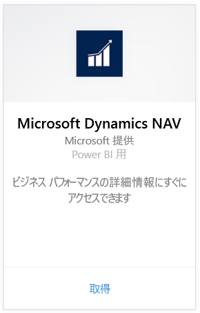
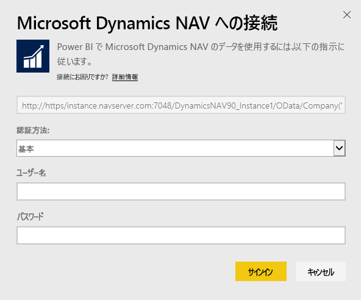
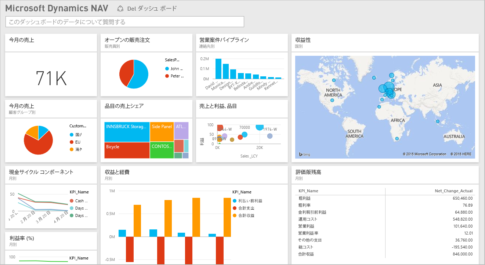

# Power BI で Microsoft Dynamics NAV に接続する
Power BI を使用すると、Microsoft Dynamics NAV データから洞察を得ることができます。 Power BI は、売上と財務の両方のデータを取得し、そのデータに基づいてダッシュボードとレポートを含むアプリを作成します。 Power BI を使うには、データの取得元のテーブル (この例では、売上と財務のデータ) に対するアクセス許可が必要です。 要件の詳細については、このあと説明します。 アプリをインストールすると、Power BI サービス ([https://powerbi.com](https://powerbi.com)) と Power BI モバイル アプリでダッシュボードとレポートを表示できます。 

[Power BI 用 Microsoft Dynamics NAV に接続する](https://app.powerbi.com/getdata/services/microsoft-dynamics-nav)か、Power BI と [Dynamics NAV との統合](https://powerbi.microsoft.com/integrations/microsoft-dynamics-nav)について詳細をお読みください。

## 接続する方法
[!INCLUDE [powerbi-service-apps-get-more-apps](./includes/powerbi-service-apps-get-more-apps.md)]

3. **[Microsoft Dynamics NAV]** を選択し、**[取得]** を選択します。  
   
4. メッセージが表示されたら、Microsoft Dynamics NAV の OData URL を入力します。 URL は、次のパターンに一致する必要があります。
   
    `https://instance.navserver.com:7048/DynamicsNAV90_Instance1/OData/Company('CRONUS%20International%20Ltd.')`
   
   * "instance.navserver.com" は実際の NAV Server 名にします
   * "DynamicsNAV90\_Instance1" は実際の NAV Server Instance 名にします
   * “Company('CRONUS%20International%20Ltd.')” は実際の NAV Company 名にします
     
     この URL を取得する簡単な方法は、Dynamics NAV で Web サービスに移動し、powerbifinance Web サービスを検索し、OData URL をコピーすることです。ただし、URL 文字列から "/powerbifinance" を除きます。  
     
5. **[基本]** を選択し、Microsoft Dynamics NAV の資格情報を入力します。
   
    使用する Microsoft Dynamics NAV アカウントには、管理者の資格情報 (または、少なくとも売上と財務のデータに対するアクセス許可) が必要です。  現在、基本 (ユーザー名とパスワード) 認証のみがサポートされています。
   
    
6. Power BI は、Microsoft Dynamics NAV データを取得して、すぐに使用できるダッシュボードとレポートを作成します。   
   

## ダッシュ ボードとレポートを表示する
[!INCLUDE [powerbi-service-apps-open-app](./includes/powerbi-service-apps-open-app.md)]

[!INCLUDE [powerbi-service-apps-open-app](./includes/powerbi-service-apps-what-now.md)]

## 含まれるもの
ダッシュ ボードとレポートには、次のテーブルからのデータが含まれます (大文字と小文字を区別します)。  

* ItemSalesAndProfit  
* ItemSalesByCustomer  
* powerbifinance  
* SalesDashboard  
* SalesOpportunities  
* SalesOrdersBySalesPerson  
* TopCustomerOverview  

## システム要件
Microsoft Dynamics NAV データを Power BI にインポートするには、(上記の) 売上データと財務データの取得元であるテーブルへのアクセス許可が必要です。 これらのテーブルにはデータが存在する必要があります。現在、テーブルが空だとインポート操作が失敗します。

## トラブルシューティング
Power BI では、Microsoft Dynamics NAV の Web サービスを使用してデータを取得します。 Microsoft Dynamics NAV インスタンスに大量のデータがある場合、Web サービスの使用量への影響を最小にするために、必要に応じて更新頻度を変更することをご提案します。 もう 1 つの提案は、すべての管理者が独自のアプリを作成するのではなく、1 人の管理者がアプリを作成してそれを共有することです。

**"パラメーターの検証でエラーが発生しました。すべてのパラメーターが有効であることを確認してください。"**  
Microsoft Dynamics NAV URL を入力した後にこのエラーが表示された場合は、 次の要件を満たしていることを確認します。

* URL は次のパターンに正確に従います。
  
    `https://instance.navserver.com:7048/DynamicsNAV90_Instance1/OData/Company('CRONUS%20International%20Ltd.')`
  
  * "instance.navserver.com" は実際の NAV Server 名にします
  * "DynamicsNAV90\_Instance1" は実際の NAV Server Instance 名にします
  * “Company('CRONUS%20International%20Ltd.')” は実際の NAV Company 名にします
* すべての文字が小文字であることを確認してください。  
* URL が 'https' であることを確認してください。  
* URL の末尾にスラッシュ (/) がないことを確認してください。

**"Login failed" (ログインに失敗しました)**  
Microsoft Dynamics NAV の資格情報を使用してログインした後、"login failed" (ログインに失敗しました) というエラーが発生する場合は、次のいずれかの問題が発生している可能性があります。

* 使用しているアカウントに、アカウントから Microsoft Dynamics NAV データを取得するアクセス許可がありません。 管理者アカウントであることを確認してからやり直してください。
* 接続しようとしている Dynamics NAV インスタンスに、有効な SSL 証明書がありません。 この場合は、さらに詳細なエラー メッセージが表示されます (「SSL の信頼関係を確立できません」)。 自己署名証明書はサポートされていないことに注意してください。

**"申し訳ございません"**  
認証ダイアログ ボックスを通過した後で "申し訳ございません" というエラー ダイアログが表示される場合は、データの読み込み中に Power BI に問題が発生しています。

* URL が上記のパターンに従っていることを確認します。 よくある間違いは:
  
    `https://instance.navserver.com:7048/DynamicsNAV90\_Instance1/OData`
  
    ただし、NAV 会社名を含む 'Company('CRONUS%20International%20Ltd.')' セクションを含める必要があります。
  
    `https://instance.navserver.com:7048/DynamicsNAV90\_Instance1/OData/Company('CRONUS%20International%20Ltd.')`

## 次の手順
* [Power BI のアプリについて](service-create-distribute-apps.md)
* [Power BI でデータを取得する](service-get-data.md)
* 他にわからないことがある場合は、 [Power BI コミュニティで質問してみてください](http://community.powerbi.com/)。

