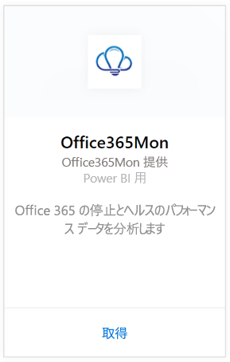
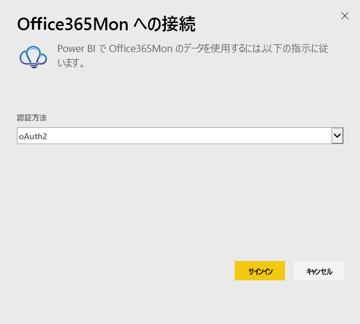
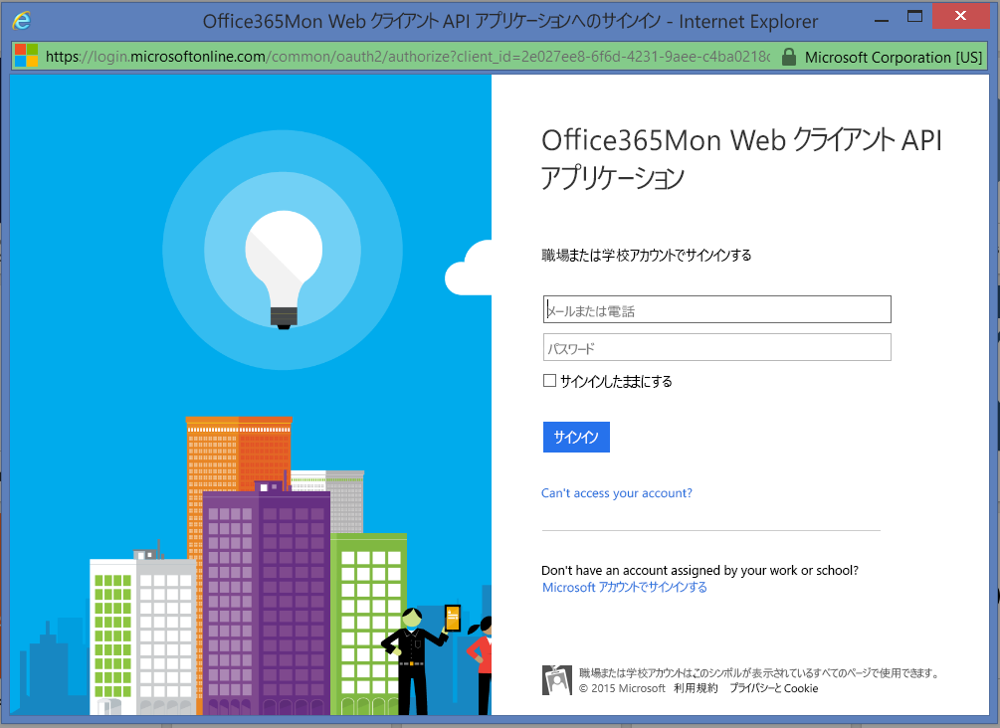
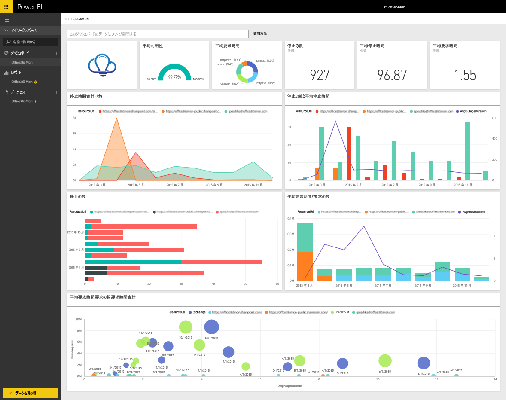

# Power BI で Office365Mon に接続する
Office 365 の障害および正常性のパフォーマンス データの分析は、Power BI や Office365Mon コンテンツ パックを使用すると簡単に行えます。 Power BI は、障害および正常性 プローブを含むデータを取得してから、そのデータに基づいてすぐに使えるダッシュボードおよびレポートを作成します。

Power BI 用 [Office365Mon コンテンツ パック](https://app.powerbi.com/groups/me/getdata/services/office365mon)に接続します。

>[!NOTE]
>Office365Mon の管理者アカウントは、Power BI コンテンツ パックに接続して読み込むときに必要です。

## 接続する方法
1. 左側のナビゲーション ウィンドウの下部にある **[データの取得]** を選択します。
   
   
2. **[サービス]** ボックスで、 **[取得]**を選択します。
   
    
3. **[Office365Mon]** \> **[接続]** を選択します。
   
   
4. [認証方法] として **[oAuth2]** を選択し、**[サイン イン]** をクリックします。
   
   プロンプトが表示されたら、Office365Mon の管理者資格情報を入力し、認証プロセスに従います。
   
   
   
   
5. Power BI によるデータのインポート後、新しいダッシュ ボード、レポート、データセットが左側のナビゲーション ウィンドウに表示されます。 新しい項目は、黄色のアスタリスク (\*) でマークされます。Office365Mon エントリを選択します。
   
   

**実行できる操作**

* ダッシュボード上部にある [Q&A ボックスで質問](service-q-and-a.md)してみてください。
* ダッシュボードで[タイルを変更](service-dashboard-edit-tile.md)できます。
* [タイルを選択](service-dashboard-tiles.md)して基になるレポートを開くことができます。
* データセットは毎日更新されるようにスケジュール設定されますが、更新のスケジュールは変更でき、また **[今すぐ更新]** を使えばいつでも必要なときに更新できます。

## トラブルシューティング
Office365Mon サブスクリプション資格情報を使用してログインした後に **"ログインに失敗しました"** エラーが表示された場合、使用しているアカウントには、アカウントから Office365Mon データを取得するためのアクセス許可がありません。 管理者アカウントであることを確認してからやり直してください。

## 次の手順
[Power BI の概要](service-get-started.md)

[Power BI のデータの取得](service-get-data.md)

