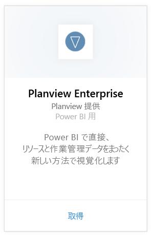
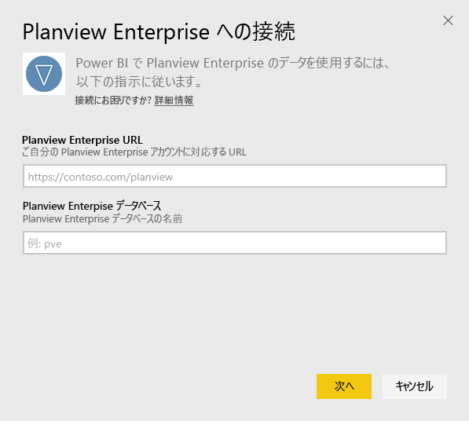
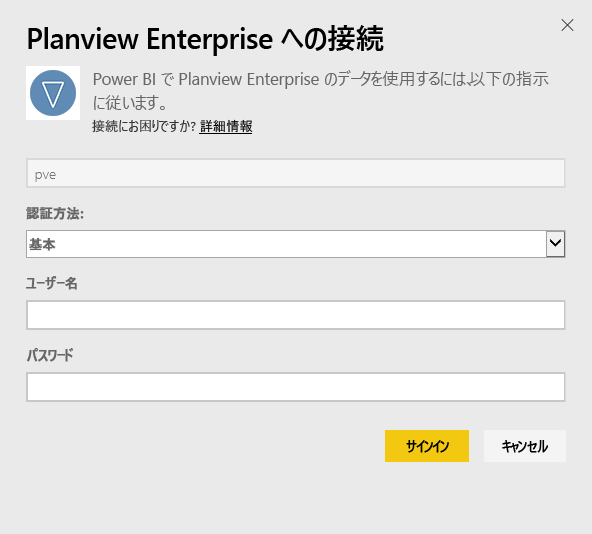
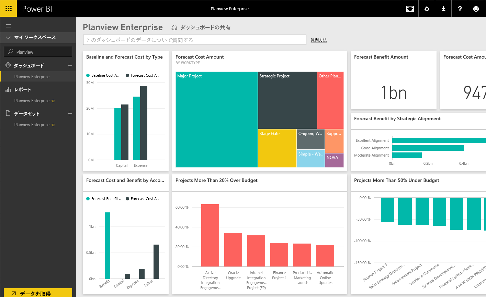

# Power BI で Planview Enterprise に接続する
Planview Enterprise コンテンツ パックを使用すると、Power BI で直接、リソースと作業管理データをまったく新しい方法で視覚化できます。 Planview Enterprise サインイン資格情報を使用して、ポートフォリオへの投資を対話形式で表示し、予算を上回ったり下回ったりしている部分を認識し、会社の戦略的優先順位とのプロジェクトの整合度合いを把握できます。 また、既定のダッシュボードやレポートを拡張して最も重要な情報を入手することもできます。

[Power BI 用 Planview Enterprise コンテンツ パック](https://app.powerbi.com/getdata/services/planview-enterprise)に接続します

>[!NOTE]
>Planview Enterprise データを Power BI にインポートするには、ロールで Reporting Portal Viewer 機能が有効になっている Planview Enterprise ユーザーである必要があります。 下の追加要件を参照してください。

## 接続する方法
1. 左側のナビゲーション ウィンドウの下部にある **[データの取得]** を選択します。
   
    
2. **[サービス]** ボックスで、 **[取得]** を選択します。
   
    
3. Power BI ページで **[Planview Enterprise]** を選択し、**[取得]** を選択します。  
    
4. [Planview Enterprise URL] テキスト ボックスに、使用する Planview Enterprise サーバーの URL を入力します。 [Planview Enterprise データベース] テキスト ボックスに Planview Enterprise データベースの名前を入力して、[次へ] をクリックします。  
    
5. [認証方法] ボックスの一覧で、 **[基本]** を選択します。 アカウントの **[ユーザー名]** と **[パスワード]** を入力し、 **[サインイン]** を選択します。  
   
6. 左側のウィンドウで、ダッシュボードの一覧から Planview Enterprise を選択します。  
     ダッシュボードに Planview Enterprise のデータがインポートされます。 データの読み込みには時間がかかる場合があります。  
    

**実行できる操作**

* ダッシュボード上部にある [Q&A ボックスで質問](power-bi-q-and-a.md)してみてください。
* ダッシュボードで[タイルを変更](service-dashboard-edit-tile.md)できます。
* [タイルを選択](service-dashboard-tiles.md)して基になるレポートを開くことができます。
* データセットは毎日更新されるようにスケジュール設定されますが、更新のスケジュールは変更でき、また **[今すぐ更新]** を使えばいつでも必要なときに更新できます。

## システム要件
Planview Enterprise データを Power BI にインポートするには、ロールで Reporting Portal Viewer 機能が有効になっている Planview Enterprise ユーザーである必要があります。 下の追加要件を参照してください。

この手順では、Power BI アカウントを使用して Microsoft Power BI のホーム ページに既にサインインしているものとします。 Power BI アカウントがない場合は、Power BI のホーム ページで新しい無料の Power BI アカウントを作成し、[データの取得] をクリックします。

## 次の手順:

[Power BI の概要](service-get-started.md)

[Power BI のデータの取得](service-get-data.md)