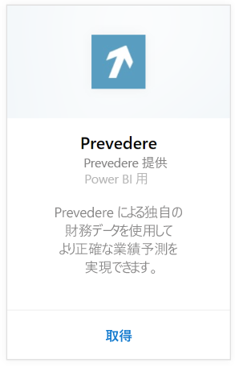
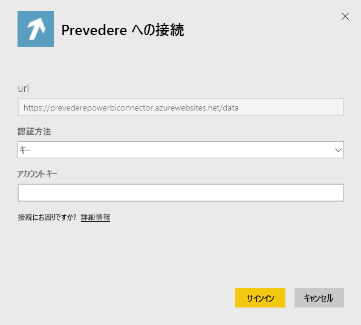
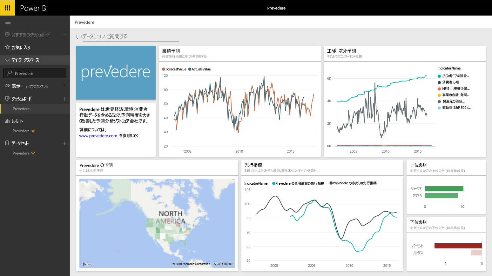

# Power BI で Prevedere に接続する
独占的で重要な財務情報にアクセスし、ビジネスを確実かつ積極的に推進します。

Power BI 用 [Prevedere コンテンツ パック](https://app.powerbi.com/getdata/services/prevedere)に接続します。

>[!NOTE]
>まだ Prevedere ユーザーでない場合は、[サンプル キー](https://prevederepowerbiconnector.azurewebsites.net/static/learnmore.html)を使って試してください。

## 接続する方法
1. 左側のナビゲーション ウィンドウの下部にある **[データの取得]** を選択します。
   
   
2. **[サービス]** ボックスで、 **[取得]**を選択します。
   
   
3. **[Prevedere]** を選択し、**[取得]** を選択します。
   
   
4. **[認証方法]**として **[キー]** を選択し、Prevedere API キーを入力します。
   
    
5. **[サインイン]** を選択して、インポート プロセスを開始します。 完了すると、ナビゲーション ウィンドウに、新しいダッシュ ボード、レポート、モデルが表示されます。 インポートされたデータを表示するダッシュボードを選択します。
   
     

**実行できる操作**

* ダッシュボード上部にある [Q&A ボックスで質問](power-bi-q-and-a.md)してみてください。
* ダッシュボードで[タイルを変更](service-dashboard-edit-tile.md)できます。
* [タイルを選択](service-dashboard-tiles.md)して基になるレポートを開くことができます。
* データセットは毎日更新されるようにスケジュール設定されますが、更新のスケジュールは変更でき、また **[今すぐ更新]** を使えばいつでも必要なときに更新できます。

## 含まれるもの
コンテンツ パックは、小売予測、予測モデル、主要指標などの情報を取得します。

## システム要件
このコンテンツ パックは、Prevedere API キーまたはサンプル キー (下記参照) へのアクセスが必要です。

## パラメーターの見つけ方

既存の顧客は、API キーを使用してデータにアクセスできます。 まだ顧客になっていない場合は、[サンプル キー](https://prevederepowerbiconnector.azurewebsites.net/static/learnmore.html)を使ってサンプル データを表示、分析できます。

## トラブルシューティング
インスタンスのサイズによっては、データの読み込みに時間がかかる場合があります。

## 次の手順
[Power BI の概要](service-get-started.md)

[Power BI でデータを取得する](service-get-data.md)

