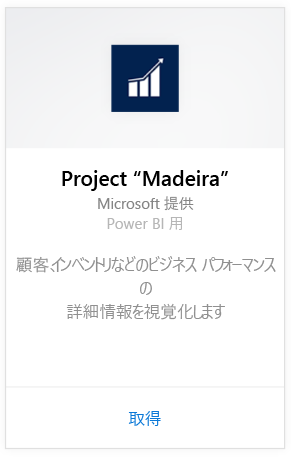
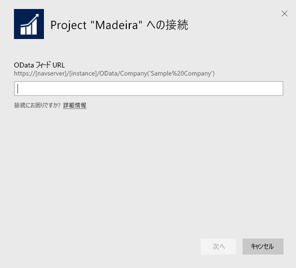
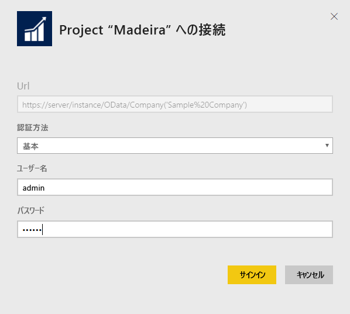
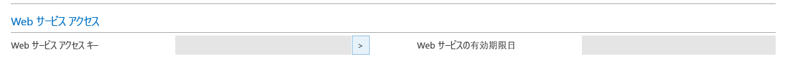
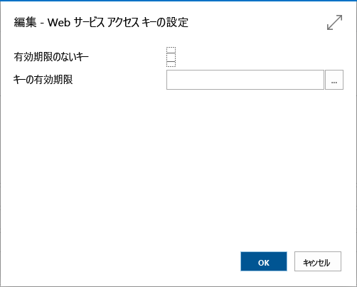

# Power BI で Project "Madeira" に接続する
Power BI と Project “Madeira” コンテンツ パックを使用すると、Project “Madeira” データの洞察を簡単に取得できます。 Power BI は、売上と財務の両方のデータを取得してから、そのデータに基づいてすぐに使えるダッシュボードおよびレポートを作成します。
Power BI 用 Project "Madeira" に接続するか、Power BI と Project "Madeira" との統合について詳細をお読みください。

>[!NOTE]
>このコンテンツ パックを使うには、データの取得元のテーブル (この例では、売上と財務のデータ) に対するアクセス許可が必要です。 要件の詳細については、[こちら](#Requirements)を参照してください。

Power BI 用 [Project "Madeira" Analytics コンテンツ パック](https://app.powerbi.com/getdata/services/project-madeira)に接続します。

## 接続する方法
1. 左側のナビゲーション ウィンドウの下部にある **[データの取得]** を選択します。  
    
2. **[サービス]** ボックスで、 **[取得]**を選択します。  
    
3. **[Project "Madeira"]** を選択し、**[取得]** を選択します。  
    
4. ダイアログが表示されたら、Project “Madeira” の URL を入力します。 URL は、次のパターンと完全に一致する必要があります (Project “Madeira” での社名を使用します): https://mycronusus.projectmadeira.com:7048/NAV/OData/Company('CRONUS%20US')。 末尾にスラッシュがないことと、接続が https であることに注意してください。 この URL を見つけるには、[こちら](#FindingParams)をご覧ください。  
   
    
5. ダイアログが表示されたら、[認証方法] として [Basic] を選択し、[ユーザー名] として Project “Madeira” のメール アドレスを入力し、[パスワード] として Project “Madeira” アカウントの Web サービス アクセス キーを入力します。 ブラウザーで既に Project “Madeira” にサインインしている場合は、資格情報を求めるダイアログが表示されないことがあります。 このアクセス キーを生成する方法の詳細については、[こちら](#FindingParams)を参照してください。  
   
    >[!NOTE]
    >Project “Madeira” のスーパーユーザーでなければなりません。
   
   
6. 接続されると、ダッシュボード、レポート、およびデータセットが自動的に読み込まれます。 完了すると、タイルがユーザーのアカウントのデータで更新されます。  
   
    

**実行できる操作**

* ダッシュボード上部にある [Q&A ボックスで質問](power-bi-q-and-a.md)してみてください。
* ダッシュボードで[タイルを変更](service-dashboard-edit-tile.md)できます。
* [タイルを選択](service-dashboard-tiles.md)して基になるレポートを開くことができます。
* データセットは毎日更新されるようにスケジュール設定されますが、更新のスケジュールは変更でき、また **[今すぐ更新]** を使えばいつでも必要なときに更新できます。

## システム要件
Project “Madeira” データを Power BI にインポートするには、売上データと財務データの取得元であるテーブルへのアクセス許可が必要です。 コンテンツ パックに必要なすべてのテーブルは次のとおりです (大文字と小文字の区別があります)。  
 
    ´´´ 
    - ItemSalesAndProfit  
    - ItemSalesByCustomer  
    - powerbifinance  
    - SalesDashboard  
    - SalesOpportunities  
    - SalesOrdersBySalesPerson  
    - TopCustomerOverview  
    ´´´ 

## パラメーターの見つけ方
**正しい URL の取得**。この URL を取得する簡単な方法は、Project “Madeira” の中で Web サービスに移動し、powerbifinance Web サービスを検索し、OData URL をコピーすることです (右クリックして [ショートカットのコピー] をクリックします)。ただし、URL 文字列から “/powerbifinance…”  を除きます。

**Web サービス アクセス キー**。Project "Madeira" のデータを使用するためには、ユーザー アカウントの Web サービス アクセス キーを作成する必要があります。 Project “Madeira” で、[ユーザー] ページを検索し、ユーザー アカウント用のカードを開きます。 新しい Web サービス キーを生成して、Power BI 接続ページの [パスワード] フィールドにコピーできます。

Web サービス アクセス キーの使用を開始するときに、この後で使用する必要があるので、ポップアップ表示されるメッセージに対して [OK] を選択します。
キーを作成するときに、特定の日付で期限切れにするかどうかを選択できます。

[OK] を選択するとキーが作成されるので、それを Power BI 接続ページの [パスワード] フィールドにコピーできます。

## トラブルシューティング
Power BI ダッシュボードは、上に示された公開済み Web サービスに依存して、デモ会社のデータを表示します。現在の財務ソリューションからデータをインポートする場合は、自社のデータを表示します。 ただし、うまくいかない場合は、このセクションで説明する最も一般的な問題の回避策を使用して対応してください。

**"パラメーターの検証でエラーが発生しました。すべてのパラメーターが有効であることを確認してください。"**

Project "Madeira" の URL を入力した後でこのエラーが発生した場合は、次の要件が満たされていることを確認してください。  

   - URL が次のパターンと完全に一致している: https://*mycronusus*.projectmadeira.com:7048/NAV/OData/Company('*CRONUS%20US*')  
   - かっこで囲まれた会社名の後ろにあるすべてのテキストが削されている。  
   - URL の末尾にスラッシュ (/) がない。  
   - URL がセキュリティで保護された接続を使用している (URL が https で始まっている)。  

**「ログインに失敗しました」**: Project “Madeira” の資格情報を使用してダッシュボードにログインしたときに「ログインに失敗しました」エラーが発生した場合は、次の問題のいずれかが原因である可能性があります。  

   - 使用しているアカウントが Project “Madeira” からデータを読み取るアクセス許可がない。 Project "Madeira" で自分のユーザー アカウントを調べ、パスワードとして正しい Web サービス アクセス キーを使用していることを確認してからやり直してください。  
   - 接続しようとしている Project "Madeira" インスタンスが有効な SSL 証明書を持っていない。 この場合は、さらに詳細なエラー メッセージが表示されます (「SSL の信頼関係を確立できません」)。 自己署名証明書はサポートされていないことに注意してください。  

**「問題が発生しました」**: 認証ダイアログ ボックスを通過した後で「問題が発生しました」エラー ダイアログが表示された場合、最も多い原因は、コンテンツ パックのデータに接続できないことです。 URL が、既に説明した次のパターンに従っていることを確認します。  
    https://*mycronusus*.projectmadeira.com:7048/NAV/OData/Company('*CRONUS%20US*')

よくある間違いは、次のように、特定の Web サービスの URL 全体を指定することです。  
    https://*mycronusus*.projectmadeira.com:7048/NAV/OData/Company('*CRONUS%20US*')/powerbifinance

次のように、会社名を指定し忘れている場合もありま   
    https://*mycronusus*.projectmadeira.com:7048/NAV/OData/

## 次の手順
[Power BI の概要](service-get-started.md)

[Power BI - 基本的な概念](service-basic-concepts.md)

