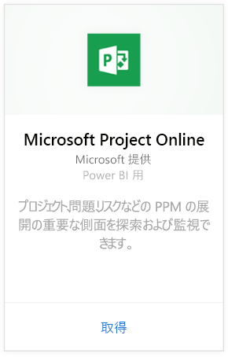
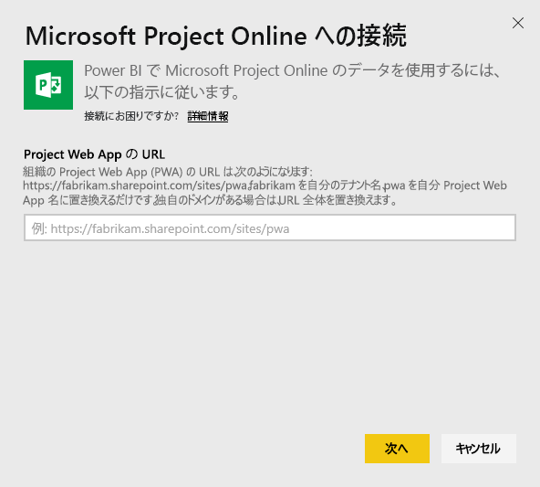
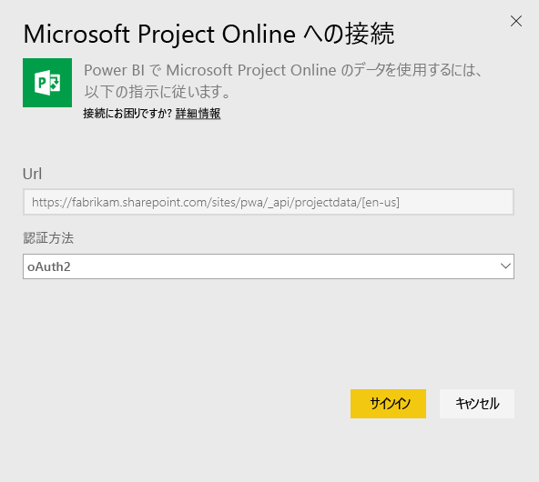
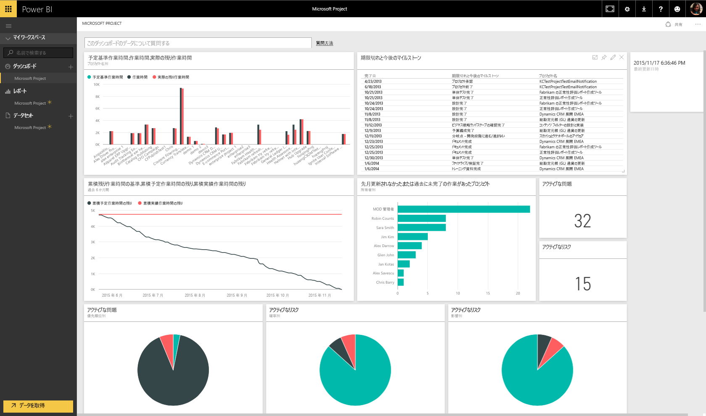
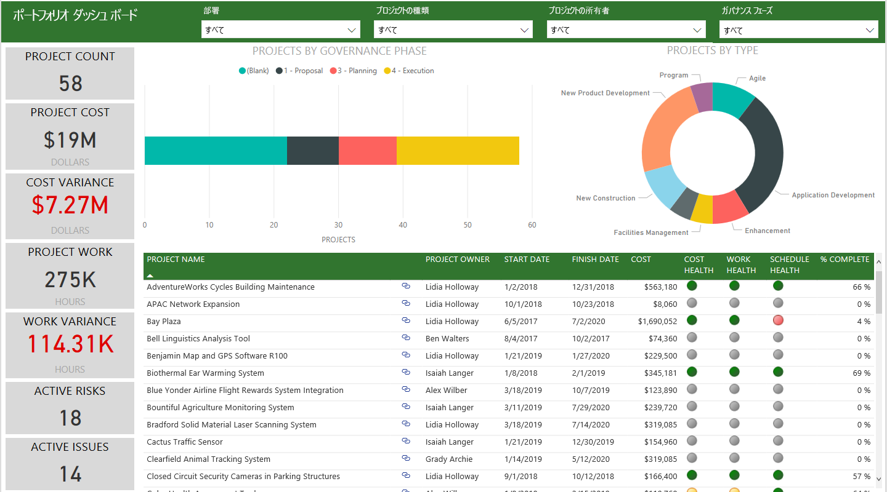
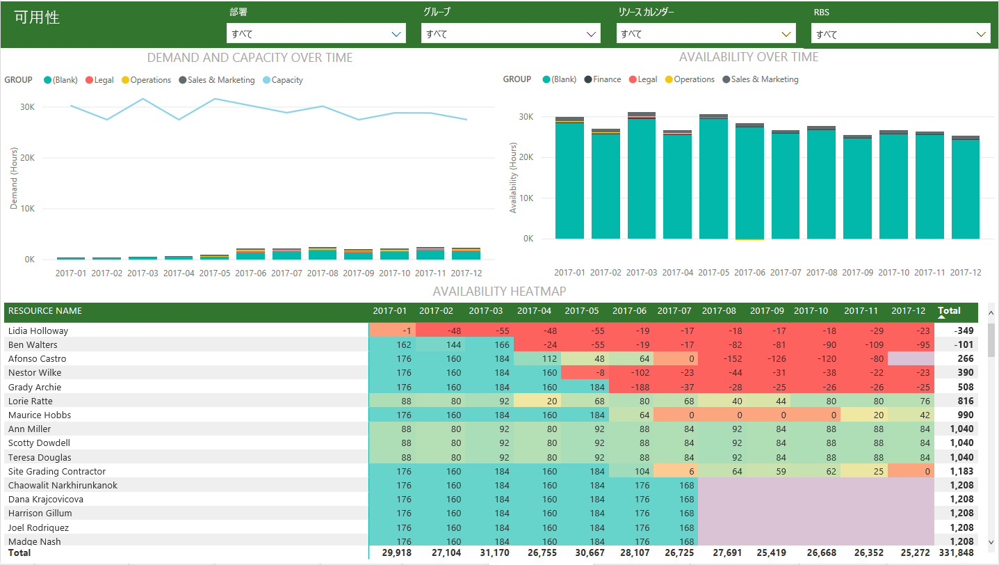
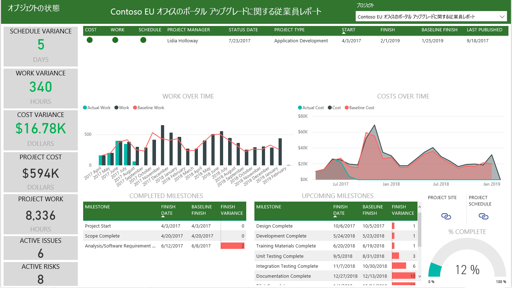

# Power BI で Project Online に接続する
Microsoft Project Online は、プロジェクト ポートフォリオ管理 (PPM) および日常の作業用の柔軟なオンライン ソリューションです。 Project Online を使用すると、プロジェクト ポートフォリオの投資を開始して優先順位を設定し、意図したとおりのビジネス価値を提供できます。 Power BI 用 Project Online コンテンツ パックでは、Project Online から分析情報をロック解除し、プロジェクト、ポートフォリオ、リソースの管理に役立てることができます。

Power BI 用 [Project Online コンテンツ パック](https://app.powerbi.com/getdata/services/project-online)に接続します。

## 接続する方法
1. 左側のナビゲーション ウィンドウの下部にある **[データの取得]** を選択します。
   
    
2. **[サービス]** ボックスで、 **[取得]** を選択します。
   
   
3. **[Microsoft Project Online]** \> **[取得]** の順に選択します。
   
   
4. **[Project Web App の URL]** テキスト ボックスに接続する Project Web App (PWA) の URL を入力し、 **[次へ]** をクリックします。 カスタム ドメインを使用している場合は例と異なる場合があることに注意してください。 **[PWA Site Language]\(PWA サイトの言語\)** テキスト ボックスに、PWA サイト言語に対応する番号を入力します。 英語には '1' を、フランス語には '2' を、ドイツ語には '3' を、ブラジルのポルトガル語には '4' を、ポルトガルのポルトガル語には '5' を、スペイン語には '6' を入力します。 
   
    
5. [認証方法] として **[oAuth2]** を選択し、**[サイン イン]** をクリックします。 プロンプトが表示されたら、Project Online の資格情報を入力し、認証プロセスに従います。
   
    
    
接続先の Project Web App のポートフォリオ閲覧者、ポートフォリオ マネージャー、または管理者のアクセス許可が必要です。

6. データを読み込んでいることを示す通知が表示されます。 アカウントの大きさによっては時間がかかる可能性があります。 Power BI によるデータのインポート後、新しいダッシュ ボード、13 のレポート、データセットが左側のナビゲーション ウィンドウに表示されます。 これは、データを表示するために Power BI によって作成された既定のダッシュボードです。 このダッシュボードを変更し、希望する方法でデータを表示できます。

   

7. ダッシュボードとレポートが準備できたら、Project Online データの探索を開始してください。 コンテンツ パックには、ポートフォリオ概要 (6 レポート ページ)、リソース概要 (5 レポート ページ)、プロジェクト ステータス (2 レポート ページ) からなる、13 の多機能かつ詳細なレポートが付属しています。 

   
   
   
   
   

**実行できる操作**

* ダッシュボード上部にある [Q&A ボックスで質問](consumer/end-user-q-and-a.md)してみてください。
* ダッシュボードで[タイルを変更](service-dashboard-edit-tile.md)できます。
* [タイルを選択](consumer/end-user-tiles.md)して基になるレポートを開くことができます。
* データセットは毎日更新するようにスケジュール設定されますが、更新のスケジュールは変更でき、また **[今すぐ更新]** を使えばいつでも必要なときに更新できます。

**コンテンツ パックの展開**

コンテンツ パックをさらにカスタマイズし、更新するには、[GitHub PBIT ファイル](https://github.com/OfficeDev/Project-Power-BI-Content-Packs)をダウンロードします

## 次の手順
[Power BI の概要](service-get-started.md)

[Power BI でデータを取得する](service-get-data.md)

