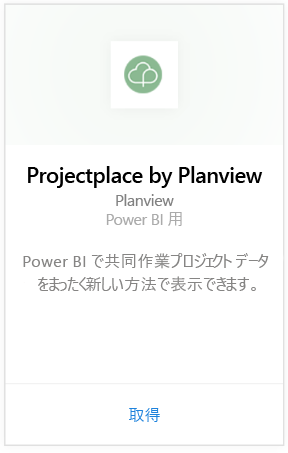
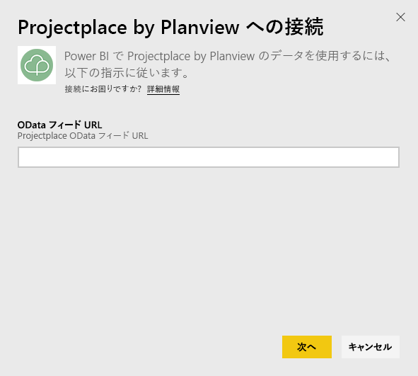
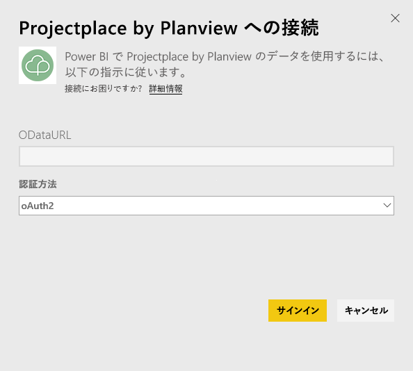
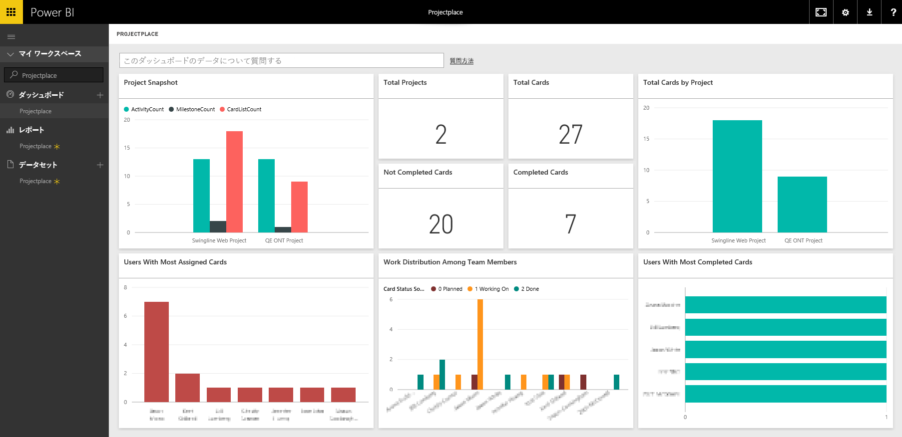

# Power BI で Projectplace by Planview に接続する
Projectplace by Planview コンテンツ パックを使用すると、Power BI で直接、共同作業プロジェクト データをまったく新しい方法で視覚化できます。 Projectplace のサインイン資格情報を使用して、プロジェクトの重要な統計情報を対話形式で表示し、最も活動的で生産性の高いチーム メンバーを確認し、Projectplace アカウント内のプロジェクトで問題が生じているカードとアクティビティを明らかにできます。 また、既定のダッシュボードやレポートを拡張して最も重要な情報を入手することもできます。

[Power BI で Projectplace コンテンツ パックに接続する](https://app.powerbi.com/getdata/services/projectplace)

>[!NOTE]
>Power BI に Projectplace データをインポートするには、Projectplace ユーザーである必要があります。 下の追加要件を参照してください。

## 接続する方法
1. 左側のナビゲーション ウィンドウの下部にある **[データの取得]** を選択します。
   
    
2. **[サービス]** ボックスで、 **[取得]** を選択します。
   
    
3. Power BI ページで **[Projectplace by Planview]** を選択し、**[取得]** を選択します。  
   
    
4. 次の図のように、[OData フィード URL] テキスト ボックスに使用する Projectplace OData フィードの URL を入力します。
   
    
5. [認証方法] ボックスの一覧で、 **[OAuth]** を選択します。 **[サインイン]** をクリックしてログインのフローに従います。  
   
   
6. 左側のウィンドウで、ダッシュボードの一覧から **Projectplace** を選択します。 ダッシュボードに Projectplace のデータがインポートされます。 データの読み込みには時間がかかる場合があります。  
   
    ダッシュボードには、Projectplace データベースからのデータを表示するタイルが含まれています。 次の図では、Power BI での既定の Projectplace ダッシュボードの例を示します。
   
    

**実行できる操作**

* ダッシュボード上部にある [Q&A ボックスで質問](power-bi-q-and-a.md)してみてください。
* ダッシュボードで[タイルを変更](service-dashboard-edit-tile.md)できます。
* [タイルを選択](service-dashboard-tiles.md)して基になるレポートを開くことができます。
* データセットは毎日更新されるようにスケジュール設定されますが、更新のスケジュールは変更でき、また **[今すぐ更新]** を使えばいつでも必要なときに更新できます。

## システム要件
Power BI に Projectplace データをインポートするには、Projectplace ユーザーである必要があります。 この手順では、Power BI アカウントを使用して Microsoft Power BI のホーム ページに既にサインインしているものとします。 Power BI アカウントがない場合は、Power BI のホーム ページで新しい無料の Power BI アカウントを作成し、[データの取得] をクリックします。

## 次の手順
[Power BI の概要](service-get-started.md)

[Power BI - 基本的な概念](service-basic-concepts.md)

