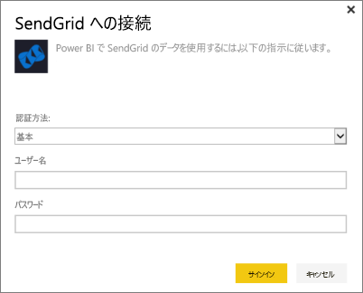
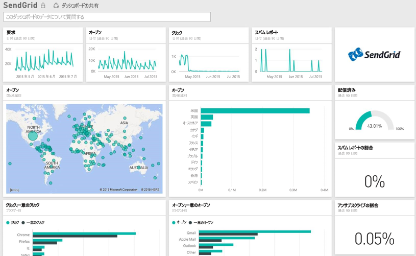

# Power BI で SendGrid に接続する
SendGrid 用 Power BI コンテンツ パックを使用すると、SendGrid アカウントから考察や統計情報を得ることができます。 SendGrid コンテンツ パックを使用して、SendGrid の統計情報をダッシュボードに視覚化することができます。

Power BI 用 [SendGrid コンテンツ パック](https://app.powerbi.com/getdata/services/sendgrid)に接続します。

## 接続する方法
1. 左側のナビゲーション ウィンドウの下部にある **[データの取得]** を選択します。
   
    
2. **[サービス]** ボックスで、 **[取得]** を選択します。
   
    
3. **SendGrid** コンテンツ パックを選び、**[取得]** をクリックします。
   
    
4. ダイアログが表示されたら、SendGrid のユーザー名とパスワードを入力します。 **[サインイン]** をクリックします。
   
   
5. Power BI にデータがインポートされると、新しいダッシュボード、レポート、データセットが左側のナビゲーション ウィンドウに表示され、そこに過去 90 日間の電子メール統計情報が取り込まれています。 新しい項目には黄色のアスタリスク \* でマークが付けられます。
   
   

**実行できる操作**

* ダッシュボード上部にある [Q&A ボックスで質問](power-bi-q-and-a.md)してみてください。
* ダッシュボードで[タイルを変更](service-dashboard-edit-tile.md)できます。
* [タイルを選択](service-dashboard-tiles.md)して基になるレポートを開くことができます。
* データセットは毎日更新されるようにスケジュール設定されますが、更新のスケジュールは変更でき、また **[今すぐ更新]** を使えばいつでも必要なときに更新できます。

## 含まれるもの
SendGrid のダッシュ ボードで次のメトリックを使用できます。

* 全体的なメール統計情報 - 要求、配信済み、バウンス済み、スパム ブロック、スパム レポートなど。
* カテゴリ別のメール統計情報
* 地理別のメール統計情報
* ISP 別のメール統計情報
* デバイス、クライアント、ブラウザー別のメール統計情報

## 次の手順
[Power BI の概要](service-get-started.md)

[データの取得](service-get-data.md)

