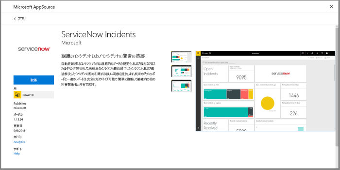
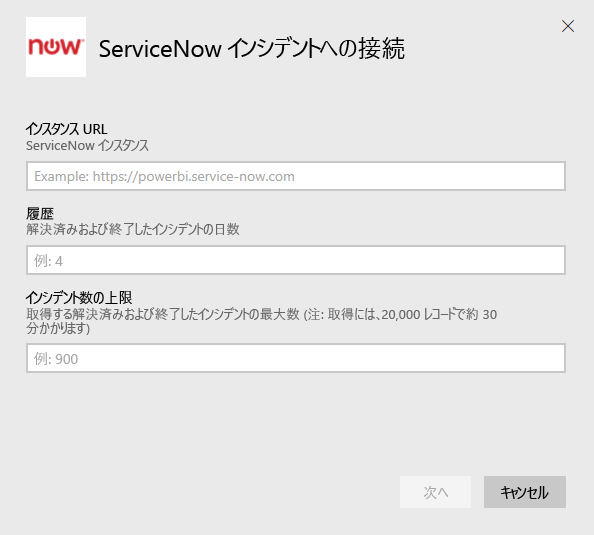
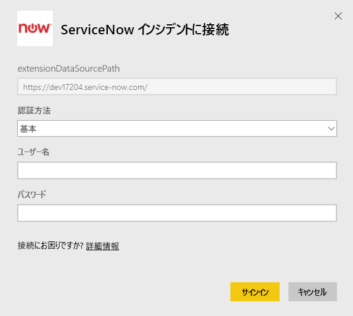
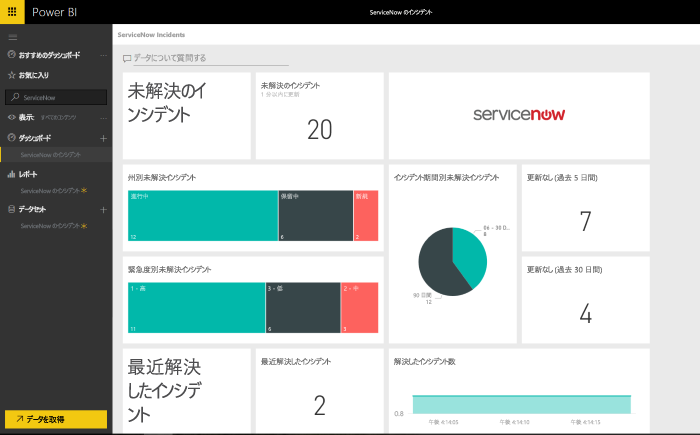

# インシデント レポート用の Power BI で ServiceNow に接続する
ServiceNow からは、ビジネスをよりよいものにするため、ビジネス、運用、IT 管理などに関する複数の製品とソリューションが提供されています。 このコンテンツ パックには、未解決のインシデント、最近解決されたインシデント、最近終了したインシデントについての複数のレポートや洞察を得られる情報が含まれています。  

[ServiceNow インシデント](https://app.powerbi.com/getdata/services/servicenow)用の Power BI コンテンツ パックに接続してください。

## 接続する方法
1. 左側のナビゲーション ウィンドウの下部にある **[データの取得]** を選択します。
   
    
2. **[サービス]** ボックスで、 **[取得]** を選択します。
   
    
3. **[ServiceNow Incidents]** \> **[取得]** の順に選択します。
   
   
4. ServiceNow インスタンスの URL、および取得する日/レコードの範囲を指定します。 1 つの制限に達するとすぐにインポートが停止することに注意してください。
   
   
5. メッセージが表示されたら、ServiceNow の **基本**資格情報を入力します。 現在はシングル サインオンがサポートされていないことに注意してください。システム要件の詳細については以下で説明します。
   
   
6. ログイン フローが完了すると、インポート プロセスが開始します。 完了すると、ナビゲーション ウィンドウに、新しいダッシュ ボード、レポート、モデルが表示されます。 インポートされたデータを表示するダッシュボードを選択します。
   
    

**実行できる操作**

* ダッシュボード上部にある [Q&A ボックスで質問](power-bi-q-and-a.md)してみてください。
* ダッシュボードで[タイルを変更](service-dashboard-edit-tile.md)できます。
* [タイルを選択](service-dashboard-tiles.md)して基になるレポートを開くことができます。
* データセットは毎日更新されるようにスケジュール設定されますが、更新のスケジュールは変更でき、また **[今すぐ更新]** を使えばいつでも必要なときに更新できます。

## システム要件
接続するには次のものが必要です。  

* 基本認証で yourorganization.service-now.com にアクセスできるアカウント (シングル サインオンはこのバージョンではサポートされていません)  
* アカウントには、rest_service ロールとインシデント テーブルの読み取りアクセス許可が必要です  

## トラブルシューティング
読み込み中に資格情報エラーが発生した場合は、前記のアクセス要件を確認してください。 正しいアクセス許可があるのに問題が発生する場合は、ServiceNow 管理者と協力して、カスタム インスタンスに必要なその他のアクセス許可がないかどうか確認してください。

読み込みに長い時間がかかる場合は、接続時に指定したインシデントの数との日数を確認し、それを減らすことを検討してください。

## 次の手順
[Power BI の概要](service-get-started.md)

[Power BI - 基本的な概念](service-basic-concepts.md)

