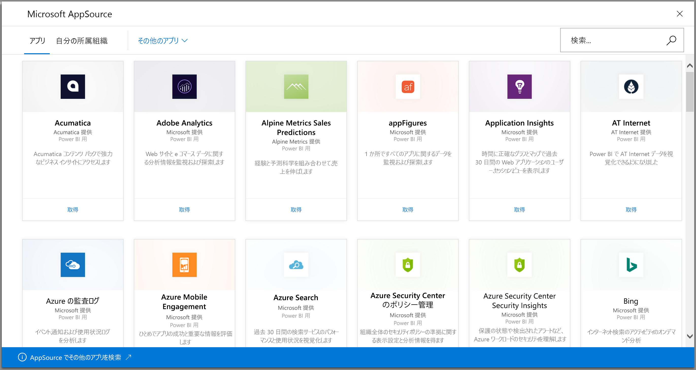
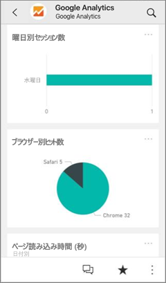
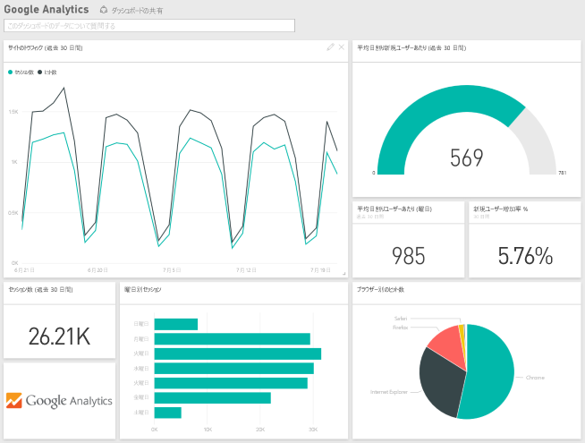

# Power BI で使用するサービスに接続する
Power bi では、Salesforce、Microsoft Dynamics、Google Analytics など、ビジネスに使用するサービスの多くに接続できます。 Power BI は、サービスに接続するための資格情報を使用して開始します。 Power BI が作成されます*ワークスペース*ダッシュ ボードと一連の Power BI レポートを自動的にデータを表示し、ビジネスに関する情報を視覚化します。

すべてを表示する Power BI にサインイン、[サービスに接続できる](https://app.powerbi.com/getdata/services)します。 

ダッシュ ボードとレポートを表示、アプリと Power BI サービス ワークスペースで、アプリをインストールした後 ([https://app.powerbi.com](https://app.powerbi.com))。 Power BI モバイル アプリにも表示できます。 ワークスペースで、組織のニーズに合わせてレポートとダッシュ ボードを変更およびとして同僚に配布する*アプリ*します。 

## 作業の開始
[!INCLUDE [powerbi-service-apps-get-more-apps](./includes/powerbi-service-apps-get-more-apps.md)]

## ダッシュ ボードとレポートを編集します。
インポートが完了すると、新しいアプリが [アプリ] ページに表示されます。

1. 左側のナビゲーション ウィンドウで **[アプリ]** を選択し、該当アプリを選択します。
   
     ![[アプリ] ページ](media/service-connect-to-services/power-bi-service-apps-open-app.png)
2. Q&A ボックスに質問を入力したり、タイルをクリックして基になっているレポートを開いたりできます。 
   
    
   
    ダッシュ ボードと、組織のニーズに合わせてレポートを変更します。 [アプリを同僚に配布します。](service-create-distribute-apps.md)

## 含まれるもの
サービスに接続したら、新しく作成されたアプリとワークスペースにダッシュ ボード、レポート、およびデータセットを参照してください。 サービスからのデータは特定のシナリオに重点を置いたものであり、そのサービスのすべての情報が入っているとは限りません。 データは、1 日に 1 回自動的に更新されます。 データセットを選択し、このスケジュールを変更できます。

できます[Power BI Desktop で多くのサービスに接続する](desktop-data-sources.md)、Google Analytics など、独自のカスタマイズされたダッシュ ボードとレポートを作成します。  

特定のサービスに接続する方法の詳細については、個々 のヘルプ ページを参照してください。

## トラブルシューティング
**タイルが空になっている**  
Power BI が初めてサービスに接続するとき、ダッシュボードに空のタイル セットが表示されることがあります。 2 時間後、空のダッシュボードが依然として表示される場合、接続に失敗した可能性があります。 問題の修正の関する情報と共にエラー メッセージが表示されていない場合、は、サポート チケットを提出します。

* 右上隅にある疑問符アイコン ( **?** ) を選択し、 **[ヘルプを取得]** を選択します。
  
    ![[ヘルプを取得] アイコン](media/service-connect-to-services/power-bi-service-get-help.png)

**情報が不足している**  
ダッシュ ボードとレポートには、特定のシナリオに重点を置いたサービスのコンテンツが含まれます。 アプリで特定のメトリックを探しているし、表示されない場合は場合のアイデアを追加、 [Power BI サポート](https://support.powerbi.com/forums/265200-power-bi)ページ。

## サービスを提案する
Power BI アプリにしてほしいサービスがある場合は、 [[Power BI サポート]](https://support.powerbi.com/forums/265200-power-bi) ページでお知らせください。

自分で配布するテンプレート アプリを作成する場合、「[Create a template app in Power BI](service-template-apps-create.md)」 (Power BI でテンプレート アプリを作成する) を参照してください。 Power BI パートナーでは、ほとんどまたはまったくない次のようにコーディングでの Power BI アプリを構築でき、Power BI のお客様に配置することができます。 

## 次の手順
* [アプリを同僚に配布します。](service-create-distribute-apps.md)
* [Power BI で新しいワークスペースを作成します。](service-create-the-new-workspaces.md)
* わからないことがある場合は、 [Power BI コミュニティで質問してみてください](http://community.powerbi.com/)。
* 他にわからないことがある場合は、 [Power BI コミュニティで質問してみてください](http://community.powerbi.com/)。

