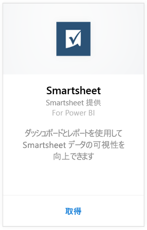
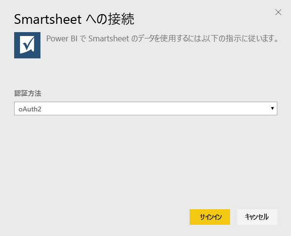
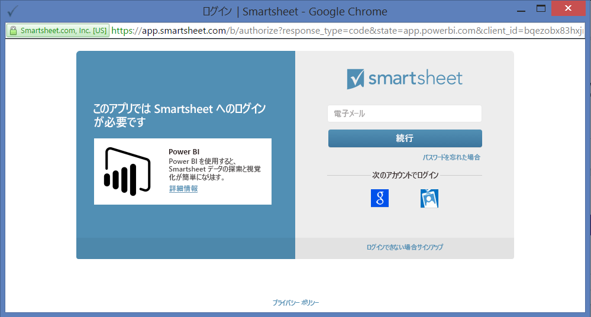

# Power BI で Smartsheet に接続する
Smartsheet は、コラボレーションとファイル共有に簡単なプラットフォームを提供しています。 Power BI 用 Smartsheet コンテンツ パックは、Smartsheet アカウントの概要を示すデータセット、レポート、ダッシュボードを提供します。 また、[Power BI Desktop](desktop-connect-to-data.md) を使用して、ご使用のアカウントでそれぞれのシートに直接接続することもできます。 

Power BI 用 [Smartsheet コンテンツ パック](https://app.powerbi.com/groups/me/getdata/services/smartsheet)に接続します。

>[!NOTE]
>Smartsheet 管理者アカウントには追加のアクセス権があるため、Power BI コンテンツ パックの接続および読み込みで優先されます。

## 接続する方法
1. 左側のナビゲーション ウィンドウの下部にある **[データの取得]** を選択します。
   
   
2. **[サービス]** ボックスで、 **[取得]** を選択します。
   
    
3. **[Smartsheet] \> [取得]** の順に選びます。
   
   
4. [認証方法] として **[oAuth2]\>、[サインイン]** の順に選びます。
   
   プロンプトが表示されたら、Smartsheet 資格情報を入力し、認証プロセスに従います。
   
   
   
   
5. Power BI によるデータのインポート後、新しいダッシュ ボード、レポート、データセットが左側のナビゲーション ウィンドウに表示されます。 新しい項目は、黄色のアスタリスク (\*) でマークされます。Smartsheet エントリを選びます。
   
   

**実行できる操作**

* ダッシュボード上部にある [Q&A ボックスで質問](power-bi-q-and-a.md)してみてください。
* ダッシュボードで[タイルを変更](service-dashboard-edit-tile.md)できます。
* [タイルを選択](service-dashboard-tiles.md)して基になるレポートを開くことができます。
* データセットは毎日更新されるようにスケジュール設定されますが、更新のスケジュールは変更でき、また **[今すぐ更新]** を使えばいつでも必要なときに更新できます。

## 含まれるもの
Power BI 用 Smartsheet コンテンツ パックには、ワークスペースの数、所有しているレポートやシート、レポートやシートが変更された日時など、Smartsheet アカウントの概要が含まれています。また、管理者ユーザーは、上位のシート作成者など、システムのユーザーに関する情報も表示することができます。  

使用しているアカウントのそれぞれのシートに直接接続するために、[Power BI Desktop](desktop-connect-to-data.md) の Smartsheet コネクタを使用することができます。  

## 次の手順:

[Power BI の概要](service-get-started.md)

[Power BI のデータの取得](service-get-data.md)