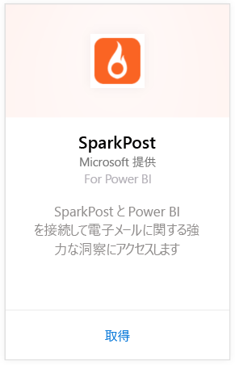
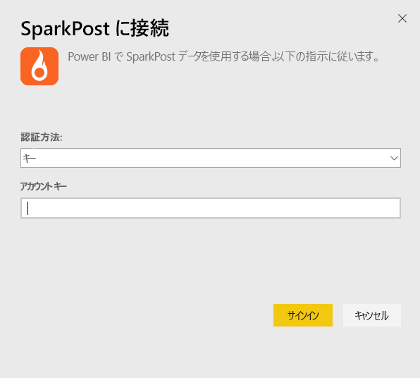
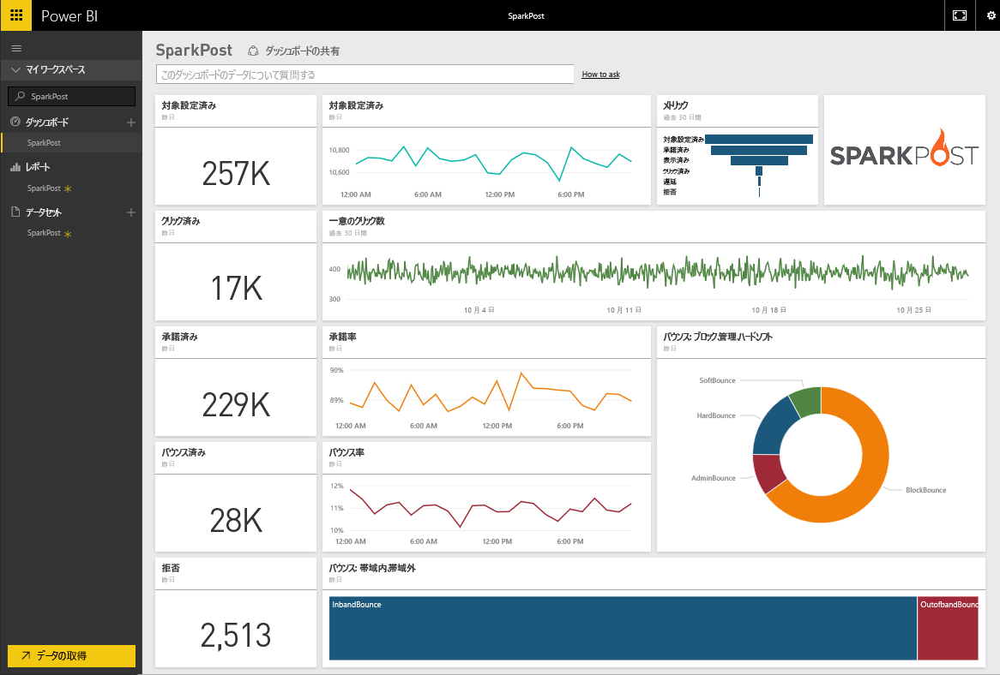
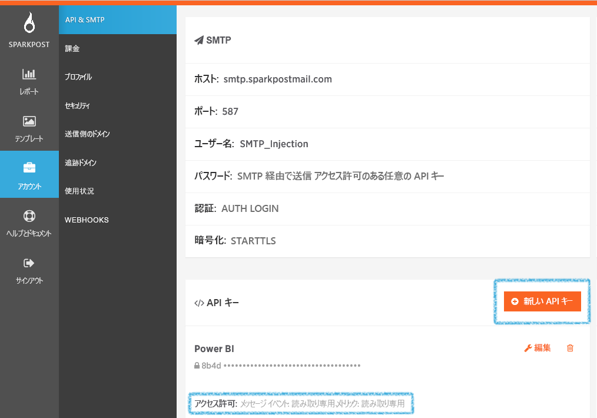

# Power BI で SparkPost に接続する
SparkPost 用 Power BI コンテンツ パックを使用すると、SparkPost アカウントから貴重なデータセットを 1 つの優れた洞察力のダッシュボードに抽出できます。 SparkPost コンテンツ パックを使用することで、ドメイン、キャンペーン、ISP によるエンゲージメントなどの電子メールの全体的な統計情報を視覚化できます。

Power BI 用 [SparkPost コンテンツ パック](https://app.powerbi.com/getdata/services/spark-post)に接続します。

## 接続する方法
1. 左側のナビゲーション ウィンドウの下部にある **[データの取得]** を選択します。
   
   
2. **[サービス]** ボックスで、 **[取得]** を選択します。
   
   
3. **SparkPost** コンテンツ パックを選び、**[取得]** をクリックします。 
   
   
4. メッセージが表示されたら、SparkPost API キーを入力し、[サインイン] を選択します。 [このパラメーターの見つけ方](#FindingParams)について詳しくは、後述します。
   
   
5. データの読み込みが始まります。アカウントのサイズによっては時間がかかることがあります。 データのインポートが済むと、左側のナビゲーション ウィンドウの既定のダッシュボード、レポート、データセットに、過去 90 日間の電子メール統計情報が取り込まれます。 新しい項目には黄色のアスタリスク \* でマークが付けられます。
   
   

**実行できる操作**

* ダッシュボード上部にある [Q&A ボックスで質問](power-bi-q-and-a.md)してみてください。
* ダッシュボードで[タイルを変更](service-dashboard-edit-tile.md)できます。
* [タイルを選択](service-dashboard-tiles.md)して基になるレポートを開くことができます。
* データセットは毎日更新されるようにスケジュール設定されますが、更新のスケジュールは変更でき、また **[今すぐ更新]** を使えばいつでも必要なときに更新できます。

## 含まれるもの
Power BI 用 SparkPost コンテンツ パックには、ユニーク クリック数、受理率、バウンス率、遅延率、拒否率などの情報が含まれています。

## パラメーターの見つけ方
コンテンツ パックは、API キーを使用して SparkPost アカウントを Power BI に接続します。 アカウントの API キーは、[アカウント] \>\[API & SMTP] \(API と SMTP) で確認できます (詳しくは、[このページ](https://support.sparkpost.com/customer/portal/articles/1933377-create-api-keys)をご覧ください)。 `Message Events: Read-only ` および `Metrics: Read-only` のアクセス許可で API キーを使用することをおすすめします。

