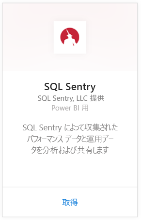
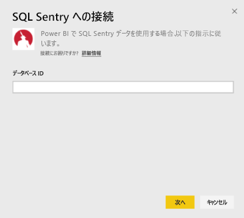
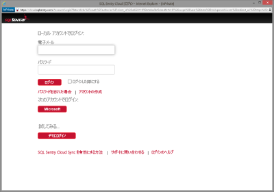
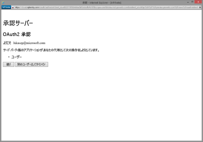
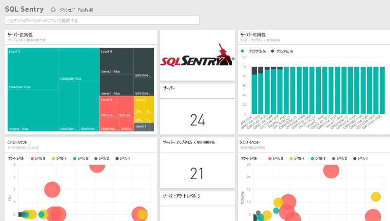
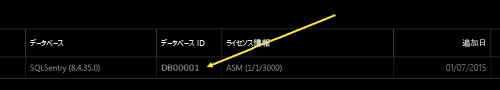
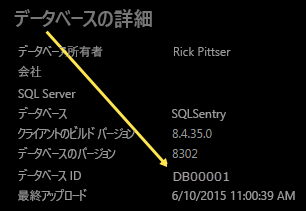

# Power BI で SQL Sentry に接続する
SQL Sentry が収集したパフォーマンス データの分析は、Power BI を使えば簡単に行えます。 Power BI は、データを取得し、そのデータに基づいて既定のダッシュボードと関連レポートを作成します。

Power BI 用 [SQL Sentry コンテンツ パック](https://app.powerbi.com/groups/me/getdata/services/sql-sentry)に接続します。

>[!NOTE]
>http://cloud.sqlsentry.com に接続するときに使用する SQL Sentry アカウントへのアクセス、および監視するデータベース ID が、接続のために必要です。  データベース ID の検索手順は次のとおりです。

## 接続する方法
1. 左側のナビゲーション ウィンドウの下部にある **[データの取得]** を選択します。
   
   
2. **[サービス]** ボックスで、 **[取得]**を選択します。
   
    
3. **[SQL Sentry] \> [接続]** の順に選びます。
   
   
4. Power BI で監視するデータベースの **データベース ID** を指定します。 この値を見つけるには、この後の「[パラメーターの見つけ方](#FindingParams)」をご覧ください。
   
   
5. [認証方法] として **[oAuth2]\>、[サインイン]** の順に選びます。
   
   メッセージが表示されたら、cloud.sqlsentry.com の資格情報を入力してから、SQL Sentry の認証プロセスに従います。
   
   
   
   初めて接続するときには、アカウントへの読み取り専用アクセスを許可するように求めるメッセージが Power BI から表示されます。 [付与] を選択して、インポート プロセスを開始します。  インポート プロセスは、ご使用のアカウントのデータの量によっては数分かかることがあります。
   
   
6. Power BI によるデータのインポート後、新しいダッシュ ボード、レポート、データセットが左側のナビゲーション ウィンドウに表示されます。 新しい項目には黄色のアスタリスク \* でマークが付けられます。
   
   
7. SQL Sentry ダッシュボードを選択します。
   
   これは、データを表示するために Power BI によって作成される既定のダッシュボードです。 このダッシュボードを変更し、希望する方法でデータを表示できます。
   
   

**実行できる操作**

* ダッシュボード上部にある [Q&A ボックスで質問](power-bi-q-and-a.md)してみてください。
* ダッシュボードで[タイルを変更](service-dashboard-edit-tile.md)できます。
* [タイルを選択](service-dashboard-tiles.md)して基になるレポートを開くことができます。
* データセットは毎日更新されるようにスケジュール設定されますが、更新のスケジュールは変更でき、また **[今すぐ更新]** を使えばいつでも必要なときに更新できます。

## 含まれるもの
Power BI では、次のデータを SQL Sentry から使用できます。

| テーブル名 | 説明 |
| --- | --- |
| 接続 |次のテーブルは、SQL Sentry で定義された接続に関する情報を提供しています。 |
| 日付  |このテーブルには、今日から遡ってパフォーマンス データが収集および保持された最も古い日までの日付が含まれています。 |
| ダウンタイム  |このテーブルには、環境内で監視されている各サーバーのダウンタイムと稼働時間に関する情報が含まれています。 |
| メモリ使用量  |このテーブルには、サーバーごとに、使用可能なメモリの量とメモリの空き容量に関するデータが含まれています。  |
| サーバー  |このテーブルには、環境内の各サーバーのレコードが含まれています。 |
| サーバー正常性  |このテーブルには、重要度と数など、環境内のカスタムの条件によって生成されたすべてのイベントに関するデータが含まれています。 |

## パラメーターの見つけ方
**データベース ID** は、新しい Web ブラウザーのウィンドウで <https://cloud.sqlsentry.com> にログインすると見つかります。  **データベース ID** は、メイン概要ページに一覧表示されます。

    

**データベース ID** は、データベースの詳細画面にも表示されます。

    

## トラブルシューティング
Power BI で一部のアプリのデータが表示されない場合は、データベース ID が正しいことと、データを表示する権限があることを確認します。 

<https://cloud.sqlsentry.com> と同期している SQL Sentry データベースの所有者ではない場合は、管理者にお問い合わせの上、収集されたデータを表示する権限があることをご確認ください。

## 次の手順
[Power BI の概要](service-get-started.md)

[Power BI のデータの取得](service-get-data.md)

