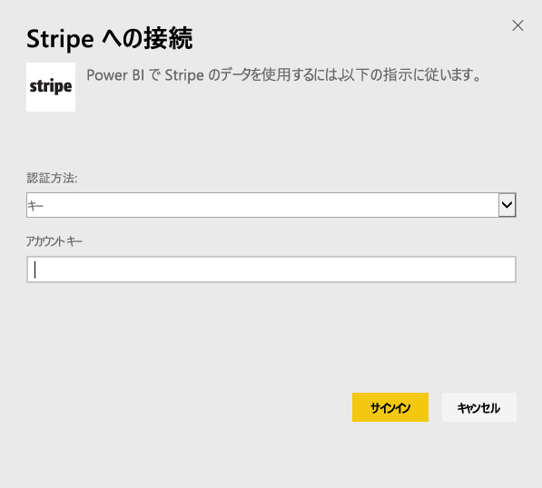
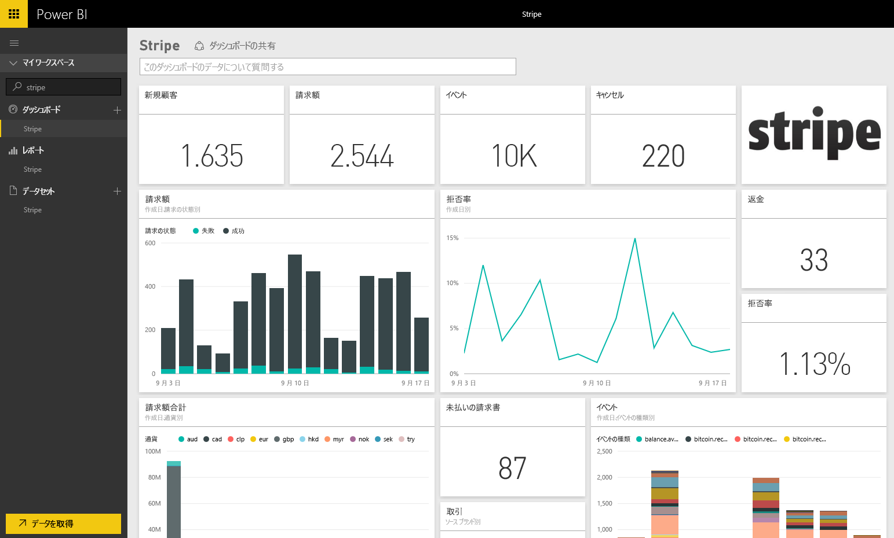

# Power BI で Stripe に接続する
Power BI コンテンツ パックを使用して、Power BI 内の Stripe データを視覚化および探索します。 Power BI の Stripe コンテンツ パックでは、顧客、料金、イベント、請求書に関するデータを取得します。 データには、過去 30 日間での最新の 1 万件のイベントと 5000 件の料金が含まれています。 コンテンツは、ユーザーの管理するスケジュールに従って 1 日に 1 回、自動的に更新されます。 

[Power BI 用 Stripe コンテンツ パック](https://app.powerbi.com/getdata/services/stripe)に接続します。

## 接続する方法
1. 左側のナビゲーション ウィンドウの下部にある [データの取得] を選択します。  
   
    
2. **[サービス]** ボックスで、 **[取得]** を選択します。  
   
      
3. **[Stripe]** &gt; **[取得]** を選びます。  
   
      
4. お使いの Stripe [API キー](https://dashboard.stripe.com/account/apikeys)を指定して接続します。  
   
    
5. インポート処理が自動的に開始されます。 完了すると、アスタリスクの付いたナビゲーション ウィンドウに、新しいダッシュボード、レポート、モデルが表示されます。 インポートされたデータを表示するダッシュボードを選択します。
   
    

**実行できる操作**

* ダッシュボード上部にある [Q&A ボックスで質問](consumer/end-user-q-and-a.md)してみてください。
* ダッシュボードで[タイルを変更](service-dashboard-edit-tile.md)できます。
* [タイルを選択](consumer/end-user-tiles.md)して基になるレポートを開くことができます。
* データセットは毎日更新するようにスケジュール設定されますが、更新のスケジュールは変更でき、また **[今すぐ更新]** を使えばいつでも必要なときに更新できます。

## 次の手順
[Power BI とは?](power-bi-overview.md)

[Power BI のデータの取得](service-get-data.md)

