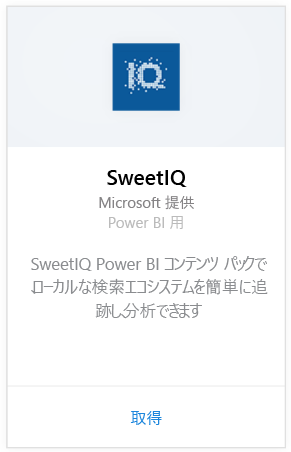
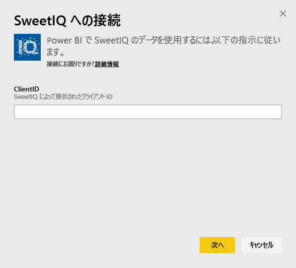
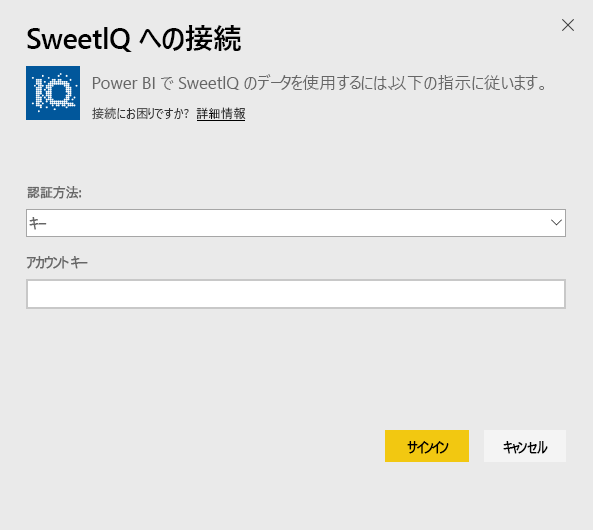
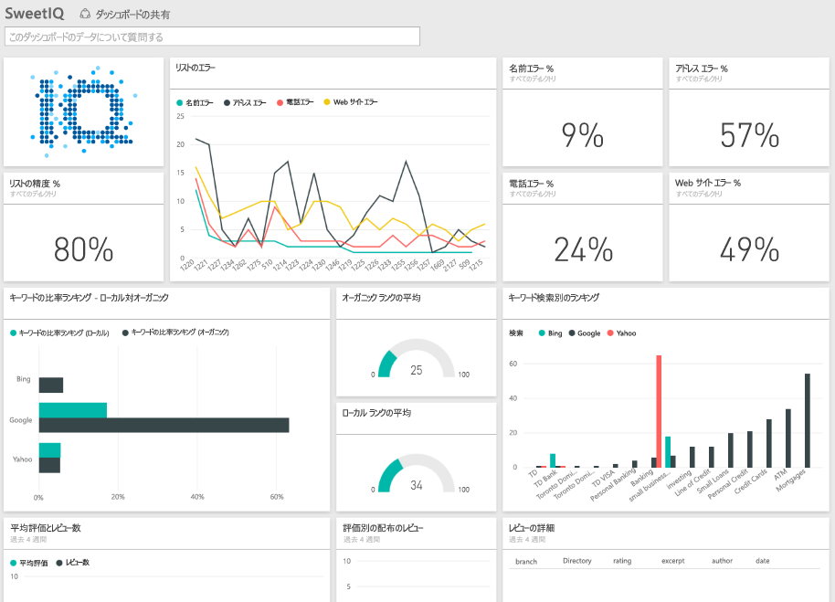

# Power BI で SweetIQ に接続する
Power BI コンテンツ パックは、SweetIQ アカウントからデータを取得し、すぐに使えるコンテンツのセットを生成して、簡単にデータを探索できるようにします。 SweetIQ コンテンツ パックを使用して、場所、一覧、評価、およびレビューに関するデータを分析します。 データは、毎日更新されるように設定されているため、監視対象のデータが常に最新の状態に保たれています。

Power BI 用 [SweetIQ コンテンツ パック](https://app.powerbi.com/groups/me/getdata/services/sweetiq) に接続します。

## 接続する方法
1. 左側のナビゲーション ウィンドウで、**[データを取得]** をクリックします。
   
    
2. **[SweetIQ]** を選び、**[取得]** をクリックします。
   
    
3. SweetIQ のクライアント ID を入力します。 通常、これは英数字の値です。 この値の検索の詳細については、以下を参照してください。
   
    
4. **キー** の認証の種類を選択し、Sweet IQ の API キーを入力します。 通常、これは英数字の値です。 この値の検索の詳細については、以下を参照してください。
   
    
5. Power BI は、データの読み込みを開始します。アカウントのデータのサイズによっては時間がかかることがあります。 読み込みが完了すると、新しいダッシュボード、レポート、およびデータセットが左側のナビゲーション ウィンドウに表示されます。
   
    

**実行できる操作**

* ダッシュボード上部にある [Q&A ボックスで質問](power-bi-q-and-a.md)してみてください。
* ダッシュボードで[タイルを変更](service-dashboard-edit-tile.md)できます。
* [タイルを選択](service-dashboard-tiles.md)して基になるレポートを開くことができます。
* データセットは毎日更新されるようにスケジュール設定されますが、更新のスケジュールは変更でき、また **[今すぐ更新]** を使えばいつでも必要なときに更新できます。

## パラメーターの見つけ方
このコンテンツ パックのクライアント ID と API キーは、SweetIQ のユーザー名とパスワードと同じではありません。

アカウントがアクセスできるいずれかのクライアントのクライアント ID を選択します。 クライアントの一覧は、SweetIQ アカウントの [クライアントの管理] にあります。

特定のクライアントのデータにアクセスするための API キーについては、管理者にお問い合わせください。

## 次の手順
[Power BI の概要](service-get-started.md)

[Power BI のデータの取得](service-get-data.md)

