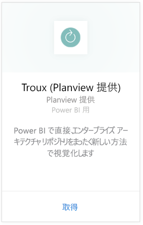
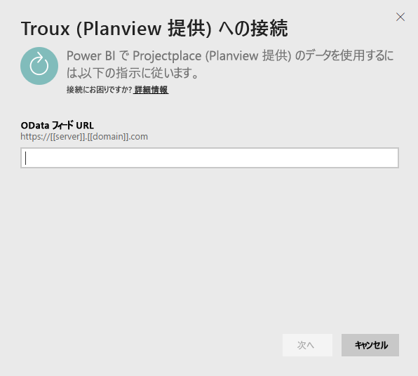
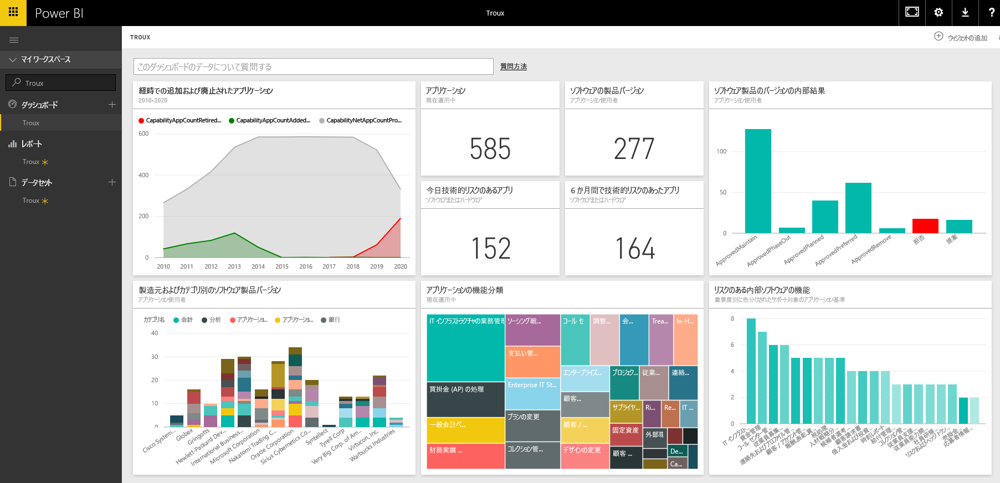

# Power BI で Troux に接続する
Troux コンテンツ パックを使用すると、Power BI で直接、エンタープライズ アーキテクチャ リポジトリをまったく新しい方法で視覚化できます。 このコンテンツ パックは、ビジネス上の可能性について一連の洞察を提供し、そうした可能性を実現するアプリケーション、そして Power BI を使用して完全にカスタマイズ可能なそれらのアプリケーションをサポートするテクノロジを提供します。

Power BI 用 [Troux コンテンツ パック](https://app.powerbi.com/getdata/services/troux)に接続します。

## 接続する方法
1. 左側のナビゲーション ウィンドウの下部にある **[データの取得]** を選択します。
   
   
2. **[サービス]** ボックスで、 **[取得]** を選択します。
   
   
3. **[Troux]** \> **[取得]** の順に選びます。
   
   
4. Troux OData URL を指定します。 [これらのパラメーターの見つけ方](#FindingParams)について詳しくは、後述します。
   
   
5. **[認証方式]** で、 **[基本]** を選択し、ユーザー名とパスワード (大文字小文字を区別) を入力し、 **[サインイン]** を選択します。
   
    
6. 承諾後、インポート処理が自動的に開始されます。 完了すると、ナビゲーション ウィンドウに、新しいダッシュ ボード、レポート、モデルが表示されます。 インポートされたデータを表示するダッシュボードを選択します。
   
     

**実行できる操作**

* ダッシュボード上部にある [Q&A ボックスで質問](power-bi-q-and-a.md)してみてください。
* ダッシュボードで[タイルを変更](service-dashboard-edit-tile.md)できます。
* [タイルを選択](service-dashboard-tiles.md)して基になるレポートを開くことができます。
* データセットは毎日更新されるようにスケジュール設定されますが、更新のスケジュールは変更でき、また **[今すぐ更新]** を使えばいつでも必要なときに更新できます。

## システム要件
Troux OData フィードへのアクセスが可能であること、また Troux 9.5.1 以上が必要です。

## パラメーターの見つけ方
カスタマー サポート チームは、一意の Troux OData フィード URL を提供することができます。

## トラブルシューティング
資格情報の入力後にタイムアウト エラーが表示される場合は、もう一度接続してください。

## 次の手順
[Power BI の概要](service-get-started.md)

[Power BI でデータを取得する](service-get-data.md)

