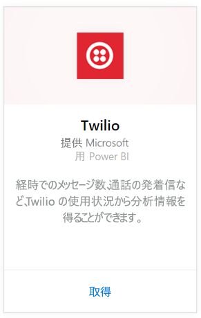
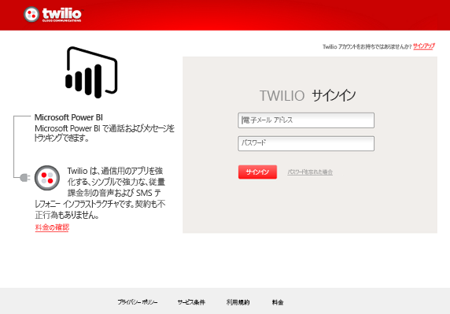
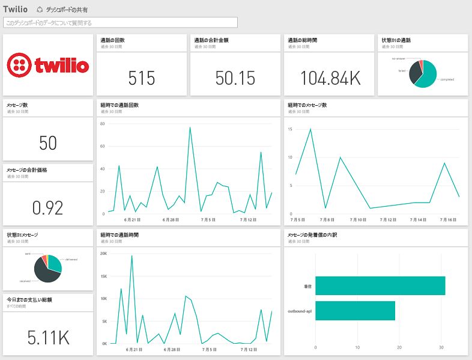

# Power BI で Twilio に接続する
Power BI 用 Microsoft Twilio コンテンツ パックを使用すると、データを Power BI に引き入れて、事前に用意された [Twilio ダッシュボード](https://powerbi.microsoft.com/integrations/twilio)とレポートを作成し、データから洞察を示すことができます。 また、Power BI が作成したデータセットに関して、カスタムのレポートやダッシュボードを作成することもできます。 データは 1 日に 1 回更新されるので、常に最新のデータを見ることができます。

Power BI 用 [Twilio コンテンツ パック](https://app.powerbi.com/getdata/services/twilio)に接続します。

## 接続する方法
1. 左側のナビゲーション ウィンドウの下部にある **[データの取得]** を選択します。
   
    
2. **[サービス]** ボックスで、 **[取得]** を選択します。
   
    
3. **[Twilio]** \> **[取得]** の順に選びます。
   
   
4. **[認証方法]** として **[oAuth2]** \> [サインイン] を選びます。 画面の指示に従って Twilio 資格情報を指定し、Power BI アプリケーションがデータにアクセスすることを承認します。
   
   
5. これによって、Twilio アカウントからのデータのインポートが開始され、過去 30 日間の通話、メッセージの使用状況がダッシュ ボードに示されます。 
   
   

**実行できる操作**

* ダッシュボード上部にある [Q&A ボックスで質問](power-bi-q-and-a.md)してみてください。
* ダッシュボードで[タイルを変更](service-dashboard-edit-tile.md)できます。
* [タイルを選択](service-dashboard-tiles.md)して基になるレポートを開くことができます。
* データセットは毎日更新されるようにスケジュール設定されますが、更新のスケジュールは変更でき、また **[今すぐ更新]** を使えばいつでも必要なときに更新できます。

## 含まれるもの
過去 30 日間のすべての通話とメッセージ トランザクションの詳細。 このデータに関してあらゆる種類の分析と集計を実行できます。

監視する集計済み統計情報セット。 このセットには以下が含まれています。

        All Time Calls Count  
        All Time Calls Duration  
        All Time Calls Price  
        All Time Messages Price  
        All Time Messages Count  
        All Time Count of Phone Numbers  
        All Time Price of Phone Numbers  
        All Time Twilio Client Calls Price  
        All Time Twilio Client Calls Duration  
        All Time Twilio Client Calls Count  
        All Time Total Price  
        All Time Inbound Calls Price  
        All Time Inbound Calls Duration  
        All Time Inbound Calls Count  
        All Time Outbound Calls Price  
        All Time Outbound Calls Duration  
        All Time Outbound Calls Count  
        This Month Calls Price  
        This Month Calls Duration  
        This Month Calls Count  
        This Month Messages Count  
        This Month Messages Price  
        This Month Count of Phone Numbers  
        This Month Price of Phone Numbers  
        This Month Twilio Client Calls Price  
        This Month Twilio Client Calls Duration  
        This Month Twilio Client Calls Count  
        This Month Total Price  
        This Month Inbound Calls Price  
        This Month Inbound Calls Duration  
        This Month Inbound Calls Count  
        This Month Outbound Calls Price  
        This Month Outbound Calls Duration  
        This Month Outbound Calls Count  
        This Month Inbound Messages Price  
        This Month Inbound Messages Count  
        This Month Outbound Messages Price  
        This Month Outbound Messages Count

## トラブルシューティング
過去 30 日間のデータ量が非常に多い場合 (数十万のトランザクション)、データの取り出しが失敗することがあります。 Microsoft は問題を承知しており、解決のために作業中です。 その間、この問題が生じた場合は Power BI ページの上部にあるサポート リンクを使用してお知らせください。さらに調査するため、連絡を差し上げます。

## 次の手順
[Power BI の概要](service-get-started.md)

[Power BI でデータを取得する](service-get-data.md)

