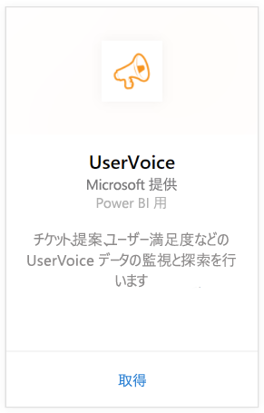
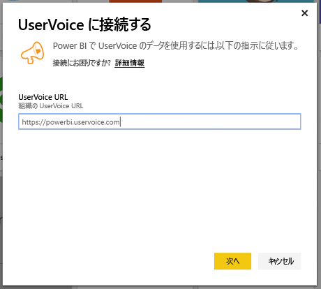
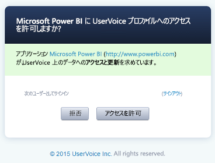
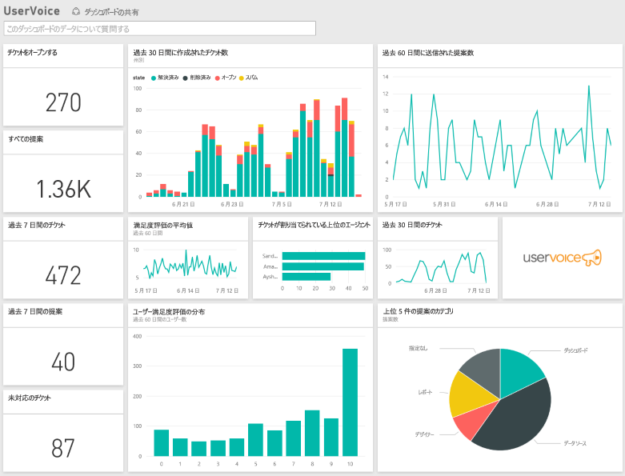

# Power BI で UserVoice に接続する
UserVoice データの追跡と探索は、Power BI と UserVoice コンテンツ パックを使えば簡単に行えます。 Power BI は、チケット、提案と満足度の評価などのデータを取得してから、そのデータに基づいて、すぐに使えるダッシュボードとレポートを作成します。

Power BI 用 [UserVoice コンテンツ パック](https://app.powerbi.com/getdata/services/uservoice)に接続します。

>[!NOTE]
>管理者アカウントが、Power BI コンテンツ パックに接続する際に必要です。 またこのコンテンツ パックは、UserVoice API を活用するので、UserVoice 制限に対する使用量に関係します。 以下で詳細を確認してください。

## 接続する方法
1. 左側のナビゲーション ウィンドウの下部にある **[データの取得]** を選択します。
   
   
2. **[サービス]** ボックスで、 **[取得]** を選択します。
   
    
3. **[UserVoice]**、**[接続]** の順に選びます。
   
   
4. ダイアログ ボックスが表示されたら、UserVoice の URL を入力します。 URL は、次のパターンに厳密に従う必要があります: `https://fabrikam.uservoice.com` 。ここで、"fabrikam" を製品名またはサービス名に置き換えます。
   
   >[!NOTE]
   >末尾にスラッシュはなく、接続は http**s** です。
   
   
5. ダイアログが表示されたら、UserVoice の資格情報を入力し、UserVoice の認証プロセスに従います。 ブラウザーで既に UserVoice にサインインした場合は、資格情報を求めるダイアログが表示されないことがあります。 [アクセスを許可する] をクリックして、Power BI アプリケーションに、データへのアクセスを付与します。
   
   >[!NOTE]
   >UserVoice アカウントの管理者資格情報が必要です。
   
   
6. Power BI は、UserVoice データを取得して、すぐに使用できるダッシュボードとレポートを作成します。 Power BI は、次のデータを取得します。すべての提案、開いているすべてのチケット、過去 30 日間に作成されたすべてのチケット (閉じているチケットを含む)、およびユーザー満足度評価の内容。 
   
   

**実行できる操作**

* ダッシュボード上部にある [Q&A ボックスで質問](power-bi-q-and-a.md)してみてください。
* ダッシュボードで[タイルを変更](service-dashboard-edit-tile.md)できます。
* [タイルを選択](service-dashboard-tiles.md)して基になるレポートを開くことができます。
* データセットは毎日更新されるようにスケジュール設定されますが、更新のスケジュールは変更でき、また **[今すぐ更新]** を使えばいつでも必要なときに更新できます。

## トラブルシューティング
**"パラメーターの検証でエラーが発生しました。すべてのパラメーターが有効であることを確認してください。"**

UserVoice URL を入力したらこのエラーが表示された場合。 次の要件を満たしていることを確認します。

* URL が厳密にこの `https://fabrikam.uservoice.com` のパターンに従っています。ここで "fabrikam" を正しい UserVoice URL プレフィックスに置き換えます。
* すべての文字が小文字であることを確認してください。
* URL が 'http**s**' であることをご確認ください。
* URL の末尾にスラッシュ (/) がないことを確認してください。

**"Login failed" (ログインに失敗しました)**

UserVoice 資格情報を使用してログインした後に、”ログインに失敗しました" エラーが表示された場合、使用しているアカウントには、アカウントから UserVoice データを取得するためのアクセス許可がありません。 管理者アカウントであることを確認してからやり直してください。

"**問題が発生しました**”

データの読み込み中にこのエラー メッセージが表示された場合は、UserVoice アカウントがその月の API の使用量クォータを超過していないことを確認します。 すべてが適正な場合は、もう一度接続してください。 問題が解決しない場合は、Power BI サポート ([https://community.powerbi.com](https://community.powerbi.com/)) にお問い合わせください。

**その他**  

Power BI UserVoice コンテンツ パックでは、UserVoice の API を使用してデータを取得します。 制限を超えないように、必ず API の使用量を監視してください。 UserVoice アカウントに大量のデータがある場合、API の使用量への影響を最小にするために、更新頻度を、既定である現在の 1 日 1 回から、必要に応じて平日のみ、または 1 日おきに更新するように変更することをご提案します。 もう 1 つの提案は、組織内の全管理者が独自のコンテンツ パックを作成して API に余分に不要な負荷をかけるのではなく、1 人の管理者にコンテンツ パックを作成してもらい、チームの残りのメンバーと共有することです。

## 次の手順
[Power BI の概要](service-get-started.md)

[Power BI でデータを取得する](service-get-data.md)

