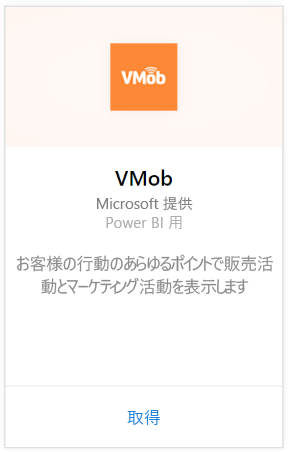
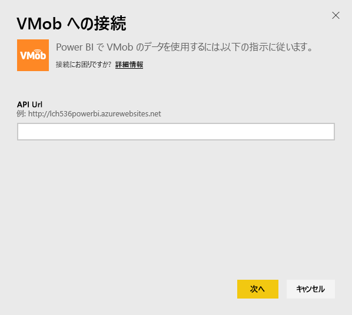
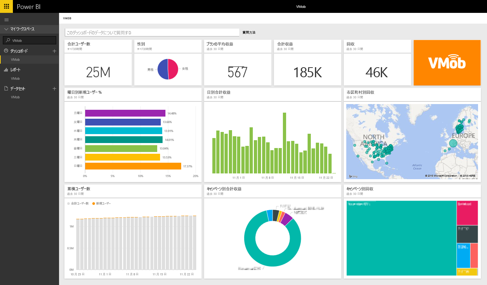

# Power BI で VMob に接続する
VMob データの追跡と探索は、Power BI と VMob コンテンツ パックを使って簡単に行うことができます。 Power BI によって取得されるデータは、すべての期間と過去 30 日間のユーザー統計情報、過去 30 日間の販売 KPI、過去 30 日間のキャンペーンの成果です。

Power BI 用 [VMob コンテンツ パック](https://app.powerbi.com/getdata/services/vmob)に接続します。

## 接続する方法
1. 左側のナビゲーション ウィンドウの下部にある **[データの取得]** を選択します。
   
    
2. **[サービス]** ボックスで、 **[取得]**を選択します。
   
   
3. **[VMob]** \> **[接続]** を選びます。
   
   
4. プロンプトが表示されたら、VMob URL を入力し、[次へ] をクリックします。 この URL は、VMob によって個別に提供されます。
   
    
5. [認証方法] ドロップダウンで **[基本]** オプションを選択し、VMob のユーザー名とパスワードを入力して、 **[サイン イン]** をクリックします。
   
    
6. インポート処理が自動的に開始され、Power BI によって VMob データが取得され、すぐに使えるダッシュボードとレポートが作成されます。
   
   

**実行できる操作**

* ダッシュボード上部にある [Q&A ボックスで質問](power-bi-q-and-a.md)してみてください。
* ダッシュボードで[タイルを変更](service-dashboard-edit-tile.md)できます。
* [タイルを選択](service-dashboard-tiles.md)して基になるレポートを開くことができます。
* データセットは毎日更新されるようにスケジュール設定されますが、更新のスケジュールは変更でき、また **[今すぐ更新]** を使えばいつでも必要なときに更新できます。

## 次の手順
[Power BI の概要](service-get-started.md)

[Power BI でデータを取得する](service-get-data.md)

